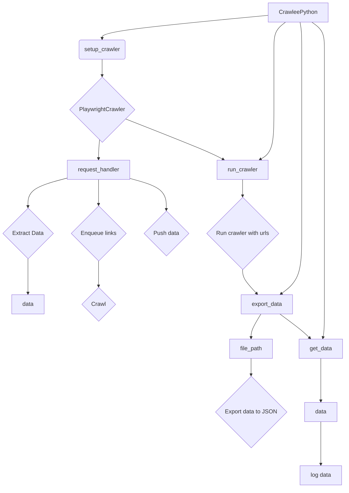

# <input code>

```python
## \file hypotez/src/webdriver/crawlee_python/crawlee_python.py
# -*- coding: utf-8 -*-\
#! venv/Scripts/python.exe
#! venv/bin/python/python3.12

"""
.. module: src.webdriver.crawlee_python 
	:platform: Windows, Unix
	:synopsis:

"""
MODE = 'dev'


from pathlib import Path
from src import gs
import asyncio
from crawlee.playwright_crawler import PlaywrightCrawler, PlaywrightCrawlingContext
from src.logger import logger

class CrawleePython:
    def __init__(self, max_requests: int = 5, headless: bool = False, browser_type: str = 'firefox'):
        """ Initializes the CrawleeExperiment with the specified parameters """
        self.max_requests = max_requests
        self.headless = headless
        self.browser_type = browser_type
        self.crawler = None

    async def setup_crawler(self):
        """ Sets up the PlaywrightCrawler instance """
        self.crawler = PlaywrightCrawler(
            max_requests_per_crawl=self.max_requests,
            headless=self.headless,
            browser_type=self.browser_type,
        )

        @self.crawler.router.default_handler
        async def request_handler(context: PlaywrightCrawlingContext) -> None:
            context.log.info(f'Processing {context.request.url} ...')

            # Enqueue all links found on the page.
            await context.enqueue_links()

            # Extract data from the page using Playwright API.
            data = {
                'url': context.request.url,
                'title': await context.page.title(),
                'content': (await context.page.content())[:100],
            }

            # Push the extracted data to the default dataset.
            await context.push_data(data)

    async def run_crawler(self, urls: list[str]):
        """ Runs the crawler with the initial list of URLs 

        @param urls: List of URLs to start the crawl
        """
        await self.crawler.run(urls)

    async def export_data(self, file_path: str):
        """ Exports the entire dataset to a JSON file 

        @param file_path: Path to save the exported JSON file
        """
        await self.crawler.export_data(file_path)

    async def get_data(self) -> dict:
        """ Retrieves the extracted data 

        @return: Extracted data as a dictionary
        """
        data = await self.crawler.get_data()
        return data

    async def run(self, urls: list[str]):
        """ Main method to set up, run the crawler, and export data 

        @param urls: List of URLs to start the crawl
        """
        await self.setup_crawler()
        await self.run_crawler(urls)
        await self.export_data(str(Path(gs.path.tmp / 'results.json')))
        data = await self.get_data()
        logger.info(f'Extracted data: {data.items}')


# Example usage
if __name__ == '__main__':
    async def main():
        experiment = CrawleePython(max_requests=5, headless=False, browser_type='firefox')
        await experiment.run(['https://ksp.co.il'])

    asyncio.run(main())
```

# <algorithm>

1. **Initialization (`__init__`):**
   - Creates an instance of `CrawleePython` with parameters (`max_requests`, `headless`, `browser_type`).
   - Initializes `self.crawler` to `None`.
   - Example: `experiment = CrawleePython(max_requests=5, headless=False, browser_type='firefox')`

2. **Crawler Setup (`setup_crawler`):**
   - Creates a `PlaywrightCrawler` instance with specified parameters.
   - Sets the `default_handler` for the crawler's router.
     - Example: `@experiment.crawler.router.default_handler`
   - Example: `experiment.crawler = PlaywrightCrawler(max_requests_per_crawl=5, headless=False, browser_type='firefox')`

3. **Request Handling (`request_handler`):**
   - Logs the processing of the URL.
   - Enqueues links found on the current page.
   - Extracts data (`url`, `title`, `content`).
   - Pushes the extracted data to the default dataset.
   - Example: Processing `https://www.example.com`


4. **Crawling (`run_crawler`):**
   - Executes the crawler with the initial list of URLs.
   - Example: `await experiment.run_crawler(['https://www.example.com', 'https://www.example.net'])`

5. **Data Export (`export_data`):**
   - Exports the collected data to a JSON file.
   - Example: `await experiment.export_data(str(Path(gs.path.tmp / 'results.json')))`

6. **Data Retrieval (`get_data`):**
   - Retrieves the extracted data.
   - Example: `data = await experiment.get_data()`


7. **Main Execution (`run`):**
   - Calls `setup_crawler` to initialize the crawler.
   - Calls `run_crawler` to start the crawl with a list of URLs.
   - Calls `export_data` to export the data.
   - Calls `get_data` to retrieve the data.
   - Logs the extracted data.
   - Example: `await experiment.run(['https://www.example.com'])`


# <mermaid>



# <explanation>

* **Imports:**
    - `pathlib`: Provides classes for working with filesystem paths.
    - `gs`: Likely a custom module from the project (`src.gs`) responsible for handling global settings or resources, probably for file paths.
    - `asyncio`: For asynchronous operations.
    - `crawlee.playwright_crawler`: Contains classes for using Playwright to crawl web pages. Part of a third-party library (`crawlee`).
    - `src.logger`: Likely a custom module for logging.

* **Classes:**
    - `CrawleePython`: Implements the web crawling logic.
        - `__init__`: Initializes the crawler with maximum requests, headless mode, and browser type.
        - `setup_crawler`: Configures the `PlaywrightCrawler`.
        - `run_crawler`: Starts the crawling process given a list of URLs.
        - `export_data`: Saves the extracted data to a file.
        - `get_data`: Retrieves the extracted data.
        - `run`: Orchestrates the crawler setup, running and data export.


* **Functions:**
    - `request_handler`: Processes each request during crawling. Extracts data from the page, logs and handles the links.
        - Arguments: `context` of type `PlaywrightCrawlingContext`
        - Return type: `None`
    - `setup_crawler`: Configures the `PlaywrightCrawler`.
    - `run_crawler`: Executes the crawler with the initial URLs.
    - `export_data`: Exports the data to the specified file path.
    - `get_data`: Retrieves the collected data from the crawler.


* **Variables:**
    - `MODE`: Stores the current mode (e.g., 'dev').
    - `max_requests`: The maximum number of parallel requests the crawler can handle.
    - `headless`: Specifies if the browser should run in headless mode.
    - `browser_type`: The type of browser to use (e.g., 'firefox', 'chromium').
    - `crawler`: Instance of `PlaywrightCrawler` used for crawling.

* **Possible Errors/Improvements:**
    - **Error Handling:** The code lacks robust error handling.  If a request fails, the entire process could be affected. Consider adding `try...except` blocks to handle potential exceptions during the crawling process (e.g., network issues, timeouts).
    - **Data Validation:**  Check if the extracted data is correctly formatted and doesn't contain errors.
    - **Concurrency Control:** The example limits requests but the crawler (possibly) doesn't control the number of concurrent connections.  This could lead to issues with the website if not handled properly.
    - **Rate Limiting:** Implement rate limiting to respect the website's robots.txt and avoid getting blocked.
    - **Robustness:** Improve error handling for file operations and crawler failures.
    - **Data Cleaning:**  Consider data cleaning techniques like removing unnecessary characters, handling encoding issues, etc., to improve data quality.

* **Relationships with other parts of the project:**
    - The code depends on the `gs` module for file paths, `logger` for logging, and `crawlee` for crawling functionality.