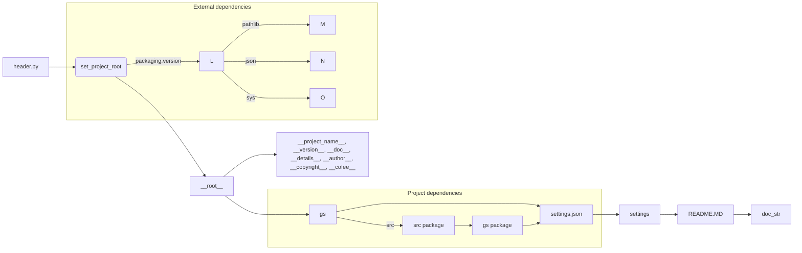

```MD
# <input code>

```python
## \file hypotez/src/webdriver/crawlee_python/header.py
# -*- coding: utf-8 -*-\
#! venv/Scripts/python.exe
#! venv/bin/python/python3.12

"""
.. module: src.webdriver.crawlee_python 
	:platform: Windows, Unix
	:synopsis:

"""


import sys
import json
from packaging.version import Version

from pathlib import Path
def set_project_root(marker_files=('__root__','.git')) -> Path:
    """
    Finds the root directory of the project starting from the current file's directory,
    searching upwards and stopping at the first directory containing any of the marker files.

    Args:
        marker_files (tuple): Filenames or directory names to identify the project root.
    
    Returns:
        Path: Path to the root directory if found, otherwise the directory where the script is located.
    """
    __root__:Path
    current_path:Path = Path(__file__).resolve().parent
    __root__ = current_path
    for parent in [current_path] + list(current_path.parents):
        if any((parent / marker).exists() for marker in marker_files):
            __root__ = parent
            break
    if __root__ not in sys.path:
        sys.path.insert(0, str(__root__))
    return __root__


# Get the root directory of the project
__root__ = set_project_root()
"""__root__ (Path): Path to the root directory of the project"""

from src import gs

settings:dict = None
try:
    with open(gs.path.root / 'src' /  'settings.json', 'r') as settings_file:
        settings = json.load(settings_file)
except (FileNotFoundError, json.JSONDecodeError):
    ...

doc_str:str = None
try:
    with open(gs.path.root / 'src' /  'README.MD', 'r') as settings_file:
        doc_str = settings_file.read()
except (FileNotFoundError, json.JSONDecodeError):
    ...


__project_name__ = settings.get("project_name", 'hypotez') if settings  else 'hypotez'
__version__: str = settings.get("version", '')  if settings  else ''
__doc__: str = doc_str if doc_str else ''
__details__: str = ''
__author__: str = settings.get("author", '')  if settings  else ''
__copyright__: str = settings.get("copyrihgnt", '')  if settings  else ''
__cofee__: str = settings.get("cofee", "Treat the developer to a cup of coffee for boosting enthusiasm in development: https://boosty.to/hypo69")  if settings  else "Treat the developer to a cup of coffee for boosting enthusiasm in development: https://boosty.to/hypo69"
```

# <algorithm>

```mermaid
graph TD
    A[Start] --> B{Find project root};
    B -- Yes --> C[Open settings.json];
    B -- No --> D[Default settings];
    C -- Success --> E[Load settings];
    C -- Fail --> F[Default settings];
    D -- --> E;
    E --> G{Open README.MD};
    G -- Success --> H[Read README];
    G -- Fail --> H[Empty README];
    H --> I[Set project attributes];
    I --> J[End];

    subgraph Project root search
        B -- --> K[Current directory];
        K -- --> L[Check marker files];
        L -- Yes --> B;
        L -- No --> M[Parent directory];
        M --> K;
        K -- --> N;
    end

    subgraph Default settings
       F --> I;
    end

    subgraph Loading settings
       E --> I;
    end
    subgraph Setting project attributes
        I --> I1[__project_name__ = settings.get("project_name", 'hypotez')];
        I --> I2[__version__ = settings.get("version", '')];
        I --> I3[__doc__ = doc_str];
        I --> I4[__details__ = ''];
        I --> I5[__author__ = settings.get("author", '')];
        I --> I6[__copyright__ = settings.get("copyrihgnt", '')];
        I --> I7[__cofee__ = settings.get("cofee", ...)];
    end
```

# <mermaid>



# <explanation>

* **Импорты:**
    * `sys`: Предоставляет доступ к системным переменным и функциям. Используется для добавления корневой директории проекта в `sys.path`, что позволяет импортировать модули из проекта.
    * `json`: Для работы с JSON-форматом. Используется для загрузки настроек из `settings.json`.
    * `packaging.version`: Обеспечивает работу с версиями пакетов. Непосредственно в данном файле не используется.
    * `pathlib`: Для работы с путями к файлам.  Используется для получения путей к файлам конфигурации и `README`.
    * `src.gs`: Модуль, предположительно, из пакета `src`, отвечающий за работу с путями к файлам проекта.  Это ключевой момент для понимания структуры проекта. Связь с другими частями проекта через `gs.path.root`.

* **Классы:** Нет определенных классов.  В основном используются функции и глобальные переменные.

* **Функции:**
    * `set_project_root(marker_files)`: Находит корневую директорию проекта, начиная с текущего файла и поднимаясь по дереву директорий, пока не найдет директорию, содержащую один из файлов-маркеров (например, `pyproject.toml`, `requirements.txt`, `.git`).  Возвращает `Path` к корневой директории. Очень важная функция для обеспечения работы проекта вне зависимости от того, откуда запускается скрипт. 
    * Аргумент `marker_files` - кортеж имен файлов или директорий, по которым определяется корневая директория проекта.

* **Переменные:**
    * `MODE`: Строковая переменная, вероятно, хранит режим работы (например, `'dev'` или `'prod'`).
    * `__root__`: `Path`-объект, хранящий путь к корню проекта.
    * `settings`: Словарь, содержащий настройки, загружаемые из `settings.json`.
    * `doc_str`: Строка, содержащая текст из файла `README.MD`.
    * `__project_name__`, `__version__`, `__doc__`, `__details__`, `__author__`, `__copyright__`, `__cofee__`: Строковые переменные, хранящие информацию о проекте, полученную из `settings`.

* **Возможные ошибки или области для улучшений:**
    * Обработка ошибок: Использование `try...except` для `FileNotFoundError` и `json.JSONDecodeError` важно, но может быть улучшено. Например, можно вывести более информативные сообщения об ошибке или сохранить логи в файл.
    * Документация: Добавьте более подробную документацию к функции `set_project_root`.
    * Общие замечания:
       *  Код является достаточно сложным, если не знать всю контекстную информацию.
       *  Использование `gs.path.root` предполагает наличие внешнего модуля (`gs`), который отвечает за работу с путями к ресурсам приложения. Необходимо подробное описание модуля `gs`.


* **Цепочка взаимосвязей:**
    Этот файл `header.py` является вспомогательным для других модулей проекта. Он устанавливает корневую директорию и загружает настройки. Далее, полученные данные о проекте используются другими модулями (`crawlers`, `pages`, etc.), обеспечивая единый доступ к информации, например, для работы с ресурсами, конфигурацией и обработкой данных.  Важным элементом является то, что `gs` должен гарантировать, что все ссылки внутри проекта верные, например, относительные пути к файлам.