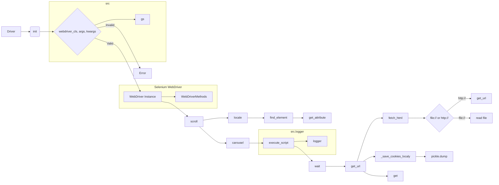

# <input code>

```python
## \file hypotez/src/webdriver/driver.py
# -*- coding: utf-8 -*-\n#! venv/Scripts/python.exe\n#! venv/bin/python/python3.12\n
"""
.. module:: src.webdriver.driver
   :platform: Windows, Unix
   :synopsis: Модуль для работы с веб-драйверами Selenium.

   Основное назначение класса `Driver` — обеспечение унифицированного интерфейса для работы с веб-драйверами Selenium.

   Основные функции:
   
   1. **Инициализация драйвера**: создание экземпляра Selenium WebDriver.
   2. **Навигация**: переход по URL, прокрутка и извлечение контента.
   3. **Работа с куки**: сохранение и управление куки.
   4. **Обработка исключений**: логирование ошибок.

Пример использования:
    >>> from selenium.webdriver import Chrome
    >>> driver = Driver(Chrome, executable_path=\'/path/to/chromedriver\')
    >>> driver.get_url(\'https://example.com\')
"""


import copy
import pickle
import time
import re
from pathlib import Path
from typing import Optional
from selenium.webdriver.common.by import By
from selenium.common.exceptions import (
    InvalidArgumentException,
    ElementClickInterceptedException,
    ElementNotInteractableException,
    ElementNotVisibleException
)
import header
from src import gs
from src.logger import logger
from src.logger.exceptions import ExecuteLocatorException, WebDriverException


class Driver:
    """
    .. class:: Driver
       :platform: Windows, Unix
       :synopsis: Унифицированный класс для взаимодействия с Selenium WebDriver.

    Класс обеспечивает удобный интерфейс для работы с различными драйверами, такими как Chrome, Firefox и Edge.

    Атрибуты:
        driver (selenium.webdriver): Экземпляр Selenium WebDriver.
    """

    def __init__(self, webdriver_cls, *args, **kwargs):
        """
        .. method:: __init__(self, webdriver_cls, *args, **kwargs)
        
        Инициализирует экземпляр класса Driver.

        :param webdriver_cls: Класс WebDriver, например Chrome или Firefox.
        :type webdriver_cls: type
        :param args: Позиционные аргументы для драйвера.
        :param kwargs: Ключевые аргументы для драйвера.

        Пример:
            >>> from selenium.webdriver import Chrome
            >>> driver = Driver(Chrome, executable_path=\'/path/to/chromedriver\')
        """
        if not hasattr(webdriver_cls, 'get'):
            raise TypeError('`webdriver_cls` должен быть допустимым классом WebDriver.')
        self.driver = webdriver_cls(*args, **kwargs)

    # ... (остальной код)
```

# <algorithm>

**Блок-схема (в формате текста):**

1. **Инициализация (Driver.__init__):**
   - Принимает класс веб-драйвера (`webdriver_cls`) и аргументы для его инициализации.
   - Проверяет, является ли `webdriver_cls` допустимым классом WebDriver.
   - Создаёт экземпляр `webdriver_cls` с переданными аргументами и сохраняет его в `self.driver`.
   - **Пример:** `driver = Driver(Chrome, executable_path='/path/to/chromedriver')`

2. **Прокрутка (scroll):**
   - Вызывает вспомогательную функцию `carousel` для прокрутки вверх/вниз/в обе стороны.
   - **Пример:** `driver.scroll(scrolls=3, direction='down')`

3. **Прокрутка (carousel):**
   - Прокручивает страницу определенное количество раз (`scrolls`) с заданным размером прокрутки (`frame_size`) и задержкой (`delay`).
   - **Пример:** `carousel('down', 2, 100, 0.5)`

4. **Определение языка (locale):**
   - Пытается найти мета-тег с языком (`meta[http-equiv='Content-Language']`).
   - Если не находит, пытается определить язык с помощью JavaScript.
   - **Пример:** `lang = driver.locale`

5. **Переход по URL (get_url):**
   - Сохраняет текущий URL.
   - Переходит по URL (`self.driver.get(url)`).
   - Ждёт завершения загрузки страницы.
   - Обновляет `previous_url` если он отличается от нового.
   - Сохраняет куки.
   - **Пример:** `driver.get_url('https://www.example.com')`

6. **Сохранение куки (_save_cookies_localy):**
   - Сохраняет куки в файл `gs.cookies_filepath`.
   - **Пример:**  Сохранение куки в `cookies.pkl`.

7. **Извлечение HTML (fetch_html):**
   - Обрабатывает URL, пытаясь определить является ли он локальным файлом или URL.
   - Если локальный файл, то читает его содержимое.
   - Если URL, то переходит по нему (`get_url`).
   - **Пример:** `driver.fetch_html('file:///C:/mypage.html')`


**Передача данных:** Данные передаются между функциями и классами через аргументы и атрибуты объектов. Например, `self.driver` используется для доступа к методам Selenium WebDriver.


# <mermaid>



# <explanation>

**Импорты:**

- `copy`, `pickle`, `time`, `re`, `Path`, `Optional`, `By`, `InvalidArgumentException`, ..., `ElementNotVisibleException`: Стандартные библиотеки Python и модули Selenium для работы с копированием, сериализацией, задержками, регулярными выражениями, путями к файлам,  типами данных, локализации элементов и обработки исключений.
- `header`: Непонятно, для чего этот модуль без дальнейших данных.
- `gs`: Очевидно, что это переменная, ссылающаяся на другой модуль, скорее всего содержащий константы или пути к файлам (`gs.cookies_filepath`).
- `logger`, `ExecuteLocatorException`, `WebDriverException`: Импорты из `src.logger` и `src.logger.exceptions`. Это указывает на наличие модуля для логирования и обработки специфичных для веб-драйвера ошибок.

**Классы:**

- `Driver`: Этот класс предоставляет абстракцию для работы с различными веб-драйверами (Chrome, Firefox, Edge). Он инициализируется экземпляром конкретного веб-драйвера, предоставляя единый интерфейс для взаимодействия с ним.
   - `__init__`: Инициализирует атрибут `self.driver` объектом веб-драйвера.
   - `__init_subclass__`: Автоматически вызывается при создании подкласса `Driver`.  Проверяет наличие атрибута `browser_name`.
   - `__getattr__`: Прокси-метод для доступа к атрибутам и методам веб-драйвера (например, `driver.current_url`, `driver.get`).
   - `scroll`, `carousel`: Методы для прокрутки веб-страницы.
   - `locale`: Метод для определения языка веб-страницы.
   - `get_url`: Метод для перехода по URL и сохранения куки.
   - `fetch_html`: Метод для получения HTML-контента из файла или веб-страницы.
   - `window_open`: Метод для открытия новой вкладки.
   - `wait`: Метод для ожидания.
   - `_save_cookies_localy`: Метод для сохранения куки.

**Функции:**

- `scroll`, `carousel`: Обрабатывают прокрутку страницы, используя `execute_script`.
- `get_url`: Переходит по URL, ожидает завершения загрузки и сохраняет куки.
- `fetch_html`: Получает HTML контент из файла или URL.
- `window_open`: Открывает новую вкладку и переходит по URL.
- `wait`: Выполняет `time.sleep`.
- `_save_cookies_localy`: Сохраняет куки в файл, но есть закомментированный блок кода.

**Переменные:**

- `MODE`: Переменная, хранящая режим работы (`dev`).
- `gs.cookies_filepath`: Путь к файлу для сохранения куки.


**Возможные ошибки/улучшения:**

- **Закомментированный код в `_save_cookies_localy`:** Неясно, почему этот код закомментирован. Возможно, он имеет баги или не используется. Нужно разобраться, почему этот блок закомментирован.
- **Обработка ошибок:** Необходимо улучшить обработку исключений в методах, чтобы не прекращать выполнение при ошибках.
- **Неясные импорты:** Неясно, для чего используется `header`.
- **Жёсткое кодирование путей (`executable_path`):**  В примерах и коде есть использование путей к драйверу (`/path/to/chromedriver`). Необходимо сделать эти пути динамическими или считывать их из конфигурационного файла.
- **Недостаточная валидация входных данных:** В некоторых методах (особенно `fetch_html`) отсутствует полная проверка и валидация переданных данных.
- **Документация:** Документация в стиле Sphinx могла бы быть еще более полной и структурированной.


**Взаимосвязи с другими частями проекта:**

- `gs`: Этот модуль взаимодействует с `gs.cookies_filepath`, указывая на наличие в проекте системы, которая определяет этот путь (например, система конфигурации или логика хранения файлов).
- `logger`: Логирование ошибок и информации происходит через объект `logger` из `src.logger`. Это указывает на наличие системы логирования в проекте.
- `header`:  Неясно, как используется `header`.


В целом, код хорошо организован и документирован.  Однако,  необходима более тщательная проверка на ошибки и улучшение  обработки исключений.