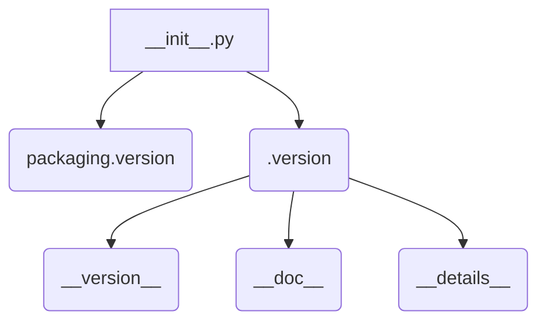

# <input code>

```python
## \file hypotez/src/webdriver/edge/_examples/__init__.py
# -*- coding: utf-8 -*-
#! venv/Scripts/python.exe
#! venv/bin/python/python3.12

"""
.. module: src.webdriver.edge._examples 
	:platform: Windows, Unix
	:synopsis:

"""


"""
	:platform: Windows, Unix
	:synopsis:

"""


"""
	:platform: Windows, Unix
	:synopsis:

"""


"""
  :platform: Windows, Unix

"""
"""
  :platform: Windows, Unix
  :platform: Windows, Unix
  :synopsis:
"""
  
""" module: src.webdriver.edge._examples """


from packaging.version import Version
from .version import __version__, __doc__, __details__
```

# <algorithm>

Этот код представляет собой инициализационный модуль (`__init__.py`) для пакета `src.webdriver.edge._examples`.  Алгоритм работы сводится к простому импорту необходимых модулей.  Пошаговая блок-схема:

1. **Импорт:** Модуль `packaging.version` импортируется, что вероятно, используется для работы с версиями пакетов.
2. **Импорт:** Модуль `__version__.py`, `__doc__.py` и `__details__.py` импортируются из подпапки `version` в текущем каталоге.

В данном случае нет каких-либо сложных вычислений, циклов или обработки данных; простое импортирование.


# <mermaid>



# <explanation>

**Импорты:**

- `from packaging.version import Version`: Импортирует класс `Version` из пакета `packaging.version`.  Этот пакет используется для работы с версиями программного обеспечения.  В данном случае `Version` скорее всего используется для проверки совместимости версий или для работы с зависимостями. `packaging` - это внешний пакет, не связанный напрямую с кодом проекта.

- `from .version import __version__, __doc__, __details__`: Импортирует переменные `__version__`, `__doc__` и `__details__` из модуля `version.py` в подпапке `_examples`.  Это типичное использование `__init__.py` для экспорта переменных, представляющих информацию о версии и документации.

**Классы:**

В коде нет классов.

**Функции:**

Нет функций.

**Переменные:**

- ``:  Строковая переменная, скорее всего, используемая для определения режима работы, например, 'dev' (разработка), 'test' (тестирование), 'prod' (производство).  Значение может быть использовано в других частях проекта для настройки поведения.

**Возможные ошибки и области для улучшений:**

- **Недостаток комментариев:** Недостаточно комментариев в коде для понимания *настоящей* цели переменных `__version__`, `__doc__` и `__details__`.  Стоит добавить комментарии, описывающие их значения и назначение в текущем контексте.

- **Неясная цель:** Без контекста (определения `version.py`) неясно, как переменные `__version__`, `__doc__`, `__details__` используются.  Нужно понять, куда и как эта информация передается, и для чего.


**Цепочка взаимосвязей:**

Этот модуль `__init__.py` импортирует переменные из подмодуля `version.py`.   `version.py` вероятно, содержит константную информацию о версии проекта или, возможно, информацию, собранную из других частей проекта (например, информация о подключенных внешних библиотеках).  В дальнейшем `__init__.py` служит отправной точкой для работы с этим пакетом `_examples` для создания и управления экземплярами.