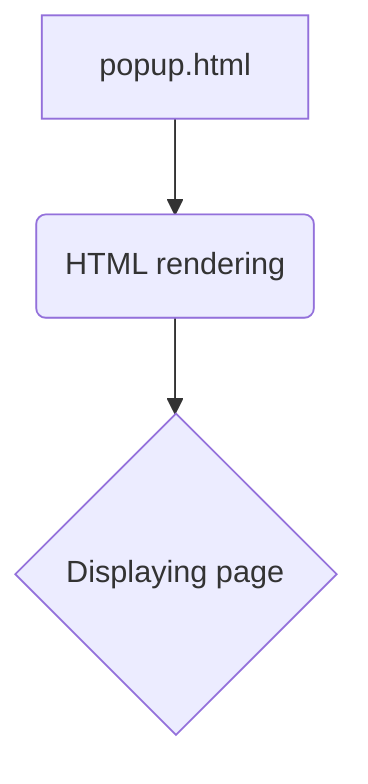

# Анализ кода popup.html

## <input code>

```html
## \file hypotez/src/webdriver/edge/extentions/test_extention/html/popup.html
# -*- coding: utf-8 -*-


""" module: src.webdriver.edge.extentions.test_extention.html """
MODE = 'debug'
<!-- popup.html -->

<!DOCTYPE html>
<html>
<head>
    <title>hypotez</title>
    <style>
        body {
            width: 200px;
            padding: 10px;
        }
    </style>
</head>
<body>
    <h1>hypotez</h1>
    <p>Click the extension icon to collect data from the current webpage.</p>
</body>
</html>
```

## <algorithm>

Этот код представляет собой HTML-документ, который формирует содержимое всплывающего окна расширения браузера. Алгоритм работы сводится к отображению статической HTML-страницы. Нет явной логики, управляемой JavaScript.

1.  **Создание HTML-структуры:** Создается структура HTML-документа, включающая заголовок (`<h1>`), параграф (`<p>`).
2.  **Определение стилей:** Определяются стили для отображения текста (`<h1>`) и элемента параграфа (`<p>`).


## <mermaid>



## <explanation>

**1. Импорты:**

В данном коде нет импортов Python-модулей. Есть лишь метаданные файла `""" module: src.webdriver.edge.extentions.test_extention.html """`, которые описывают местоположение файла в иерархии проекта.  Этот комментарий не является непосредственным импортом.

**2. Классы:**

Нет определенных классов.

**3. Функции:**

Нет определенных функций.

**4. Переменные:**

`MODE = 'debug'`: Это глобальная константа, хранящая строку 'debug'. Используется для настройки режима работы, скорее всего, в другом модуле проекта.

**5. Объяснение кода:**

Файл `popup.html` отвечает за отображение пользовательского интерфейса всплывающего окна расширения браузера. Он создает простую страницу с заголовком и текстом, который сообщает пользователю, что нужно нажать на иконку расширения для сбора данных. HTML-код описывает структуру страницы, а CSS-стили управляют ее отображением.

**6. Взаимосвязи с другими частями проекта:**

Этот HTML-файл будет использоваться как часть расширения браузера. Вероятно, он взаимодействует с кодом на JavaScript, который обрабатывает события клика по иконке и запускает процесс сбора данных.  Связь с другими частями проекта (например, обработкой данных) осуществляется посредством JavaScript-кода, который запускается при взаимодействии пользователя с интерфейсом в браузере.


**7. Возможные ошибки или области для улучшений:**

*   **Отсутствие JavaScript:**  Сам по себе HTML-файл не может выполнять никакие действия. Для взаимодействия с расширением, сбора данных и запуска действий требуется JavaScript-код, который будет обрабатывать события (например, клики).
*   **Недостаточная описательность:**  Описание `MODE` может быть неполным. Необходимо указать, для чего используется эта переменная в других частях проекта.

**8. Цепочка взаимосвязей:**

```
config (настройка) -> module (модуль) -> popup.html (отображение) -> JavaScript (обработка событий) ->  data processing (обработка данных)
```
```