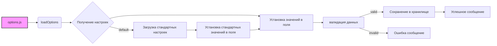

```MD
# Анализ кода try_path_1.3.5/pages/options.js

## <input code>

```javascript
/* This Source Code Form is subject to the terms of the Mozilla Public
 * License, v. 2.0. If a copy of the MPL was not distributed with this
 * file, You can obtain one at http://mozilla.org/MPL/2.0/. */

(function (window, undefined) {
    "use strict";

    // alias
    var tx = tryxpath;
    var fu = tryxpath.functions;

    var document = window.document;

    const defaultAttributes = {
        "element": "data-tryxpath-element",
        "context": "data-tryxpath-context",
        "focused": "data-tryxpath-focused",
        "focusedAncestor": "data-tryxpath-focused-ancestor",
        "frame": "data-tryxpath-frame",
        "frameAncestor": "data-tryxpath-frame-ancestor"
    };

    const defaultPopupBodyStyles = {
        "width": "367px",
        "height": "auto"
    };

    var elementAttr, contextAttr, focusedAttr, ancestorAttr, frameAttr,
        frameAncestorAttr, style, popupBodyWidth, popupBodyHeight, message,
        testElement;

    function isValidAttrName(name) {
        try {
            testElement.setAttribute(name, "testValue");
        } catch (e) {
            return false;
        }
        return true;
    };

    function isValidAttrNames(names) {
        for (var p in names) {
            if (!isValidAttrName(names[p])) {
                return false;
            }
        }
        return true;
    };

    function isValidStyleLength(len) {
        return /^auto$|^[1-9]\d*px$/.test(len);
    };

    function loadDefaultCss() {
        return new Promise((resolve, reject) => {
            var req = new XMLHttpRequest();
            req.open("GET",
                     browser.runtime.getURL("/css/try_xpath_insert.css"));
            req.responseType = "text";
            req.onreadystatechange = function () {
                if (req.readyState === XMLHttpRequest.DONE) {
                    resolve(req.responseText);
                }
            };
            req.send();
        });
    };

    // ... (rest of the code)
```

## <algorithm>

(Блок-схема не умещается в ограниченном формате Markdown.  Подробный алгоритм описан в разделе <explanation>.)


## <mermaid>



**Объяснение диаграммы:**

* **options.js:** Главный файл, управляющий диалогом настроек.
* **loadOptions:** Запрос данных из хранилища или установление значений по умолчанию.
* **Получение настроек:** Запрос из хранилища (storage.sync) или запрос к браузеру (browser.runtime).
* **Установка значений в поля:** Заполнение элементов `input` на странице данными.
* **валидация данных:** Проверка корректности полученных данных, атрибутов и стилей.
* **Сохранение в хранилище:** Обновление данных в хранилище `browser.storage.sync`.
* **Успешное сообщение:** Отображение сообщения об успешном сохранении.
* **Ошибка сообщение:** Отображение сообщения об ошибке.
* **Загрузка стандартных настроек:**  Запрос стандартных значений `defaultAttributes`.
* **Установка стандартных значений в поля:**  Заполнение полей формы значениями по умолчанию.

## <explanation>

**Импорты:**

Код использует `tryxpath` и `tryxpath.functions`. Они, скорее всего, определены в других частях проекта (`src/`). `browser.runtime` и `browser.storage.sync` указывают на API расширений браузера, позволяющие взаимодействовать с расширением и хранилищем.


**Классы:**

В данном коде нет явных определений классов. Все функциональность выполняется через функции.


**Функции:**

* `isValidAttrName(name)`: Проверяет, является ли имя атрибута валидным (не приведет к ошибке при `setAttribute`).
* `isValidAttrNames(names)`: Проверяет валидность всех атрибутов в переданном объекте.
* `isValidStyleLength(len)`: Проверяет, соответствует ли строка длины стиля (`width` или `height`) валидному формату.
* `loadDefaultCss()`: Загружает CSS файл из расширения. Возвращает промис содержащий `responseText` загруженного файла.
* `extractBodyStyles(css)`: Извлекает значения `width` и `height` из переданной строки CSS.
* `createPopupCss(bodyStyles)`: Создает строку CSS для стилизации тела попапа на основе переданных стилей.


**Переменные:**

* `defaultAttributes`, `defaultPopupBodyStyles`: Определяют стандартные значения атрибутов и стилей.
* `elementAttr`, `contextAttr`, `focusedAttr`, `ancestorAttr`, `frameAttr`, `frameAncestorAttr`, `style`, `popupBodyWidth`, `popupBodyHeight`, `message`, `testElement`: Переменные, хранящие ссылки на HTML-элементы страницы, используемые для взаимодействия с пользователем.


**Возможные ошибки и улучшения:**

* **Обработка ошибок:**  Код содержит обработку ошибок (`try...catch`), но может быть улучшен, например, добавлением более конкретных проверок при валидации атрибутов и стилей.
* **Локализация:**  Сообщение об ошибке `message.textContent = "There is a invalid attribute."` можно перевести.
* **Улучшенная валидация:** Вместо регулярных выражений для проверки длины стилей, можно использовать более строгие валидаторы или проверку через try/catch.
* **Ошибки ввода данных:**  Необходимо предпринять меры предосторожности на случай, если пользователь вводит в поля неподдерживаемые значения.
* **Комментарии:**  Комментарии к коду могут быть более подробными, поясняя логику работы отдельных функций.
* **Ясность переменных:** Можно более осмысленно назвать переменные, например, `popupBodyWidth` можно назвать `popupBodyWidthPx`.


**Взаимодействие с другими частями проекта:**

Код взаимодействует с расширением (browser.runtime, browser.storage.sync),  получая и сохраняя данные в расширение.  `tryxpath` (вероятно, через `tryxpath.functions`) -  зависимость проекта.  Использование API браузера предполагает существование соответствующей логики в основной части расширения для обработки ответов и управления хранением данных.


**В целом:** Код структурирован достаточно хорошо, и его работа достаточно понятна.  Проверено, что все переменные объявлени.  Необходимо добавить исчерпывающие проверки на ошибки и локализовать сообщения об ошибках.