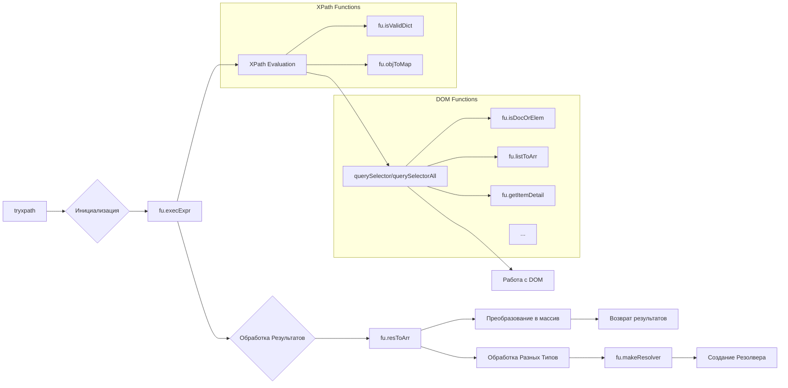

# Анализ кода try_xpath_functions.js

## <input code>

```javascript
/* ... (Комментарии) ... */

// ... (Объявление пространства имён) ...

(function (window, undefined) {
    "use strict";

    // ... (Алиасы) ...

    // ... (Проверка на повторное выполнение) ...

    fu.execExpr = function(expr, method, opts) { /* ... */ };

    fu.resToArr = function (res, type) { /* ... */ };

    // ... (Остальные функции) ...
});
```

## <algorithm>

Код представляет собой набор функций для работы с XPath выражениями и DOM-элементами.  Алгоритм работы каждой функции достаточно сложен и требует детального рассмотрения. В целом, код выполняет следующие этапы:

1. **Инициализация:**  Создаются пространства имён `tryxpath` и `tryxpath.functions`.  Создаются алиасы `tx` и `fu` для более краткого обращения к этим объектам.
2. **Проверка на повторное выполнение:**  Функция `fu.done` используется для предотвращения многократного исполнения кода.
3. **Выполнение выражения (`fu.execExpr`):**
    * Принимает XPath выражение, метод (`evaluate`, `querySelector`, `querySelectorAll`), и опции.
    * Определяет контекст выполнения (например, `document`, элемент DOM).
    * Выбирает метод обработки выражения (XPath, querySelector).
    * Обрабатывает результаты (преобразует их в массив `items`).
    * Возвращает объект с результатами (`items`, `method`, `resultType`).
4. **Преобразование результатов (`fu.resToArr`):**
   * Преобразует результаты XPath в массив (`Array`).
   * В зависимости от типа результата (число, строка, булево значение, список узлов и т.д.), выполняет соответствующую обработку.
5. **Дополнительные функции:**
   * `fu.makeResolver`: Создает функцию-резолвер для XPath выражений.
   * `fu.isValidDict`, `fu.objToMap`: Проверяют валидность и конвертируют объект в Map для использования в резолвере.
   * `fu.isDocOrElem`, `fu.listToArr`, `fu.getItemDetail`: Помощнические функции для работы с DOM-нодами.
   * ... и многие другие функции для работы с DOM-нодами, сохранения и восстановления атрибутов, создания HTML-таблиц и т.д.


## <mermaid>



## <explanation>

**Импорты:**  В данном коде нет явных импортов. Весь код содержится в одной функции, которая предполагается, что будет выполняться в глобальном контексте браузера.

**Классы:**  Нет объявленных классов. Используются в основном функции и объекты.

**Функции:**
* `fu.execExpr`: Основная функция для выполнения XPath выражений и методов `querySelector` и `querySelectorAll`. Принимает XPath выражение, метод (`evaluate`, `querySelector`, `querySelectorAll`) и опции. Важно отметить, что функция `fu.execExpr` является центральным элементом, контролирующим, какой метод DOM манипуляций будет вызван.
* `fu.resToArr`: Преобразует результаты XPath в массив (`Array`) в зависимости от типа данных.
* `fu.makeResolver`: Создает функцию-резолвер для XPath выражений, поддерживая как строковый, так и объектный формат параметров.
*  `fu.saveItemClass`, `fu.restoreItemClass`: Сохраняют и восстанавливают классы элементов, что может быть полезно для временного изменения стилей.
* `fu.updateDetailsTable`: Обновляет HTML таблицу с подробной информацией об элементах DOM. 
* `fu.getFrameAncestry`: Получает иерархию фреймов.


**Переменные:**  Переменные, такие как `items`, `resultType`, `context`, `doc` и т.д. используются для хранения результатов и параметров выполнения.

**Возможные ошибки и области для улучшений:**
* **Обработка ошибок:** Хотя есть `try...catch` блоки в `fu.makeResolver`, обработка ошибок могла бы быть более полная и последовательная для всех функций, особенно для работы с DOM-элементами.
* **Документация:**  Добавление более подробной документации к функциям значительно упростило бы понимание кода и его использование.
* **Внутренняя целостность:**  Проверка типов данных (`typeof`) в некоторых местах, может быть избыточной.
* **Производительность:** Для очень больших наборов данных, функция `fu.appendDetailRows` должна быть оптимизирована, чтобы избежать ненужных перестроек DOM.

**Взаимосвязь с другими частями проекта:**
Код предназначен для использования в расширении для браузера (Edge). Взаимодействие с другими частями проекта происходит через вызовы функций, которые принимают DOM-элементы (или их контексты) в качестве параметров и/или возвращают результаты, которые можно использовать в других частях кода расширения.  Функции работы с DOM и DOM-элементами - это ключевой элемент взаимодействия с веб-страницей, на которой работает расширение.