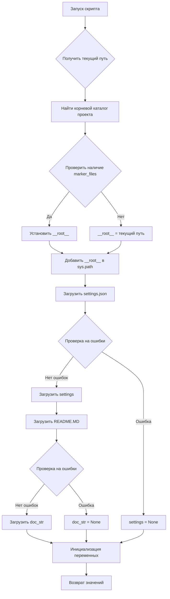

# Анализ кода файла hypotez/src/webdriver/edge/header.py

## <input code>

```python
## \file hypotez/src/webdriver/edge/header.py
# -*- coding: utf-8 -*-\
#! venv/Scripts/python.exe
#! venv/bin/python/python3.12

"""
.. module: src.webdriver.edge 
	:platform: Windows, Unix
	:synopsis:

"""


import sys
import json
from packaging.version import Version

from pathlib import Path
def set_project_root(marker_files=('__root__')) -> Path:
    """
    Finds the root directory of the project starting from the current file's directory,
    searching upwards and stopping at the first directory containing any of the marker files.

    Args:
        marker_files (tuple): Filenames or directory names to identify the project root.
    
    Returns:
        Path: Path to the root directory if found, otherwise the directory where the script is located.
    """
    __root__:Path
    current_path:Path = Path(__file__).resolve().parent
    __root__ = current_path
    for parent in [current_path] + list(current_path.parents):
        if any((parent / marker).exists() for marker in marker_files):
            __root__ = parent
            break
    if __root__ not in sys.path:
        sys.path.insert(0, str(__root__))
    return __root__


# Get the root directory of the project
__root__ = set_project_root()
"""__root__ (Path): Path to the root directory of the project"""


from src import gs

settings:dict = None
try:
    with open(gs.path.root / 'src' /  'settings.json', 'r') as settings_file:
        settings = json.load(settings_file)
except (FileNotFoundError, json.JSONDecodeError):
    ...

doc_str:str = None
try:
    with open(gs.path.root / 'src' /  'README.MD', 'r') as settings_file:
        doc_str = settings_file.read()
except (FileNotFoundError, json.JSONDecodeError):
    ...


__project_name__ = settings.get("project_name", 'hypotez') if settings  else 'hypotez'
__version__: str = settings.get("version", '')  if settings  else ''
__doc__: str = doc_str if doc_str else ''
__details__: str = ''
__author__: str = settings.get("author", '')  if settings  else ''
__copyright__: str = settings.get("copyrihgnt", '')  if settings  else ''
__cofee__: str = settings.get("cofee", "Treat the developer to a cup of coffee for boosting enthusiasm in development: https://boosty.to/hypo69")  if settings  else "Treat the developer to a cup of coffee for boosting enthusiasm in development: https://boosty.to/hypo69"
```

## <algorithm>

**Блок-схема:**



**Примеры:**

* Если `pyproject.toml`, `requirements.txt` и `.git` находятся в родительском каталоге текущего файла, `__root__` будет установлен на этот родительский каталог.
* Если ни один из указанных файлов не найден в иерархии каталогов, `__root__` будет установлен на каталог, где находится текущий файл.
* Данные из `settings.json` загружаются и используются для инициализации переменных `__project_name__`, `__version__`, `__author__`, `__copyright__`, `__cofee__`. Если `settings.json` не найден или содержит ошибки, соответствующие переменные инициализируются значениями по умолчанию.
* Данные из `README.MD` загружаются, если файл существует, иначе `doc_str` остается `None`.


## <mermaid>

```mermaid
graph LR
    subgraph "Функция set_project_root"
        A[Path(__file__)] --> B(resolve);
        B --> C[parent];
        C --> D{exists(marker)};
        D -- true --> E[__root__=parent];
        D -- false --> F(continue);
        E --> G[sys.path.insert];
        F --> G;
        G --> H[return __root__];
    end
    subgraph "Основная часть"
        I[set_project_root()] --> J[__root__];
        J --> K[open settings.json];
        K --> L{load json};
        L --> M[settings];
        K -- ошибка --> N[settings=None];
        M --> O[open README.MD];
        O --> P{read};
        P --> Q[doc_str];
        O -- ошибка --> R[doc_str=None];
        Q --> S[Инициализация переменных];
        N --> S;
        R --> S;
        S --> T[__project_name__, __version__, ...];
    end
    
    subgraph "Зависимости"
        K --> U[gs.path.root];
        U --> V[pathlib];
        T --> W[json];
        T --> X[packaging];
    end
```

## <explanation>

**Импорты:**

* `sys`:  Предоставляет доступ к системным параметрам, в том числе к пути поиска модулей (`sys.path`).
* `json`:  Обеспечивает работу с JSON-данными (загрузка и чтение `settings.json`).
* `packaging.version`:  Используется для работы с версиями пакетов (хотя в текущем коде не используется напрямую).
* `pathlib`: Обеспечивает работу с путями к файлам, использует методы для работы с путями (например, `Path(__file__).resolve().parent`)
* `src.gs`:  Вероятно, собственный модуль проекта, содержащий переменную `gs.path`, вероятно содержащую пути к важным файлам проекта.  Необходим дополнительный контекст для более детального анализа.

**Классы:**

Код не содержит явных определений классов.

**Функции:**

* `set_project_root(marker_files)`:  Ищет корневой каталог проекта, начиная от текущего файла и поднимаясь по иерархии каталогов, пока не найдет каталог, содержащий один из файлов в `marker_files`.  Возвращает путь к корневому каталогу.  Этот метод важен для корректной работы импорта модулей, когда файлы проекта лежат не в текущем каталоге.
    * **Аргументы:** `marker_files` — кортеж имен файлов, которые указывают на корневой каталог проекта.
    * **Возвращаемое значение:** `Path` — путь к корневому каталогу проекта.

**Переменные:**

* `__root__`: Путь к корневому каталогу проекта.  Важная переменная, используемая для корректного импорта модулей.
* `settings`: Словарь (dict) с настройками, загруженными из `settings.json`.  Может быть `None`, если файл не найден или содержит ошибки.
* `doc_str`: Строка с содержимым файла `README.MD`. Может быть `None`, если файл не найден или содержит ошибки.
* `__project_name__`, `__version__`, `__author__`, `__copyright__`, `__cofee__`: Строковые переменные, содержащие информацию о проекте, полученные из `settings`.  Используются для метаданных о проекте.

**Возможные ошибки и улучшения:**

* **Обработка ошибок:** Обработка `FileNotFoundError` и `json.JSONDecodeError` в блоках `try...except` уместна, но можно добавить более подробные сообщения об ошибках для лучшей диагностики проблем.
* **Улучшение читаемости:**  Имена переменных `__root__`, `__project_name__` могут быть изменены на более читаемые (например, `project_root`, `projectName`).
* **Переменная `MODE`:** Значение `MODE='dev'` не используется в коде и может быть удалено или объяснено, если это необходимо.
* **Стандартизация путей:**  Использование `Path` объекта для всех операций с файлами значительно улучшит устойчивость к различным операционным системам.
* **Документация:**  Добавление docstrings к переменным, которые содержат значения по умолчанию, или именам, которых не хватает может упростить понимание кода.
* **Модуль `gs`:** Подробное описание, что это за модуль, крайне важно. Вероятно, он предоставляет функции для работы с путями в проекте (`gs.path.root`).


**Цепочка взаимосвязей:**

Код в `header.py` отвечает за инициализацию метаданных проекта (`__project_name__`, `__version__`, и т. д.) и определение пути к корневому каталогу проекта (`__root__`),  которые необходимы для других частей проекта (например, импорта модулей).  Это является частью инициализации, которая должна происходить до работы каких-либо других компонентов. Зависимость `gs` (возможно, глобальная система) важна для определения пути к `settings.json` и `README.MD`.