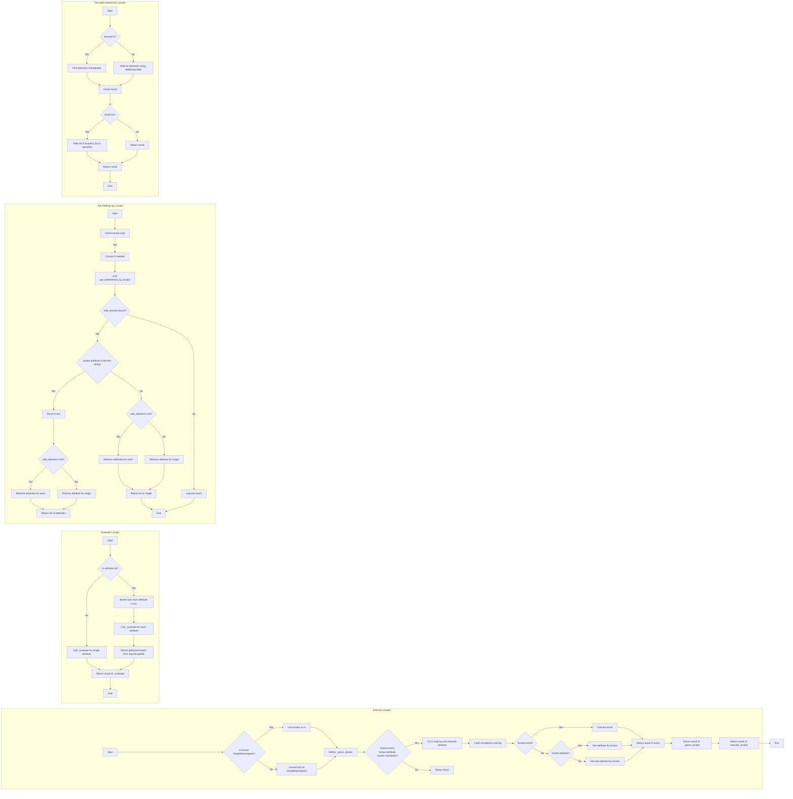

```MD
# <input code>

```python
## \file hypotez/src/webdriver/executor.py
# -*- coding: utf-8 -*-\
#! venv/Scripts/python.exe
#! venv/bin/python/python3.12

"""
.. module: src.webdriver 
	:platform: Windows, Unix
	:synopsis: The purpose of the `executor` module is to perform actions on web elements based on provided configurations, 
known as "locators." These configurations (or "locators") are dictionaries containing information on how to locate and interact with elements on a web page. The module provides the following functionalities:

1. **Parsing and Handling Locators**: Converts dictionaries with configurations into `SimpleNamespace` objects, 
allowing for flexible manipulation of locator data.

2. **Interacting with Web Elements**: Depending on the provided data, the module can perform various actions such as clicks, 
sending messages, executing events, and retrieving attributes from web elements.

3. **Error Handling**: The module supports continuing execution in case of an error, allowing for the processing of web pages 
that might have unstable elements or require a special approach.

4. **Support for Multiple Locator Types**: Handles both single and multiple locators, enabling the identification and interaction 
with one or several web elements simultaneously.

This module provides flexibility and versatility in working with web elements, enabling the automation of complex web interaction scenarios.


"""
# ... (rest of the code)
```

# <algorithm>

**Шаг 1:**  Проверка типа локатора.
- Если локатор является `SimpleNamespace`, то используется непосредственно.
- Если локатор является `dict`, то он конвертируется в `SimpleNamespace`.
- Если локатор не является ни `dict`, ни `SimpleNamespace`, то возвращается `None` (локатор-заглушка).
**Пример:** Если locator = {"by": "id", "selector": "myElement"}, он преобразуется в SimpleNamespace(by='id', selector='myElement').


**Шаг 2:** Проверка наличия атрибутов или селектора. Если ни то, ни другое не задано, возвращается из функции. 


**Шаг 3:**  Выполнение асинхронной функции `_parse_locator`.
- Обрабатывает локатор (`locator`).
-  Проверяет наличие событий, атрибутов и обязательных параметров.
- Обрабатывает исключения.
**Пример:** Если locator.event есть, выполняется `execute_event`. Если locator.attribute есть, выполняется `get_attribute_by_locator`. Если ни то, ни другое нету, выполняется `get_webelement_by_locator`

**Шаг 4:**  Выполнение event, attribute или поиска элемента.
- Если есть событие, выполняется `execute_event`.
- Если есть атрибут, выполняется `get_attribute_by_locator`.
- Если нет ни события, ни атрибута, выполняется поиск элемента `get_webelement_by_locator`.

**Шаг 5:**  Возвращается результат обработанного локатора.

**Пример перемещения данных:**
`execute_locator` принимает `locator`, передает его `_parse_locator`. `_parse_locator` обрабатывает локатор и возвращает результат.  `execute_locator` возвращает результат, полученный от `_parse_locator`.  Внутри `get_attribute_by_locator` может быть обращение к `get_webelement_by_locator`.


# <mermaid>



**Зависимости:**

* `selenium`: для работы с веб-драйвером (нахождения и взаимодействия с элементами веб-страницы).
* `asyncio`: для асинхронного программирования, что позволяет обрабатывать несколько задач параллельно.
* `re`: для работы с регулярными выражениями.
* `time`: для работы со временем.
* `dataclasses`: для создания данных.
* `enum`: для создания перечислений.
* `pathlib`: для работы с путями к файлам.
* `typing`: для типов данных.
* `header`: Возможно, предоставляет функции для работы с заголовками запросов.
* `gs`: Вероятно, модуль для работы с Google Sheets.
* `logger`: модуль для логирования.
* `jjson`: модуль для работы с JSON (возможно, для чтения конфигураций или данных).
* `printer`: модуль для красивого вывода текста.
* `image`: модуль для работы со скриншотами.

**Цепочка взаимосвязей:**

`executor` использует `selenium` для работы с веб-элементами.  Он использует `asyncio` для асинхронной обработки.  `logger` используется для вывода информации об ошибках и других событиях.  Конфигурации (локейторы) вероятно считываются из `jjson` или аналогичного формата, и данные передаются из `gs` или других компонентов в `locator` для обработки.


# <explanation>

**Импорты:**

Импортируются различные модули для работы с Selenium, асинхронностью, регулярными выражениями, обработкой данных, логированием и скриншотами.  Обратите внимание на импорт `StaleElementReferenceException`.
Они используются для работы с веб-драйвером, асинхронных операций, обработки текста, работы с временем, данными, логированием,  и работой со скриншотами.
`src.gs` вероятно, связан с обработкой Google Sheets. `src.logger` — модуль для логирования. `src.utils` — подмодуль, содержащий функции для работы с JSON, отображением данных и скриншотами.


**Классы:**

`ExecuteLocator`: Обрабатывает локаторы для веб-элементов с использованием Selenium.  Ключевые атрибуты:
- `driver`: экземпляр веб-драйвера.
- `actions`: экземпляр `ActionChains` для управления действиями с веб-элементами.
- `by_mapping`: словарь для преобразования строк в методы `By`.
- `mode`: режим работы (debug/dev).

**Функции:**

* `execute_locator`:  Выполняет действия с веб-элементом по заданному локатору.  Принимает данные о локаторах, опциональные таймауты и другие параметры. Возвращает результат выполнения.
* `_parse_locator`:  Помощниковая функция для обработки локатора.
* `evaluate_locator`:  Обрабатывает атрибуты локатора.
* `get_attribute_by_locator`: извлекает атрибут у веб-элемента по локатору.
* `get_webelement_by_locator`: находит веб-элемент по локатору.
* `get_webelement_as_screenshot`: делает скриншот найденного веб-элемента.
* `execute_event`: выполняет различные события (клик, отправка текста, паузы).
* `send_message`: отправляет сообщение в поле ввода.
    * `type_message`:  Типизирует сообщение.

**Переменные:**

Переменные, такие как `timeout`, `typing_speed`,  `locator`, хранят значения, необходимые для выполнения заданных действий.


**Возможные ошибки и улучшения:**

1. **Обработка ошибок:** В коде есть много блоков `try...except`, что хорошо для обработки потенциальных исключений.  Однако, можно более четко определить, какие исключения нужно ловить и как они обрабатываются.
2. **Использование ActionChains:**  Код использует `ActionChains`, но в некоторых местах явно не используется `await`. Это может привести к синхронным блокировкам.  Рекомендуется использовать `await` для методов `ActionChains` и других асинхронных операций.
3. **Проверка locator.attribute:**  В `get_attribute_by_locator`, можно добавить более подробную проверку на корректность данных  `locator.attribute` перед парсингом в словарь.
4. **Прозрачность:** Необходимо документировать все локаторы и переменные для лучшей читаемости и понимания кода.
5. **Улучшение структуры:** Возможно, некоторые функции можно разделить для лучшей организации кода и повторного использования.
6. **Таймауты:** Рекомендуется использовать более универсальные/адаптивные таймауты.  Вместо фиксированного `timeout`, возможно, лучше использовать значение по умолчанию, которое можно переопределять в локаторах.
7. **Избегать использования `...`:**  В коде слишком часто встречается использование `...`.  Рекомендуется явно обрабатывать все возможные исключения.

В целом, код хорошо структурирован и читаем. Но для улучшения рекомендуется уделить внимание обработке ошибок и повысить его надежность.