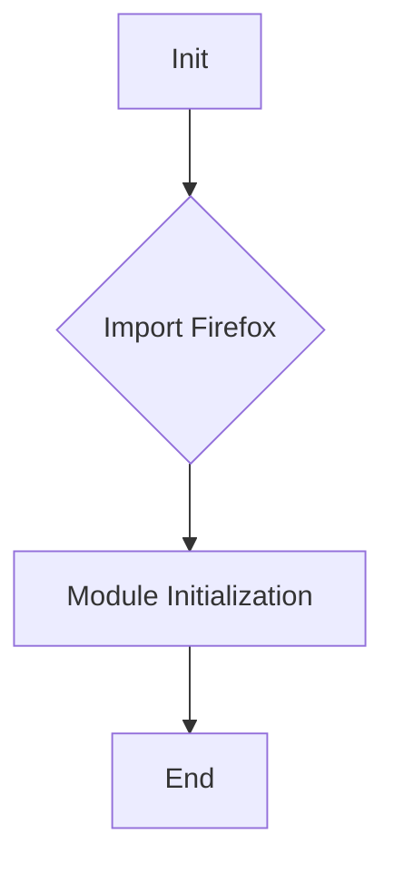
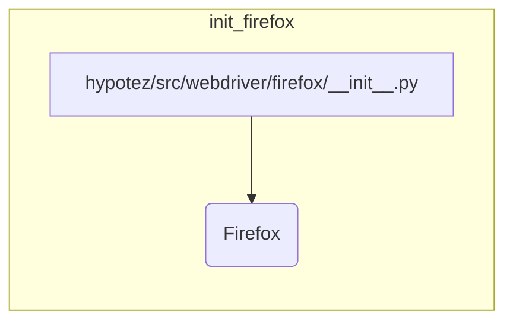

# <input code>

```python
## \file hypotez/src/webdriver/firefox/__init__.py
# -*- coding: utf-8 -*-\
#! venv/Scripts/python.exe
#! venv/bin/python/python3.12

"""
.. module: src.webdriver.firefox 
	:platform: Windows, Unix
	:synopsis:

"""
MODE = 'dev'


from .firefox import Firefox
```

# <algorithm>



**Описание алгоритма:**

Модуль `hypotez/src/webdriver/firefox/__init__.py` представляет собой инициализирующий модуль для подсистемы управления браузером Firefox.  Алгоритм прост:

1. **Инициализация:** Модуль импортирует класс `Firefox` из подмодуля `firefox`.
2. **Возвращение:** Модуль неявно возвращает  объект `Firefox` (если импортируется).

**Примеры:**

* При импорте `from hypotez.src.webdriver.firefox import Firefox` в другой части кода, будет доступен класс `Firefox`.  


# <mermaid>



**Описание диаграммы:**

Диаграмма показывает, что модуль `hypotez/src/webdriver/firefox/__init__.py` импортирует класс `Firefox` из подмодуля `firefox`.  Этот импорт является основной операцией, необходимой для использования возможностей драйвера Firefox в других модулях проекта.

# <explanation>

**Импорты:**

* `from .firefox import Firefox`:  Этот импорт извлечёт класс `Firefox` из файла `hypotez/src/webdriver/firefox/firefox.py`.  `.` указывает на поиск модуля `firefox` в текущем директории.  Это стандартный способ импорта подмодулей.  Подразумевается, что `firefox.py` содержит определение класса `Firefox`, связанного с управлением веб-драйвером Firefox.  Эта связь критически важна для корректного использования веб-драйвера в других частях проекта.

**Классы:**

* `Firefox`: Этот класс, определённый в `firefox.py`,  предположительно отвечает за инициализацию и управление экземпляром WebDriver для браузера Firefox. Входные данные в этот класс не показаны в этом фрагменте кода, но они должны поступать из других частей проекта.

**Функции:**

В данном фрагменте кода нет функций.

**Переменные:**

* `MODE = 'dev'`: Эта строковая переменная, вероятно, определяет режим работы системы.  `dev` указывает на режим разработки. Значения этой переменной используются в других частях проекта для настройки поведения программы.


**Возможные ошибки и улучшения:**

* **Отсутствие документации для `Firefox`:** Фрагмент кода не содержит никаких деталей о методах и аргументах класса `Firefox`.  Очень желательно добавить docstrings для ясности использования.
* **Неясная цель `MODE`:** В отсутствие дальнейшего кода, сложно оценить назначение `MODE`.  Рекомендуется пояснить его использование в документации.
* **Отсутствие тестов:** Не показаны никакие тесты для класса `Firefox`, что снижает уверенность в его правильности и корректности работы.

**Взаимосвязь с другими частями проекта:**

Этот модуль выступает в роли интерфейса для работы с драйвером Firefox.  Другие части проекта, которые используют веб-драйвер, будут импортировать класс `Firefox` из этого модуля для инициализации и управления экземпляром браузера.  Возможно, в проекте есть отдельные модули для тестирования, которые впоследствии будут использовать созданный `Firefox` для автоматизации тестов.