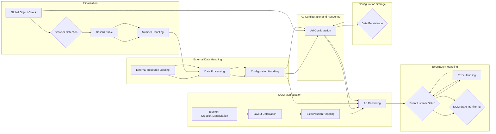

# Анализ кода

```javascript
(function(sttc){'use strict';var aa=typeof Object.defineProperties=="function"?Object.defineProperty:function(a,b,c){if(a==Array.prototype||a==Object.prototype)return a;a[b]=c.value;return a};function ba(a){a=["object"==typeof globalThis&&globalThis,a,"object"==typeof window&&window,"object"==typeof self&&self,"object"==typeof global&&global];for(var b=0;b<a.length;++b){var c=a[b];if(c&&c.Math==Math)return c}throw Error("Cannot find global object");}
// ... (остальной код)
```

## <algorithm>

(Схема блок-схемы не может быть отображена в текстовом формате. Необходимо использовать инструмент визуализации блок-схем.)

В целом, код реализует сложную систему для обработки и управления рекламными объявлениями на веб-странице.  Алгоритм включает:

1. **Инициализация и проверка окружения**: Функции `ba`, `ja`, `ka`, `la` и др. проверяют доступность глобальных объектов (например, `window`, `self`) и конфигурационных флагов.

2. **Обработка кодировок**: Функция `$a` создает таблицу соответствий для различных баз данных. Функция `bb` декодирует данные из base64.

3. **Обработка чисел**: Функции `fb`, `hb`, `jb` и др. работают с числами с плавающей точкой, включая обработку больших целых чисел и преобразование между различными форматами.

4. **Создание и работа с объектами**: Функции `Yb`, `$b`, `bc`, `fc`, `gc`, `kc`, `mc` и др. выполняют разнообразные операции с массивами и объектами, включая копирование, преобразование и глубокое копирование.

5. **Работа с DOM**: Функции `Jd`, `Id`, `Si` и т.д.  обрабатывают элементы DOM (HTML-документ), определяют размеры и позиции элементов, манипулируют HTML-контентом.

6. **Анализ пользовательского агента**: Функции `Fa`, `Ia`, `r` и др. анализируют данные браузера (например, `navigator.userAgent`) для определения платформы и браузера.

7. **Загрузка и обработка данных**: Функции `le`, `ne`, `pe`, `oe` и др. отвечают за загрузку внешних ресурсов (JavaScript, изображения), обработку запросов, получение данных.

8. **Обработка конфигурации**: Функции `kn`, `ln`, `on`, `pn`, `sn`, `tn` и др. обрабатывают и используют конфигурацию рекламных объявлений.

9. **Генерация HTML**: Функции `wq`, `zo`, `tn`, `Wn` и др. генерируют и вставляют HTML-код для рекламных объявлений, включая настройку стилей и динамическое изменение размеров.

10. **Обработка ошибок и событий**: Функции `wa`, `Hb`, `Ib`, `dk`, `fl`, `vq`, `rq` и др. отвечают за обработку ошибок, событий (например, `DOMContentLoaded`) и уведомления.

11. **Обновление и запись данных**: Функции `Hk`, `Mp` и др. отвечают за обновление глобального состояния (например, хранение настроек в localStorage)

12. **Управление таймерами и задержками**: Функции `setTimeout`, `setInterval` и другие служат для выполнения операций с заданными задержками.

13. **Обработка запросов**: Функции `kg`, `Sn` и др. реализуют HTTP-запросы для получения данных из удаленных источников.

Этот алгоритм, и код в целом, очень сложный и содержит множество деталей, которые требуют дальнейшего изучения.


## <mermaid>




## <explanation>

**Импорты**:
- Код использует множество импортов, которые являются частями Closure Library.  Они обеспечивают общие функции для работы с объектами, массивами, строками, DOM, числами, обработкой ошибок и т.д.

**Классы**:
- `M`, `tf`, `qe`, `We`, `Ze`, `Qe`, `We`, `Be`, `Ee`, `Ke`, `Qe`, `rn`, `Y`, `jo`, `lo`, `so`, `bp`, `Ag`, `Qm`, `dm`, `Fl`, `md`, `Tl`, `Vl`, `Sk`, `kh`, `sh`, `yh`, `Cp`, `dq`,  и многие другие - все это классы, которые представляют различные компоненты системы управления рекламными объявлениями.  Каждый класс отвечает за определенный набор функций и данных.

**Функции**:
- Функции `y`, `z`, `yc`, `Ec`, `B`, `Fc`, `Gc`, `Lc`, `xc`, `Mc`, `D`, `E`, `Oc`, `Pc`, `Qq`, `No`, `Mo`, `tn` и многие другие имеют разные параметры и возвращаемые значения, управляющие различными аспектами работы с рекламными объявлениями.  Например,  функции `y` и `z` изменяют внутренние структуры данных,  `yc` и `Ec` обрабатывают массивы, `B` работает с числами и т.д.  Важно обратить внимание на то, что большое количество функций в коде делает его сложным для анализа и понимания без контекста.

**Переменные**:
- Большое количество переменных используется для хранения данных о рекламных объявлениях, конфигурации, DOM-элементов и т.д.  Переменные различных типов (числа, строки, массивы, объекты) используются в разных функциях для передачи данных.

**Возможные ошибки и улучшения**:
- **Сложность кода**: код чрезвычайно сложен и содержит множество вложенных функций, классов и переменных, что усложняет его понимание.  Для улучшения кода, целесообразно рассмотреть декомпозицию на более мелкие, легко понимаемые модули и функции.
- **Отсутствие комментариев**: отсутствие подробных комментариев затрудняет понимание логики и назначения различных частей кода. Добавление комментариев существенно улучшит читаемость и поддержку кода.
- **Неявные зависимости**: код сильно зависит от внешних библиотек (Closure Library), поэтому важно уточнить зависимости и их версия для воспроизведения.


**Взаимосвязи с другими частями проекта**:

- Код зависит от внешних библиотек (Closure Library), а также от различных функций и классов, определённых внутри файла.  Для полной картины необходим весь проект.


**Заключение**:

Код представляет собой очень сложную систему управления рекламными объявлениями, содержащую множество деталей. Для более подробного анализа, важно иметь доступ к полному коду проекта, а также к документации Closure Library.  Для улучшения кода рекомендуется декомпозиция, добавление комментариев и использование более понятных имён переменных и функций.