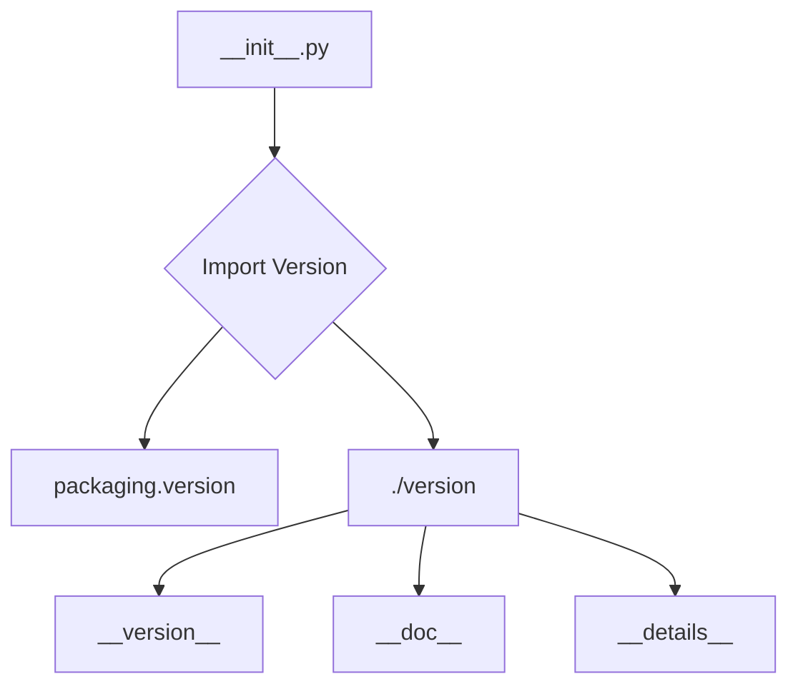

# <input code>

```python
## \file hypotez/src/webdriver/firefox/_examples/__init__.py
# -*- coding: utf-8 -*-\
#! venv/Scripts/python.exe
#! venv/bin/python/python3.12

"""
.. module: src.webdriver.firefox._examples 
	:platform: Windows, Unix
	:synopsis:

"""


"""
	:platform: Windows, Unix
	:synopsis:

"""


"""
	:platform: Windows, Unix
	:synopsis:

"""


"""
  :platform: Windows, Unix

"""
"""
  :platform: Windows, Unix
  :platform: Windows, Unix
  :synopsis:
"""
  
""" module: src.webdriver.firefox._examples """


""" Firefox examples """


from packaging.version import Version
from .version import __version__, __doc__, __details__
```

# <algorithm>

Этот код представляет собой файл инициализации (`__init__.py`) модуля `_examples` внутри пакета `firefox` в `webdriver` подпакете `src` проекта.  

По сути, он  не содержит логики выполнения, а скорее служит для организации и импорта связанных файлов.  Алгоритм работы сводится к импорту необходимых модулей.

Пошаговая блок-схема:

1. **Импорт:**  Модуль импортирует класс `Version` из `packaging.version` и переменные `__version__`, `__doc__`, `__details__` из `./version`.

# <mermaid>



# <explanation>

**Импорты:**

- `from packaging.version import Version`: Импортирует класс `Version` из модуля `packaging.version`.  Этот модуль, скорее всего, используется для работы с версиями пакетов и библиотек.  Его использование в контексте `firefox` указывает, что проект имеет дело с управляемыми версиями компонентов.  Связь с `src` проявляется в том, что `packaging` является внешней зависимостью проекта.

- `from .version import __version__, __doc__, __details__`:  Импортирует переменные `__version__`, `__doc__`, `__details__` из модуля `version.py` в той же папке (`./version`). Этот импорт подразумевает, что `version.py` содержит информацию о версии, документации и других деталях модуля `_examples`. Это типичная практика для структурированного хранения метаданных о модуле.  Связь с `src` проявляется в том, что `version.py` является частью иерархии пакетов проекта.


**Классы:**

Нет явных определений классов в данном коде.


**Функции:**

Нет функций в этом коде.


**Переменные:**

- ``:  Переменная, скорее всего, конфигурационная, используемая для обозначения среды разработки ('dev') или других состояний. Это полезно для управления поведением программы в разных окружениях (разработка, тестирование, производство).  Это обычная практика в Python.

**Возможные ошибки или области для улучшений:**

- **Комментарии:** Комментарии в стиле `"""Docstrings"""` часто пустые, так что это область для улучшений. Добавление точных описаний, параметров и возвращаемых значений для импортируемых элементов будет повышать читабельность.
- **Комментарии:** Многочисленные пустые строки и комментарии типа `"""\n"""`. Это может быть избыточным и потенциально затруднять чтение кода.  Убрать лишние, не содержащие информации, строки или улучшить содержательность.


**Взаимосвязь с другими частями проекта:**

Модуль `_examples` вероятно содержит примеры использования webdriver для управления браузером Firefox, так как он находится в папке `firefox` подпакетов `webdriver`, а  метаданные о версии и документации хранятся в `version.py`.  Этот модуль зависит от `packaging`, который является внешним пакетом.  Взаимосвязи с другими частями проекта (например, какие-то классы или функции) неизвестны без доступа к остальной части кодовой базы.