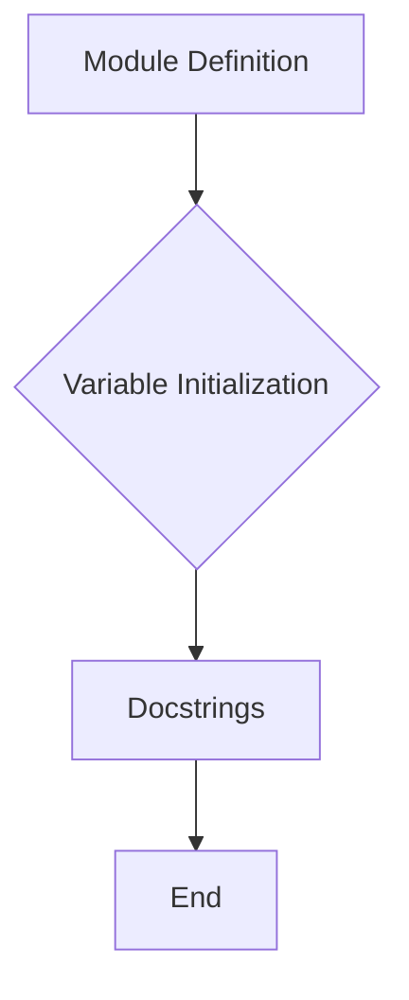

# <input code>

```python
## \file hypotez/src/webdriver/firefox/_examples/version.py
# -*- coding: utf-8 -*-\n
#! venv/bin/python/python3.12

"""
.. module: src.webdriver.firefox._examples 
	:platform: Windows, Unix
	:synopsis:

"""


"""
	:platform: Windows, Unix
	:synopsis:

"""


"""
	:platform: Windows, Unix
	:synopsis:

"""


"""
  :platform: Windows, Unix

"""
"""
  :platform: Windows, Unix
  :platform: Windows, Unix
  :synopsis:
"""
  
""" module: src.webdriver.firefox._examples """


"""
- `__version__`: This variable holds the version of the module or package.
- `__name__`: Contains the name of the module. If the script is being run directly, the value will be `"__main__"`.
- `__doc__`: The module's documentation string.
- `__details__`: This variable likely contains additional details about the module, but the exact purpose depends on the specific module or package.
- `__annotations__`: Contains type annotations for variables and functions in the module.
- `__author__`: The name(s) of the author(s) of the module.
"""
__name__:str
__version__="3.12.0.0.0.4"
__doc__:str
__details__:str="Details about version for module or class"
__annotations__

__author__='hypotez '
```

# <algorithm>

Этот код представляет собой определение модуля (файла `.py`) и инициализацию нескольких переменных.  Алгоритм работы заключается в объявлении констант, строк документации, и переменных, отвечающих за версию, имя, описание и автора модуля.  В данном случае, нет циклов или условий, поэтому пошаговая блок-схема будет простой.

1. **Объявление переменных:**
   - `MODE`:  Присваивается значение 'dev'.
   - `__version__`: Присваивается значение "3.12.0.0.0.4".
   - `__details__`: Присваивается значение "Details about version for module or class".
   - `__author__`: Присваивается значение 'hypotez '.
   - Остальные переменные имеют тип `str` или `None`.

2. **Строки документации:**
   - Документируются разные части модуля, указываются платформа и краткое описание.
   - Много строковых литералов, которые задают метаданные модуля.

Пример:


```

__version__ = "3.12.0.0.0.4"
```

# <mermaid>



**Объяснение диаграммы:**

Модуль (файл `.py`) определяется (A). После этого происходит инициализация переменных (B), включая строки документации (C).  Процесс завершается (D).  Нет сложных зависимостей, все происходит в пределах одного файла.


# <explanation>

**Импорты:**

В коде отсутствуют импорты. Все переменные и константы определены непосредственно в текущем файле.  Это означает, что модуль является автономным и не зависит от других файлов.

**Классы:**

Нет объявленных классов.

**Функции:**

Нет функций.

**Переменные:**

- `MODE`, `__version__`, `__details__`, `__author__`, `__name__`, `__doc__`, `__annotations__`:  Эти переменные являются константами, хранящими информацию о модуле.  Типы данных переменных - строки.  `__annotations__` – вероятно, будет заполняться позднее (возможно, через аннотации типов) при выполнении кода.


**Возможные ошибки или области для улучшений:**

- **Непонятные значения:**  `__details__` содержит лишь фрагмент информации, нет конкретики, для чего нужна переменная.  Возможно, значение должно быть уточнено или прокомментировано.

- **Избыточность:** Строки документации повторяют информацию, которая может быть более точно и лаконично описана в одном месте.

- **Отсутствие функциональности:** Код чисто описательный, не выполняет каких-либо вычислений или действий.  В нем отсутствует логика, которая могла бы обработать данные или вызвать другие модули.  Следует рассмотреть, что этот файл должен представлять.


**Цепочка взаимосвязей:**

Этот модуль `version.py` скорее всего является частью проекта `hypotez`, который имеет структуру с подмодулями.   `src` likely представляет собой корневую директорию проекта, а `webdriver/firefox/_examples` - директория, содержащая примеры или вспомогательные файлы.  Без дополнительного контекста проекта сложно сказать, как именно этот файл взаимодействует с другими компонентами.