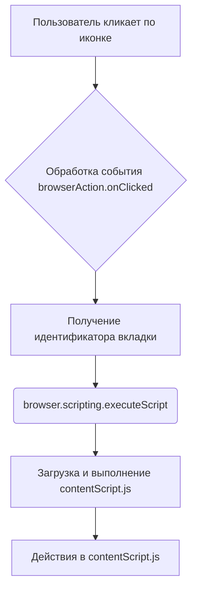

```MD
# Анализ кода background.js

## <input code>

```javascript
// background.js
\
browser.browserAction.onClicked.addListener((tab) => {
    browser.scripting.executeScript({
        target: { tabId: tab.id },
        files: ["contentScript.js"],
    });
});
```

## <algorithm>

**Пошаговая блок-схема:**

1. **Слушатель события `browserAction.onClicked`:**  Код регистрирует слушатель на событие `browserAction.onClicked`.  Это событие срабатывает, когда пользователь кликает по иконке расширения в адресной строке браузера.
   * **Пример:** Пользователь кликает по иконке расширения на странице.

2. **Функция `addListener`:**  При срабатывании события вызывается функция `addListener` с аргументом `tab`. `tab` - это объект, содержащий информацию о текущей вкладке, включая её идентификатор (`id`).
   * **Пример:**  `tab` содержит данные о текущей вкладке, например: `tab = { id: 123 }`.

3. **`browser.scripting.executeScript`:**  Выполняется функция `executeScript`, которая отправляет скрипт в контекст текущей вкладки.
   * **Аргументы:**
      * `target`: объект, определяющий, в какой вкладке выполнить скрипт. `tabId: tab.id` указывает, что скрипт должен выполняться в вкладке с идентификатором, полученным из объекта `tab`.
      * `files`: массив путей к файлам скриптов, которые нужно выполнить. В данном случае, это `"contentScript.js"`.
   * **Пример:** `browser.scripting.executeScript({ target: { tabId: 123 }, files: ["contentScript.js"] });`


4. **Выполнение `contentScript.js`:**  `contentScript.js` загружается и выполняется в контексте указанной вкладки.

## <mermaid>



## <explanation>

**Импорты:**

Код не содержит импортов. Все необходимые функции и объекты предоставляются API браузера.

**Классы:**

Нет классов.

**Функции:**

* **`browser.browserAction.onClicked.addListener((tab) => { ... });`:** Эта функция служит слушателем события `browserAction.onClicked`.  Она принимает один аргумент `tab`, который содержит информацию о вкладке, и не возвращает значений.  Внутри обрабатывается событие нажатия инициируется выполнение `browser.scripting.executeScript`.

* **`browser.scripting.executeScript({target: { tabId: tab.id }, files: ["contentScript.js"]});`:**  Эта функция выполняет скрипт в контексте текущей вкладки. Она принимает объект с настройками,  включая `tabId`, определяющий целевую вкладку, и массив путей к скриптам `files`.  Функция не возвращает никаких значений.

**Переменные:**

Единственная переменная - `tab`, которая передается как аргумент функции `addListener`. Она содержит информацию о вкладке браузера, в частности `tab.id`, который используется для идентификации вкладки.

**Возможные ошибки и улучшения:**

* **Отсутствие обработки ошибок:** Код не содержит проверки на ошибки (например, проверку на существование `tab.id`).  Если `tab.id` некорректен, `executeScript` может не сработать или выбросить ошибку. Необходимо добавить обработку ошибок.

* **Отсутствие логирования:** Отсутствие логирования затрудняет отладку. Добавление `console.log()` или аналогичных инструментов для вывода информации о процессе будет полезно в случае проблем.

* **`contentScript.js` не показан:**  Не показано содержимое `contentScript.js`.  Его наличие и корректность необходимо проверить.

**Взаимосвязи с другими частями проекта:**

`background.js` управляет взаимодействием расширения с веб-страницей. `contentScript.js` является скриптом, который будет выполняться в контексте вкладки.  Очевидно, `contentScript.js` имеет функциональность, которая выполняется в ответ на нажатие на значок расширения,  связанную с данной страницей.

**Заключение:**

Код является простым, но эффективным фрагментом для обработки кликов на значке расширения.  Он запускает `contentScript.js` в целевой вкладке. Однако, для повышения надежности и отладки стоит добавить обработку ошибок и логирования.