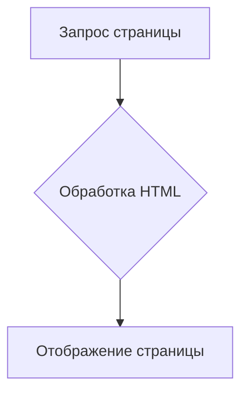
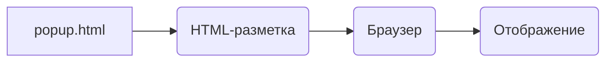

```MD
# Анализ кода popup.html

## <input code>

```html
## \file hypotez/src/webdriver/firefox/extentions/test_extention - Copy/html/popup.html
# -*- coding: utf-8 -*-
#! venv/Scripts/python.exe

""" module: src.webdriver.firefox.extentions.test_extention - Copy.html """
MODE = 'debug'
<!DOCTYPE html>
<html lang="en">
<head>
    <meta charset="UTF-8">
    <meta name="viewport" content="width=device-width, initial-scale=1.0">
    <title>Hypotez</title>
</head>
<body>
    <h1>Hypotez</h1>
    <p>Привет, Это Давидка. Я обучаю модель</p>
</body>
</html>
```

## <algorithm>

Код представляет собой простую HTML-страницу, которая отображается в всплывающем окне расширения Firefox. Алгоритм заключается в отображении этой страницы. Нет никаких функций или классов, которые бы выполняли логику.

**Блок-схема:**



**Примеры:**

- Запрос страницы: Пользователь открывает расширение, которое вызывает загрузку HTML-файла.
- Обработка HTML: Браузер парсит HTML-код и преобразует его в визуальную структуру.
- Отображение страницы:  Браузер отображает заголовок "Hypotez", и текст "Привет, Это Давидка. Я обучаю модель".

## <mermaid>



**Объяснение диаграммы:**

* `popup.html`: Сам HTML-файл.
* `HTML-разметка`:  Код HTML, который парсится браузером.
* `Браузер`: Браузер, который отображает страницу.
* `Отображение`: Визуальное представление страницы в браузере.

В этой диаграмме нет сложных зависимостей, так как HTML-файл просто отображается в браузере.

## <explanation>

**Импорты:**

Файл `popup.html` — это HTML-документ.  В нем нет импорта модулей Python.  `#! venv/Scripts/python.exe` — это устаревшая конструкция, указывающая интерпретатор Python, который должен быть использован (сейчас не применяется).

**Классы:**

В коде отсутствуют классы.

**Функции:**

Нет функций.  Всё происходит на уровне HTML-разметки.

**Переменные:**

`MODE = 'debug'` — глобальная переменная, но её значение в контексте HTML не используется.

**Возможные ошибки и улучшения:**

- **Неявный импорт `venv`:**  Строка `#! venv/Scripts/python.exe`  предполагает, что  `venv`  установлен и доступен в системе. Неясно, есть ли эта переменная окружения в самом файле.
- **Отсутствие связи с другим кодом:**  Файл `popup.html` — это просто HTML-представление, которое не содержит логики.  Связь с другими частями проекта (если таковые имеются) —  через события или другие механизмы, вызывающие его рендеринг (например, код в расширении Chrome, javascript).  Для связи с JS кодом в расширении нужна работа с API расширений браузера.
- **Непонятно назначение `MODE`:**  Переменная `MODE` без дальнейшего использования в коде не имеет значения.
- **Отсутствие JavaScript-связи:** HTML-документ не имеет кода на JavaScript для взаимодействия с другими частями расширения.


**Цепочка взаимосвязей:**

`popup.html`  отображается в контексте расширения Firefox.  Связь с другими частями проекта осуществляется через JavaScript-код в расширении, который реагирует на действия пользователя.  Этот Javascript-код взаимодействует с HTML-элементами `popup.html`.  Нет непосредственной зависимости от других модулей.

```
   +-----------------+
   |  popup.html     |
   +-----------------+
       |
       V
   +-----------------+
   | JavaScript код  |  <--- Управление отображением
   | расширения      |
   +-----------------+
```
```