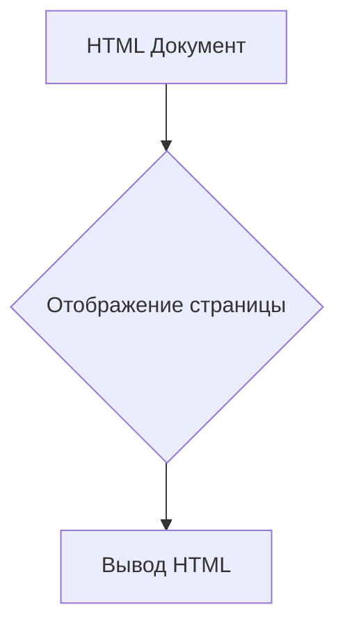
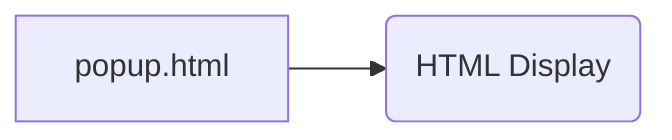

# Анализ кода popup.html

## <input code>

```html
## \file hypotez/src/webdriver/firefox/extentions/test_extention/html/popup.html
# -*- coding: utf-8 -*-\


""" module: src.webdriver.firefox.extentions.test_extention.html """
MODE = 'debug'
<!DOCTYPE html>
<html lang="en">
<head>
    <meta charset="UTF-8">
    <meta name="viewport" content="width=device-width, initial-scale=1.0">
    <title>Hypotez</title>
</head>
<body>
    <h1>Hypotez</h1>
    <p>Привет, Это Давидка. Я обучаю модель</p>
</body>
</html>
```

## <algorithm>

Поскольку предоставленный код - это HTML-документ, алгоритм его работы - это просто отображение структуры страницы.  Нет циклов или условных операторов, влияющих на динамическое поведение.



Примеры:
- Входные данные: HTML-код.
- Выходные данные: Отображенная в браузере веб-страница с заголовком "Hypotez" и абзацем текста.


## <mermaid>



Эта диаграмма отражает, что файл `popup.html` создает HTML-код, который затем отображается браузером. Зависимости здесь - это стандартные веб-технологии (HTML, CSS, JavaScript) в рамках браузера. Нет зависимостей от внешних библиотек или файлов внутри проекта, описанных в коде.

## <explanation>

Этот файл представляет собой HTML-шаблон, который определяет структуру веб-страницы.

**Импорты:**

В этом файле нет импортов, поскольку это чисто HTML-код.  Код `# -*- coding: utf-8 -*-\` и `` вероятно, добавлены для работы в системе с интерпретатором Python, но не являются частью HTML.  Они не относятся к Python-зависимостям этого проекта.

**Классы:**

Нет определений классов.

**Функции:**

Нет определений функций.

**Переменные:**

`MODE = 'debug'` — глобальная переменная, вероятно, для настройки режима работы (debug или production). Это не критично для работы HTML, но может быть использована в связанных файлах (например, JavaScript).

**Возможные ошибки и улучшения:**

* Не хватает связи с внешними файлами (CSS, JavaScript) или внешними ресурсами. Если приложение должно динамически изменять содержимое страницы, потребуется JavaScript, чтобы добавить взаимодействие.
* Не указан `src`, `href`, `srcset` и другие атрибуты для картинок, если таковые присутствуют.
* Отсутствие каких-либо метаданных, например, метатегов, специфичных для поисковых систем.

**Цепочка взаимосвязей с другими частями проекта:**

Этот `popup.html` является частью расширения Firefox. Его функция - вывести интерфейс для пользователя.  Связь с остальной частью проекта обеспечивается через JavaScript, который может быть сопряжен с этим HTML-файлом.  Этот JavaScript-код будет находиться в другом файле (скорее всего, в папке `js` или подобной), и он будет взаимодействовать с внутренней логикой расширения.  Например, JavaScript может отправлять данные в backend, обрабатывать полученные данные и обновлять `popup.html` на основе этого результата.
```