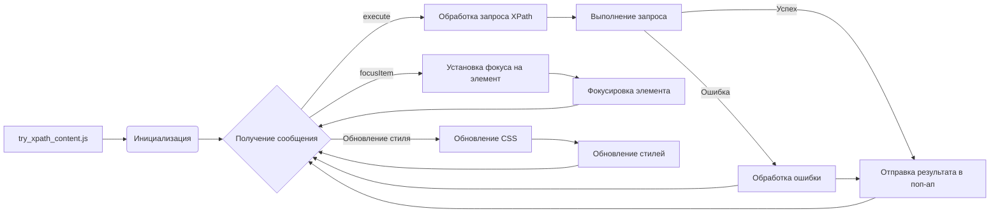

# Анализ кода try_xpath_content.js

## <input code>

```javascript
/* ... (Многострочный комментарий) ... */

(function (window, undefined) {
    "use strict";

    // alias
    var tx = tryxpath;
    var fu = tryxpath.functions;

    // prevent multiple execution
    if (tx.isContentLoaded) {
        return;
    }
    tx.isContentLoaded = true;

    // ... (Определения констант и переменных) ...

    // ... (Функции setAttr, setIndex, isFocusable, focusItem, ...) ...

    // ... (Функции setMainAttrs, restoreAttrs, resetPrev, ...) ...

    // ... (Функции makeTypeStr, updateCss, ...) ...

    // ... (Функции getFrames, parseFrameDesignation, traceBlankWindows, ...) ...

    // ... (Функции handleCssChange, findFrameByMessage, ...) ...

    // ... (Функции setFocusFrameListener, initBlankWindow, ...) ...

    // ... (Функции findStyleParent, updateStyleElement, updateAllStyleElements, ...) ...

    // ... (Функции removeStyleElement, removeAllStyleElements, createResultMessage, ...) ...

    // ... (Функция genericListener и обработчики событий) ...

})(window);
```

## <algorithm>

Этот код реализует обработчик сообщений для расширения браузера, вероятно, для работы с XPath.  Алгоритм сложный и основан на обработке сообщений, полученных от других компонентов расширения и установленных обработчиков событий.  Пошаговая схема неполная, так как код содержит множество вложенных условий и вызовов функций.  Основная логика заключается в:

1. **Инициализация:** При первом запуске проверяется `tx.isContentLoaded`. Если `true`,  выполнение прекращается.  Инициализируются переменные, связанные с выполнением запросов XPath и стилями.

2. **Обработка сообщений:** Код использует `browser.runtime.onMessage.addListener(genericListener)` для получения сообщений от других частей расширения.

3. **`genericListener`:**  Эта функция является центральным обработчиком, который принимает сообщение и вызывает соответствующий обработчик в зависимости от типа события (`setContentInfo`, `execute`, `focusItem`, и т. д.).

4. **`execute`:**  Этот обработчик является ключевым для выполнения запросов XPath. Он получает данные о запросе (`expression`, `method`, `resultType`), обрабатывает указанные фреймы (если есть), выполняет запрос на основе контекста (`contextItem`) с помощью `fu.execExpr`, и отправляет результат в поп-ап расширения.

5. **`focusItem`:** Этот обработчик устанавливает фокус на определённый элемент, обновляет соответствующие атрибуты (`focused`, `focusedAncestor`) и вызывает методы для переключения фокуса и прокрутки.

6. **Обработка фреймов:**  Функции `traceBlankWindows`, `parseFrameDesignation`, `getFrames` обрабатывают указания на фреймы (вложенные окна) и проверяют доступность и актуальность фреймов.

7. **Обновление стилей:** Функции `updateCss`, `updateStyleElement`, `updateAllStyleElements`, `removeStyleElement` отвечают за динамическое добавление и обновление CSS стилей.

8. **Обработка ошибок:** Код содержит много `try...catch` блоков для обработки возможных ошибок во время работы с запросами XPath, контекстом и фреймами.  Если происходит ошибка, отправляется соответствующее сообщение об ошибке в поп-ап.

9. **`genericListener.listeners`:**  В этом объекте хранятся  функции-обработчики для различных сообщений (например, `execute`, `focusItem`).

10. **`browser.storage.onChanged.addListener`:** Этот слушатель обрабатывает изменения в хранилище браузера, например, изменения в атрибутах (`attributes`) и CSS стилях (`css`).


## <mermaid>



## <explanation>

**Импорты:**

Код использует `tryxpath` и `tryxpath.functions`.  Эти алиасы, вероятно, определены в другом файле (возможно, `try_xpath.js`). Эти импорты обеспечивают доступ к функциям и данным другого модуля.  `tx` - вероятно, ссылка на глобальный объект, связанный с логикой расширения, а `fu` - к методам, отвечающим за работу с узлами DOM.  Связь с `src` неясна без контекста проекта.

**Классы:**

Нет явных классов в этом фрагменте.  Есть структура данных –  `attributes`,  `originalAttributes`,  `insertedStyleElements` и  `expiredCssSet`, которые предоставляют способы хранения атрибутов, информации о CSS, и т.д.


**Функции:**

- `setAttr`, `setIndex`:  Устанавливают атрибуты элементов DOM. Принимают атрибут, значение, и элемент как аргументы. Важно, что сохраняется исходное значение атрибута в `originalAttributes` для восстановления.
- `isFocusable`: Проверяет, является ли элемент фокусируемым.
- `focusItem`: Устанавливает фокус на элемент и обновляет данные о фокусируемых предках. Используется для навигации по результатам XPath.
- `setMainAttrs`: Устанавливает атрибуты `context` и `element` для результатов поиска.
- `restoreAttrs`: Восстанавливает атрибуты элементов к исходным значениям.
- `resetPrev`: Сбрасывает переменные, связанные с текущим запросом (например, `contextItem`, `currentItems`) и создаёт новое сообщение результата (`prevMsg`).
- `makeTypeStr`, `updateCss`: Обрабатывают результаты, связанные с типом результатов и обновляют CSS.
- `getFrames`, `parseFrameDesignation`:  Получают и анализируют данные о фреймах.  `traceBlankWindows`: проверяет наличие вложенных фреймов.
- `handleCssChange`: Обрабатывает изменения CSS стилей.
- `findFrameByMessage`: Ищет элемент во вложенном фрейме.
- `setFocusFrameListener`: устанавливает слушатель сообщений для фокусировки фреймов.
- `initBlankWindow`: Инициализирует обработчики событий для фреймов.
- `updateStyleElement`, `updateAllStyleElements`, `removeStyleElement`, `removeAllStyleElements`:  Динамически управляют стилями, прикреплёнными к документам.
- `createResultMessage`: Создаёт стандартное сообщение результата для отправки в поп-ап.
- `genericListener`: Обработчик сообщений для различных событий.
- ... Много других функций,  которые отвечают за специфические задачи, например, обработку сообщений, обновление данных, обработку вложенных фреймов,  и т.д.


**Переменные:**

Переменные, такие как `contextItem`, `currentItems`, `focusedItem`, `currentCss`, `inBlankWindow` хранят состояние и данные, связанные с текущим XPath запросом. `dummyItem`, `dummyItems`, `invalidExecutionId` - служебные константы.  `attributes`, `originalAttributes`, `insertedStyleElements`,  `expiredCssSet` – хранилища данных, важные для работы с атрибутами, стилями,  и результатами запросов.

**Возможные ошибки и улучшения:**

- **Недостаточная документация:**  Некоторые функции и переменные не имеют достаточной документации.  Добавление поясняющих комментариев значительно улучшит читаемость и понимание кода.
- **Обработка ошибок:**  В некоторых `try...catch` блоках недостаточно информации об ошибке, перехваченной в функции.  Добавление сообщений об ошибке, которые дают больше контекста (например, подробности об ошибке или информацию о конкретном элементе), облегчит отладку.
- **`fu.execExpr`:** Неясно, какая библиотека и как реализует `fu.execExpr`, что является ключевой функцией для выполнения XPath запросов.  Дополнительная информация о методах и входных данных этой функции повысит понимание кода.
- **Возможность утечки памяти:**  Необходимо проанализировать, правильно ли удаляются элементы или объекты после использования.

**Взаимосвязь с другими частями проекта:**

Этот код, вероятно, взаимодействует с другими частями расширения, особенно с интерфейсом пользователя (поп-ап), который получает результаты запросов.  Указываемые события (`showResultsInPopup`, `presence_of_element_located`) и функции (`browser.runtime.sendMessage`) подтверждают эту связь.  Вероятно, есть  дополнительный код, обрабатывающий пользовательский интерфейс и отправляющий запросы к данному файлу.  Необходимы дополнительные данные, чтобы полностью понять всю систему.