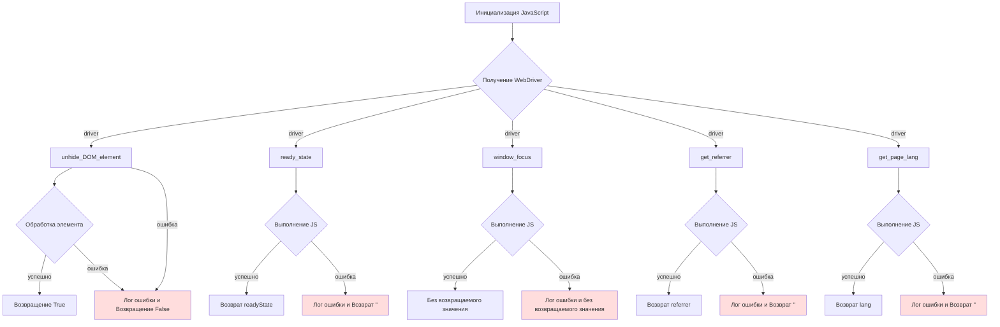

# <input code>

```python
## \file hypotez/src/webdriver/js.py
# -*- coding: utf-8 -*-\
#! venv/Scripts/python.exe
#! venv/bin/python/python3.12

"""
.. module:: src.webdriver.js
    :platform: Windows, Unix
    :synopsis: Provides JavaScript utility functions for interacting with a web page.

This module is designed to extend the capabilities of Selenium WebDriver by adding common JavaScript-based
functions for interacting with web pages, including visibility manipulations, retrieving page information,
and managing browser focus.

Key Features:
    1. Make invisible DOM elements visible for interaction.
    2. Retrieve metadata like document ready state, referrer, or page language.
    3. Manage browser window focus programmatically.
"""
MODE = 'dev'

import header
from src import gs
from src.logger import logger
from selenium.webdriver.remote.webdriver import WebDriver
from selenium.webdriver.remote.webelement import WebElement


class JavaScript:
    """Provides JavaScript utility functions for interacting with a web page."""

    def __init__(self, driver: WebDriver):
        """Initializes the JavaScript helper with a Selenium WebDriver instance.

        Args:
            driver (WebDriver): Selenium WebDriver instance to execute JavaScript.
        """
        self.driver = driver

    def unhide_DOM_element(self, element: WebElement) -> bool:
        """Makes an invisible DOM element visible by modifying its style properties.

        Args:
            element (WebElement): The WebElement object to make visible.

        Returns:
            bool: True if the script executes successfully, False otherwise.
        """
        script = """
        arguments[0].style.opacity = 1;
        arguments[0].style.transform = 'translate(0px, 0px) scale(1)';
        arguments[0].style.MozTransform = 'translate(0px, 0px) scale(1)';
        arguments[0].style.WebkitTransform = 'translate(0px, 0px) scale(1)';
        arguments[0].style.msTransform = 'translate(0px, 0px) scale(1)';
        arguments[0].style.OTransform = 'translate(0px, 0px) scale(1)';
        arguments[0].scrollIntoView(true);
        return true;
        """
        try:
            self.driver.execute_script(script, element)
            return True
        except Exception as ex:
            logger.error('Error in unhide_DOM_element: %s', ex)
            return False

    @property
    def ready_state(self) -> str:
        """Retrieves the document loading status.

        Returns:
            str: 'loading' if the document is still loading, 'complete' if loading is finished.
        """
        try:
            return self.driver.execute_script('return document.readyState;')
        except Exception as ex:
            logger.error('Error retrieving document.readyState: %s', ex)
            return ''

    def window_focus(self) -> None:
        """Sets focus to the browser window using JavaScript.

        Attempts to bring the browser window to the foreground.
        """
        try:
            self.driver.execute_script('window.focus();')
        except Exception as ex:
            logger.error('Error executing window.focus(): %s', ex)

    def get_referrer(self) -> str:
        """Retrieves the referrer URL of the current document.

        Returns:
            str: The referrer URL, or an empty string if unavailable.
        """
        try:
            return self.driver.execute_script('return document.referrer;') or ''
        except Exception as ex:
            logger.error('Error retrieving document.referrer: %s', ex)
            return ''

    def get_page_lang(self) -> str:
        """Retrieves the language of the current page.

        Returns:
            str: The language code of the page, or an empty string if unavailable.
        """
        try:
            return self.driver.execute_script('return document.documentElement.lang;') or ''
        except Exception as ex:
            logger.error('Error retrieving document.documentElement.lang: %s', ex)
            return ''
```

# <algorithm>

**Блок-схема:**



**Пример:**

Предположим, у нас есть `WebElement` с id `myElement` и `WebDriver` instance `driver`.  `unhide_DOM_element` вызывается для `myElement`.  Если JavaScript скрипт выполняется успешно, возвращается `True`. Если возникает исключение, записывается ошибка в `logger` и возвращается `False`.  `ready_state` получает состояние загрузки документа и возвращает 'loading' или 'complete'.

# <mermaid>

```mermaid
graph LR
    subgraph Selenium WebDriver
        A[WebDriver] --> B(execute_script);
        B --> C{JavaScript скрипт};
    end
    subgraph JavaScript
        C --> D[unhide_DOM_element];
        D --> E[WebElement];
        E --> F[изменение стилей];
        F --> G[scrollIntoView];
        G --> H[возврат True]
    end

    subgraph JavaScript
        B --> I[ready_state];
        I --> J[document.readyState];
        J --> K[возврат значения];
    end

    subgraph JavaScript
        B --> L[window_focus];
        L --> M[window.focus()];
    end

    subgraph JavaScript
        B --> N[get_referrer];
        N --> O[document.referrer];
        O --> P[возврат значения];
    end

    subgraph JavaScript
        B --> Q[get_page_lang];
        Q --> R[document.documentElement.lang];
        R --> S[возврат значения];
    end

    style B fill:#ccf;
    style C fill:#ccf;
    style D fill:#ccf;
    style I fill:#ccf;
    style L fill:#ccf;
    style N fill:#ccf;
    style Q fill:#ccf;
```

**Объяснение зависимостей:**

Код зависит от `selenium` (для взаимодействия с WebDriver), `src.logger` (для логирования ошибок), и `header` и `gs` (их предназначение неясно без контекста).  `src` предполагается, что это директория проекта, содержащая дополнительные модули и пакеты.

# <explanation>

**Импорты:**

- `header`:  Без контекста проекта непонятно, для чего импортирован этот модуль. Предположительно, он содержит общие или специфичные для проекта импорты.
- `gs`:  Без контекста проекта непонятно, для чего импортирован этот модуль. Предположительно, он содержит вспомогательные функции или классы.
- `logger`:  Импортируется из `src.logger`, подразумевая, что это собственный модуль для логирования.  Возможно, он предоставляет улучшенные возможности логирования по сравнению со стандартным модулем `logging`.
- `WebDriver`, `WebElement`: Импортируются из `selenium`, предоставляя классы для работы с WebDriver и веб-элементами.  Это библиотека для автоматизации браузера.

**Классы:**

- `JavaScript`:  Этот класс предоставляет методы для взаимодействия с веб-страницей через JavaScript.  Он держит экземпляр `WebDriver` для выполнения JavaScript-кода.  Атрибуты: `driver` (экземпляр `WebDriver`). Методы: `unhide_DOM_element`, `ready_state`, `window_focus`, `get_referrer`, `get_page_lang`.  Методы напрямую связаны с работой браузера и выполнением JS кода.

**Функции:**

- `unhide_DOM_element`:  Скрывает элемент DOM, изменяя его свойства стиля.  Возвращает `True` при успешном выполнении, `False` иначе.  Используется `try...except` для обработки возможных исключений во время выполнения JavaScript.
- `ready_state`:  Возвращает состояние загрузки документа ('loading' или 'complete').  Обрабатывает исключения.
- `window_focus`:  Вызывает `window.focus()` для фокусировки на браузере.  Обрабатывает исключения.
- `get_referrer`:  Возвращает URL предыдущей страницы.  Обрабатывает исключения.
- `get_page_lang`:  Возвращает язык веб-страницы (например, "en", "ru"). Обрабатывает исключения.

**Переменные:**

- `MODE`:  Строковая переменная, хранящая значение режима работы ('dev').  Вероятно, используется для конфигурации.


**Возможные ошибки и улучшения:**

- **Нет проверки на NULL:**  Не выполняется проверка на `None` для `element` в `unhide_DOM_element`. Это может привести к ошибкам, если элемент не найден.
- **Неопределенные импорты:**  Необходимо уточнить роль `header` и `gs`, без понимания их цели сложно определить область для улучшения.
- **Добавление таймаутов:**  Добавление таймаутов к операциям JavaScript (например, `unhide_DOM_element`) может предотвратить зависание программы при длительной загрузке или отсутствии реагирования веб-страницы.
- **Более конкретные исключения:**  В обработке исключений можно использовать более специфичные типы исключений для более точной диагностики проблем.

**Взаимосвязь с другими частями проекта:**

Код напрямую взаимодействует с `WebDriver` и `WebElement`, это ключевые элементы для управления браузером и взаимодействия с веб-страницей. Он полагается на `logger` для ведения журнала.  `gs` и `header` вероятно используются для других функций приложения. Без более подробного контекста взаимосвязи с другими модулями проекта остаются неясными.