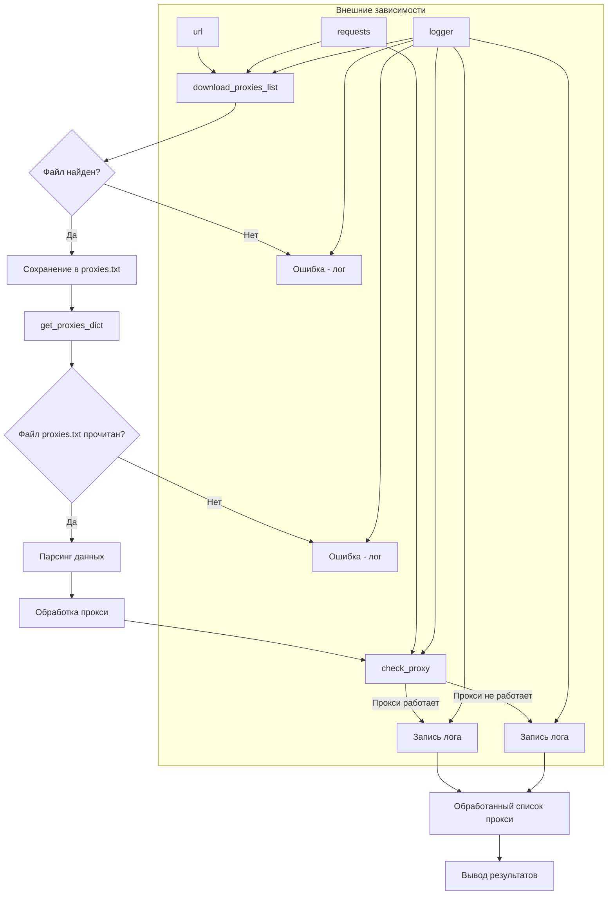
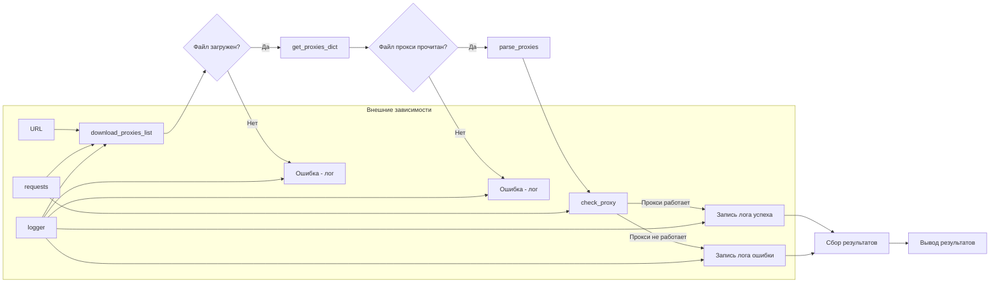

# <input code>

```python
## \file /src/webdriver/proxy.py
# -*- coding: utf-8 -*-
#! venv/Scripts/python.exe
#! venv/bin/python/python3.12

"""
Модуль для работы с прокси
=========================================================================================

Этот модуль определяет функции для загрузки и парсинга списка прокси. 
Загружается текстовый файл с прокси-адресами и распределяется по категориям.

Пример использования
--------------------

.. code-block:: python

    download_proxies_list()
    proxies = parse_proxies()

"""

MODE = 'dev'

import re
import requests
from requests.exceptions import ProxyError, RequestException
from pathlib import Path
from typing import Any, Dict, List, Optional
import header
from src import gs
from src.utils.printer import pprint
from src.logger import logger

# URL источника списка прокси
url: str = 'https://raw.githubusercontent.com/proxifly/free-proxy-list/main/proxies/all/data.txt'

# Путь к файлу для сохранения списка прокси
proxies_list_path: Path = gs.path.src / 'webdriver' / 'proxies.txt'


def download_proxies_list(url: str = url, save_path: Path = proxies_list_path) -> bool:
    """
    Загружает файл по указанному URL и сохраняет его в заданный путь.

    :param url: URL файла для загрузки.
    :param save_path: Путь для сохранения загруженного файла.
    :return: Успешность выполнения операции.
    """
    try:
        # Отправка запроса на загрузку файла
        response = requests.get(url, stream=True)
        response.raise_for_status()  # Генерирует исключение для ошибок HTTP

        # Сохранение файла
        with open(save_path, 'wb') as file:
            for chunk in response.iter_content(chunk_size=8192):
                file.write(chunk)

        logger.info(f'Файл успешно загружен и сохранён в {save_path}')
        return True
    except Exception as ex:
        logger.error('Ошибка при загрузке файла: ', ex)
        ...
        return False


def get_proxies_dict(file_path: Path = proxies_list_path) -> Dict[str, List[Dict[str, Any]]]:
    """
    Парсит файл с прокси-адресами и распределяет их по категориям.

    :param file_path: Путь к файлу с прокси.
    :return: Словарь с распределёнными по типам прокси.
    """

    download_proxies_list()

    proxies: Dict[str, List[Dict[str, Any]]] = {
        'http': [],
        'socks4': [],
        'socks5': []
    }

    try:
        # Чтение файла
        with open(file_path, 'r', encoding='utf-8') as file:
            for line in file:
                match = re.match(r'^(http|socks4|socks5)://([\\d\\.]+):(\\d+)', line.strip())
                if match:
                    protocol, host, port = match.groups()
                    proxies[protocol].append({'protocol':protocol, 'host': host, 'port': port})
    except FileNotFoundError as ex:
        logger.error('Файл не найден: ', ex)
        ...
    except Exception as ex:
        logger.error('Ошибка при парсинге прокси: ', ex)
        ...

    return proxies


def check_proxy(proxy: dict) -> bool:
    """
    Проверяет работоспособность прокси-сервера.
    
    :param proxy: Словарь с данными прокси (host, port, protocol).
    :return: True, если прокси работает, иначе False.
    """
    try:
        # Попытка сделать запрос через прокси
        response = requests.get("https://httpbin.org/ip", proxies={proxy['protocol']: f"{proxy['protocol']}://{proxy['host']}:{proxy['port']}"}, timeout=5)
        # Проверка кода ответа
        if response.status_code == 200:
            logger.info(f"Прокси найден: {proxy['host']}:{proxy['port']}")
            return True
        else:
            logger.warning(f"Прокси не работает: {proxy['host']}:{proxy['port']} (Статус: {response.status_code})", None, False)
            return False
    except (ProxyError, RequestException) as ex:
        logger.warning(f"Ошибка подключения через прокси {proxy['host']}:{proxy['port']}:",ex)
        return False

if __name__ == '__main__':
    # Загрузка списка прокси и парсинг
    if download_proxies_list():
        parsed_proxies = parse_proxies() # Missing definition for parse_proxies()
        logger.info(f'Обработано {sum(len(v) for v in parsed_proxies.values())} прокси.')
```



```markdown
# <algorithm>

1. **download_proxies_list():** Загружает файл прокси с указанного URL и сохраняет его в файл `proxies.txt`.
   - Обрабатывает HTTP-запросы с помощью `requests`.
   - Обрабатывает ошибки (`Exception`).
   - Логирует успешное завершение или ошибку.
   *Пример:* Загрузка файла `https://raw.githubusercontent.com/proxifly/free-proxy-list/main/proxies/all/data.txt` в `proxies.txt`.

2. **get_proxies_dict():** Парсит файл `proxies.txt`, извлекает информацию о прокси (протокол, хост, порт) и распределяет их по категориям ('http', 'socks4', 'socks5').
    - Обрабатывает ошибки `FileNotFoundError`.
    - Обрабатывает ошибки (`Exception`).
    - Логирует ошибку или успешное чтение файла.
    *Пример:* Из файла `proxies.txt`, содержащего строки типа `http://192.168.1.1:8080`, создаёт словарь `{'http': [{'protocol': 'http', 'host': '192.168.1.1', 'port': '8080'}], ...}`

3. **check_proxy():** Проверяет работоспособность прокси.
    - Создаёт запрос к `https://httpbin.org/ip` используя `requests` с заданным прокси.
    - Проверяет код ответа (`response.status_code`).
    - Логирует результат проверки (успех или неуспех).
    *Пример:*  Проверяет прокси `http://192.168.1.1:8080` - если запрос успешен, возвращает `True`, иначе `False`.

**Последовательность:**
    1. Вызывается `download_proxies_list()` для загрузки списка прокси.
    2. Вызывается `get_proxies_dict()` для парсинга и категоризации прокси.
    3. Каждая запись прокси из полученного словаря передаётся в функцию `check_proxy()` для проверки.
    4. Результаты проверки сохраняются и выводятся.

# <mermaid>




# <explanation>

**Импорты:**

- `re`: Для работы с регулярными выражениями при парсинге прокси.
- `requests`: Для работы с HTTP-запросами, загрузки списка прокси и проверки работоспособности.
- `requests.exceptions`: Обработка исключений, связанных с HTTP-запросами.
- `pathlib`: Для работы с путями к файлам.
- `typing`: Для указания типов переменных (PEP 484).
- `header`: Вероятно, модуль для работы с HTTP-заголовками (необходимость уточнить из контекста проекта).
- `gs`:  Модуль `gs` скорее всего отвечает за глобальные настройки и конфигурацию (например, путь к файлам), импортируется из корневой папки проекта.
- `pprint`: Для удобного вывода данных.
- `logger`:  Модуль для логирования. Из папки `src.logger`.
- `src`: Предположительно, корневая папка проекта, из которой импортируются другие модули.


**Классы:**

Нет классов в данном коде.

**Функции:**

- `download_proxies_list(url=..., save_path=...)`: Загружает список прокси из указанного URL в указанный файл.  Возвращает `True` при успехе, `False` в противном случае.
- `get_proxies_dict(file_path=...)`: Парсит файл прокси и распределяет по категориям (http, socks4, socks5). Возвращает словарь с прокси.
- `check_proxy(proxy=...)`: Проверяет работоспособность заданного прокси. Возвращает `True`, если прокси работает, `False` - если нет.

**Переменные:**

- `url`: Строка, содержащая URL списка прокси.
- `proxies_list_path`: Путь к файлу, в который сохраняется список прокси.
- `proxies`: Словарь, содержащий список прокси, разделенных по типу (`http`, `socks4`, `socks5`).

**Возможные ошибки или области для улучшений:**

- Отсутствует функция `parse_proxies()`, используемая в `if __name__ == '__main__':`. Необходимо добавить определение этой функции.
- Обработка ошибок в `download_proxies_list` и `get_proxies_dict` может быть улучшена, например, добавлением более подробных сообщений об ошибках.
- Нет проверки на валидность данных в `check_proxy` (проверяется только код ответа, а не наличие поля `proxy`).
- Не используется `parse_proxies` в `__main__`.


**Взаимосвязи с другими частями проекта:**

- Модуль `gs` необходим для определения пути к файлу `proxies.txt` и, вероятно, для доступа к другим конфигурационным параметрам проекта.
- Модуль `logger` используется для логирования различных операций.
- Модуль `header` (потребуется уточнение) может использоваться для добавления HTTP-заголовков при выполнении запросов к `https://httpbin.org/ip`.
- Функция `download_proxies_list` зависима от `requests`, а `check_proxy` использует `requests`.