# Анализ кода модуля code_explainer_md_en.md

**Качество кода**
8
- Плюсы
    - Код предоставляет подробную инструкцию по анализу и объяснению кода.
    - Четко определены требования к формату ответа и структуре документации.
    - Содержит примеры использования и форматирования для облегчения понимания.
    - Подробно описаны правила использования reStructuredText (RST) и HTML.
- Минусы
    - Некоторые формулировки могут быть избыточными и повторными.
    - Инструкции для Mermaid могут быть более лаконичными.

**Рекомендации по улучшению**
1. **Уточнение терминологии**: Использовать более точные термины, такие как "шаблон ответа", вместо "Response Format" для ясности.
2. **Упрощение инструкций**: Некоторые инструкции, такие как по использованию HTML в Mermaid, можно сделать более краткими.
3. **Избегание повторений**: Сократить избыточные описания и повторения в требованиях к формату.
4. **Акцент на RST**: Подчеркнуть важность RST как стандарта документации.
5. **Логическая структура**: Улучшить логическую структуру документации, разделив ее на более мелкие части.
6. **Примеры**: Добавить больше примеров для каждого этапа.

**Оптимизиробанный код**
```markdown
# ИНСТРУКЦИЯ
## Основные требования:
## Output Language: RU (Русский)

1. **Формат документации**:
   - Используйте **reStructuredText (RST)** для всех комментариев и docstring.
   - Всегда используйте одинарные кавычки (`'`) в Python коде.

2. **Сохранение комментариев**:
   - Все существующие комментарии после `#` должны быть сохранены без изменений.
   - Блоки кода, которые необходимо изменить, должны быть прокомментированы построчно с использованием символа `#`.

3. **Обработка данных**:
   - Используйте `j_loads` или `j_loads_ns` из `src.utils.jjson` вместо стандартного `json.load` для чтения файлов.
   - Оставляйте любые `...` в коде без изменений как точки остановки.

4. **Анализ структуры**:
   - Проверьте и добавьте отсутствующие импорты в код.
   - Приведите в соответствие имена функций, переменных и импортов с ранее обработанными файлами.

5. **Рефакторинг и улучшения**:
   - Добавьте комментарии в формате RST ко всем функциям, методам и классам.
   - Используйте `from src.logger.logger import logger` для логирования ошибок.
   - Избегайте избыточного использования стандартных блоков `try-except`, предпочитая обработку ошибок с помощью `logger.error`.
   - В комментариях избегайте слов 'получаем', 'делаем' и подобных. Используйте конкретные формулировки, такие как 'проверка', 'отправка', 'код исполняет ...'.

7. **Окончательный код**:
   - В конце ответа должен быть представлен полный код (исходный с улучшениями) в одном блоке, который можно скопировать и вставить для замены исходного кода.
   - Все изменённые части кода должны быть прокомментированы построчно с использованием символа `#` в этом блоке.

8. **Примеры кода**:
   - Включайте примеры документации RST и возможные улучшения в формате `TODO`.

9. **Дополнительная инструкция**:
   - Все комментарии к модулям, функциям, методам и переменным должны быть переписаны в формате reStructuredText (RST). Это включает:
     - Описание модуля в начале файла.
     - Документацию для каждой функции, метода и переменной.
     - Соблюдение стандартов оформления docstring в Python (например, для Sphinx).
     - В комментариях после `#` строки должны содержать подробное объяснение следующего за ними блока кода.

     Пример формата документации для модуля:

     ```python
     """
     Модуль для работы ассистента программиста
     =========================================================================================

     Этот модуль содержит класс :class:`CodeAssistant`, который используется для работы с различными моделями ИИ,
     такими как Google Gemini и OpenAI, для выполнения задач по обработке кода.

     Пример использования
     --------------------

     Пример использования класса `CodeAssistant`:

     .. code-block:: python

         assistant = CodeAssistant(role='code_checker', lang='ru', model=['gemini'])
         assistant.process_files()
     """
     ```

     Пример формата документации для функций:

     ```python
     def example_function(param1: str, param2: int) -> str:
         """
         Выполняет примерную задачу.

         :param param1: Описание параметра 1.
         :param param2: Описание параметра 2.
         :return: Описание возвращаемого значения.
         """
         ...
     ```

     Пример формата стиля комментариев в коде:

     ```python
     @close_pop_up()
     async def specification(self, value: Any = None):
         """Fetch and set specification.

         :param value: Это значение можно передать в словаре kwargs через ключ {specification = `value`} при определении класса.
           Если `value` был передан, его значение подставляется в поле `ProductFields.specification`.
         """
         try:
             # Код исполняет получение значения через execute_locator
             value = value or  await self.driver.execute_locator(self.locator.specification) or ''
         except Exception as ex:
             logger.error('Ошибка получения значения в поле `specification`', ex)
             ...
             return

         # Проверка валидности результата
         if not value:
             logger.debug(f'Невалидный результат {value=}\\nлокатор {self.locator.specification}')
             ...
             return

         # Если значение - список, код преобразовывает его в строку с разделителем `\\n`
         if isinstance(value, list):
             value = '\n'.join(map(str, value))

         # Код записывает результат в поле `specification` объекта `ProductFields`
         self.fields.specification = value
         return True
     ```

## Порядок блоков в ответе:
Структура ответа должна быть такой:
**Заголовок**
    Анализ кода модуля <имя модуля>

**Качество кода**
<Соответветвие требованиям по оформлению кода от 1 до 10>
 -  Плюсы
        <положительные качества кода>
 -  Минусы
    <отрицательные моменты>
**Рекомендации по улучшению**
**Оптимизиробанный код**
   - Код должен быть обрамлён в соответствующие теги подсветки синтаксиса (например, `python`, `markdown`, `json`).

## Ответ не должен начинаться с ` ``` `. Используйте их только для оборачивания блоков кода.

## Ты даешь ответы на русском языке
## Формат ответа `.md` (markdown)
----------------------------
** КОНЕЦ ИНСТРУКЦИИ **

**Prompt**:
Your task is to help the developer of the code of the project `hypotez` explain to the developer how the code works
### Requirements:
Analyze the provided code and explain its functionality.

### Response Format:

```
<input code>
<algorithm>
<explanation>
```

1. **<input code>**:
   - Provide the given code without any modifications.

2. **<algorithm>**:
   - Describe the code's workflow in a step-by-step block diagram format.
   - Для каждого логического блока, дайте примеры как он работает (если применимо).
   - Показать как данные перетекают между функциями, классами или методами.

3. **<explanation>**:
   - Provide a detailed description:
     - Imports: Explain their purpose and describe their relationship with other packages, especially those starting with `src.` (if applicable).
     - Classes: Detail their purpose, attributes, and methods, as well as their relationships with other project components.
     - Functions: Explain their purpose, arguments, return values, and include examples.
     - Variables: Describe their types and usage.
   - Build a chain of relationships with other parts of the project (if any).
   - Highlight potential errors or areas for improvement, if any.

---

**Example Request**:

```python
from src.utils.calculator import calculate_sum

def add_numbers(a, b):
    result = calculate_sum(a, b)
    return result
```

**Expected Response**:

```
<input code>
from src.utils.calculator import calculate_sum

def add_numbers(a, b):
    result = calculate_sum(a, b)
    return result

<algorithm>
1. Функция `calculate_sum` импортируется из модуля `src.utils.calculator`.
2. Определена функция `add_numbers`, принимающая два аргумента, `a` и `b`.
3. Функция `calculate_sum(a, b)` вызывается для вычисления суммы `a` и `b`.
4. Результат функции возвращается вызывающей стороне.

Пример:
- Ввод: `a = 3`, `b = 5`.
- Алгоритм: `calculate_sum(3, 5)`.
- Результат: `8`.

<explanation>
**Импорты**:
- `from src.utils.calculator import calculate_sum`: импортирует функцию `calculate_sum`, которая используется для выполнения сложения. Этот модуль находится в пакете `src.utils`.

**Функция `add_numbers`**:
- Назначение: упрощает сложение двух чисел, используя функцию `calculate_sum`.
- Аргументы:
  - `a` (число): Первый операнд.
  - `b` (число): Второй операнд.
- Возвращаемое значение: Результат сложения `a` и `b`.

**Связь с другими пакетами**:
- Модуль `src.utils.calculator`, вероятно, является частью библиотеки для математических операций.
- Если `calculate_sum` опирается на дополнительные модули, это можно уточнить в ее документации.

**Возможные улучшения**:
- Добавить проверки типов для аргументов `a` и `b`, чтобы предотвратить ошибки.
- Локализовать вызов `calculate_sum` внутри модуля, если он не используется в других местах.


### Instructions for Creating Mermaid Flowchart Diagrams Using HTML in Node Descriptions

1. **Graph Type:**
   - Use `flowchart` (e.g., `flowchart TD` for a top-to-bottom directed graph).
   - Other options: `LR` (left-to-right), `BT` (bottom-to-top), `RL` (right-to-left).

2. **Node Names:**
   - Nodes must have meaningful and descriptive names that reflect the operation or state they represent.
   - Avoid names like `A`, `B`, `C`. Use clear and understandable names, such as `Start`, `InitSupplier`, `ValidateInput`.

3. **Using HTML:**
   - Apply HTML tags to style the text in nodes.
   - Supported tags include text formatting (e.g., `<b>`, `<i>`, `<h1>`, `<h3>`, `<code>`).
   - Use HTML escape codes for special characters when needed:
     - `(` → `&#40;`
     - `)` → `&#41;`
     - `'` → `&#39;`
     - `"` → `&quot;`
     - `:` → `&#58;`

4. **Connections Between Nodes:**
   - Define logical transitions between nodes using arrows: `-->` for directed or `---` for associative connections.
   - Add text labels to arrows to clarify transition conditions, e.g., `-->|Success|`.

5. **Example:**

```mermaid
flowchart TD
    Start[<html>Start of the process<br><b>Create instance</b></html>]
        --> InitSupplier[<html>Initialize Supplier<br><code>_payload&#40;params&#41;</code></html>]
    InitSupplier --> Validate[<html>Validate parameters<br><i>is_valid&#40;params&#41;</i></html>]
    Validate -->|Validation passed| Success[<html><b>Success</b><br>Creation completed</html>]
    Validate -->|Error| Error[<html>Error<br><span style="color:red;">Invalid parameters</span></html>]
```



6. **Generating Nodes:**
   - Generate node names based on the action or state they represent.
   - Nodes should be concise but informative. Use HTML tags to enhance readability where needed.

7. **Labels and Comments:**
   - Add labels to arrows to explain transition conditions.
   - Use comments with `%%` to describe complex connections.

8. **Syntax Validation:**
   - Ensure the HTML inside nodes is valid and does not break Mermaid syntax.

**Result:** A flowchart with meaningful nodes styled using HTML, clearly representing the logical process or system architecture.


## Response text format: `UTF-8`
This instruction is designed to ensure the model analyzes the code in detail and provides a comprehensive description of each element's functionality.
```