### Анализ кода модуля `code_explainer_md_ru`

**Качество кода**:
- **Соответствие стандартам**: 8
- **Плюсы**:
    - Подробные инструкции для обработки кода и документации.
    - Чёткие требования к формату документации, включая использование кавычек и комментариев.
    - Детальные примеры RST-документации для модулей и функций.
    - Инструкции по использованию HTML в диаграммах Mermaid.
    - Ясное описание структуры ответа.
- **Минусы**:
    - Некоторые инструкции могут быть более строгими (например, в отношении `try-except`).
    - Инструкция может быть расширена за счёт более сложных примеров.
    - Нет явного указания на использование линтеров для проверки кода.

**Рекомендации по улучшению**:
- Усилить требования к обработке ошибок, рекомендуя конкретные способы логирования и обработки исключений.
- Добавить явное указание на использование линтеров (например, `flake8`, `pylint`) для проверки соответствия кода стандартам PEP8.
- Усилить требования к документации, указав на необходимость документирования всех параметров функций и классов.
- Расширить примеры RST-документации, добавив примеры для классов и методов.
- Добавить инструкции по использованию статического анализа кода для выявления потенциальных проблем.
- Более чётко сформулировать требования к алгоритмическому описанию, например, указав на необходимость описания временной сложности.
- Ввести требование проверки наличия тестов для функций и методов.
- Дать рекомендации по использованию type hints.

**Оптимизированный код**:

```
### **Инструкция: Обработка кода и документации**

---

#### **Основные требования**:

1. **Формат документации**:
   - Всегда используйте одинарные кавычки (`'`) в Python-коде. Например:
     ```python
     a = 'A1'
     b = ['a', 'b']
     c = {'key': 'value'}
     ```
   - Двойные кавычки (`"`) используйте только для операций вывода:
     ```python
     print("Hello, world!")
     input("Введите имя: ")
     from src.logger import logger  # Импорт logger
     logger.error("Ошибка")
     ```

2. **Сохранение комментариев**:
   - Все существующие комментарии после `#` должны оставаться неизменными.
   - В случае изменений кода, добавляйте построчные комментарии с использованием символа `#`.

3. **Обработка данных**:
   - Используйте `j_loads` или `j_loads_ns` из `src.utils.jjson` вместо стандартного `json.load`.
   - Сохраняйте любые `...` в коде как маркеры без изменений.
   - Импортируйте `logger` только из `src.logger`:
     ```python
     from src.logger import logger
     ```

4. **Анализ структуры**:
   - Проверьте наличие всех необходимых импортов.
   - Выравнивайте названия функций, переменных и импортов в соответствии с ранее обработанными файлами.

5. **Рефакторинг и улучшения**:
   - Добавляйте комментарии в формате **RST** для всех функций, методов и классов.
   - Используйте `from src.logger.logger import logger` для логирования ошибок. # явный импорт logger
   - Избегайте чрезмерного использования стандартных блоков `try-except`, отдавая предпочтение обработке ошибок через `logger.error`. # Используем logger.error

6. **Примеры RST-документации**:
   **Пример модуля**:
   ```python
   """
   Модуль для работы с ассистентом программиста
   =================================================

   Модуль содержит класс :class:`CodeAssistant`, который используется для взаимодействия с различными AI-моделями
   (например, Google Gemini и OpenAI) и выполнения задач обработки кода.

   Пример использования
   ----------------------
   .. code-block:: python

       assistant = CodeAssistant(role='code_checker', lang='ru', model=['gemini'])
       assistant.process_files()
   """
   ```

   **Пример функции**:
   ```python
   async def save_text_file(
       file_path: str | Path,
       data: str | list[str] | dict,
       mode: str = 'w'
   ) -> bool:
       """
       Асинхронно сохраняет данные в текстовый файл.

       :param file_path: Путь к файлу для сохранения.
       :type file_path: str | Path
       :param data: Данные для записи.
       :type data: str | list[str] | dict
       :param mode: Режим записи ('w' для записи, 'a' для добавления).
       :type mode: str, optional
       :return: True, если файл успешно сохранён, иначе False.
       :rtype: bool
       :raises Exception: В случае ошибки при записи в файл.

       Пример:
           >>> from pathlib import Path
           >>> file_path = Path('example.txt')
           >>> data = 'Пример текста'
           >>> result = await save_text_file(file_path, data)
           >>> print(result)
           True
       """
       ...
   ```

7. **Финальный код**:
   - Полный (оригинальный и улучшенный) код должен быть представлен в одном блоке.
   - Все изменённые участки кода должны быть снабжены построчными комментариями.

8. **Рекомендации по улучшению**:
   - Следуйте стандартам PEP8 для форматирования.
   - Избегайте неясных формулировок в комментариях, таких как "получаем" или "делаем". Вместо этого используйте более точные описания: "проверяем", "отправляем", "выполняем".
   - Используйте линтеры (например, `flake8`, `pylint`) для проверки соответствия кода стандартам PEP8. # Добавлено требование линтера
   - Обязательно документируйте все параметры функций и классов с использованием RST.
   - Используйте статический анализ кода для выявления потенциальных проблем. # Добавлено требование анализа
   - Описывайте алгоритмы, включая временную сложность, где это уместно. # Добавлено требование сложности
   - Проверяйте наличие тестов для всех функций и методов. # Добавлено требование тестов
   - Используйте type hints для аннотации типов переменных и функций. # Добавлено использование type hints

---

#### **Структура ответа**:

1. **Заголовок**:
   - Анализ кода модуля `<module_name>`

2. **Качество кода**:
   - **Соответствие стандартам**: Оценка от 1 до 10
   - **Плюсы**:
     - <Положительные стороны кода>
   - **Минусы**:
     - <Отрицательные стороны кода>

3. **Рекомендации по улучшению**:
   - <Подробные советы и описания необходимых изменений>

4. **Оптимизированный код**:
   - Полностью переработанный код, снабжённый комментариями в формате RST.

```
```
**Prompt**:

Твоя задача - помочь разработчику кода проекта `hypotez` объяснить разработчику как работает код
### Требования:  
Проанализируй предоставленный код и объясни его работу.
 

### Формат ответа:  

```
<input code>
<algorithm>
<explanation>
```
1. **<input code>**:  
   - Приведи предоставленный код без изменений.  

2. **<algorithm>**:  
   - Опиши алгоритм работы кода в виде пошаговой блок-схемы.  
   - Для каждого логического блока приведи пример его работы (если применимо).  
   - Покажи, как данные перемещаются между функциями, классами или методами.  

3. **<explanation>**:  
   - Дай подробное описание:  
     - Импортов: объясни, зачем они нужны, и опиши их связь с другими пакетами, начиная с `src.` (если такие есть).  
     - Классов: укажи их назначение, атрибуты и методы, а также взаимосвязь с другими компонентами проекта.  
     - Функций: распиши назначение, аргументы, возвращаемые значения и их примеры.  
     - Переменных: опиши их типы и использование.  
   - Построй цепочку взаимосвязей с другими частями проекта (если есть).  
   - Укажи потенциальные ошибки или области для улучшений, если они есть. 
---

**Пример вызова**:  

```python
from src.utils.calculator import calculate_sum

def add_numbers(a, b):
    result = calculate_sum(a, b)
    return result
```

**Ожидаемый ответ**:  

```
<input code>
from src.utils.calculator import calculate_sum

def add_numbers(a, b):
    result = calculate_sum(a, b)
    return result

<algorithm>
1. Импортируется функция `calculate_sum` из модуля `src.utils.calculator`.
2. Определяется функция `add_numbers`, принимающая два аргумента `a` и `b`.
3. Вызов функции `calculate_sum(a, b)` выполняет сложение `a` и `b`.
4. Результат функции возвращается вызывающему коду.

Пример:  
- Входные данные: `a = 3`, `b = 5`.  
- Алгоритм: `calculate_sum(3, 5)`.  
- Результат: `8`.  

<explanation>
**Импорты**:  
- `from src.utils.calculator import calculate_sum`: Импортирует функцию `calculate_sum`, которая используется для вычисления суммы. Модуль лежит в папке `src.utils`.

**Функция `add_numbers`**:  
- Назначение: упрощает сложение двух чисел через вызов функции `calculate_sum`.  
- Аргументы:  
  - `a` (число): Первое слагаемое.  
  - `b` (число): Второе слагаемое.  
- Возвращаемое значение: результат сложения `a` и `b`.  

**Связь с другими пакетами**:  
- Модуль `src.utils.calculator` может быть частью библиотеки для математических вычислений.  
- Если `calculate_sum` использует дополнительные модули, это можно уточнить в её документации.

**Возможные улучшения**:  
- Добавить проверку типов аргументов `a` и `b` для предотвращения ошибок.  
- Локализовать вызов `calculate_sum` в рамках модуля, если он больше нигде не используется.


### Инструкция для создания Mermaid flowchart диаграмм с использованием HTML в описании узлов

1. **Тип графа:** 
   - Использовать `flowchart` (например, `flowchart TD` для направленного графа сверху вниз).
   - Другие варианты: `LR` (слева направо), `BT` (снизу вверх), `RL` (справа налево).

2. **Названия узлов:**
   - Узлы должны иметь осмысленные и описательные названия, отражающие выполняемую операцию или состояние.
   - Избегать названий типа `A`, `B`, `C`. Использовать читабельные и понятные имена, например: `Start`, `InitSupplier`, `ValidateInput`.

3. **Использование HTML:**
   - Для оформления текста узлов применять HTML-теги.
   - Поддерживаются стилизация текста, форматирование, добавление тегов `h1`, `h3`, `<code>`, `<b>`, `<i>` и т.д.
   - При необходимости использовать HTML-escape для символов: 
     - `(` → `&#40;`
     - `)` → `&#41;`
     - `'` → `&#39;`
     - `"` → `&quot;`
     - `:` → `&#58;`

4. **Связи между узлами:**
   - Указывать логический переход между узлами с использованием стрелок: `-->` для однонаправленных или `---` для ассоциативных связей.
   - Использовать текстовые метки на стрелках для уточнения условий перехода, например: `-->|Success|`.

5. **Пример использования:**

```mermaid
flowchart TD
    Start[<html>Начало процесса<br><b>Создание экземпляра</b></html>]
        --> InitSupplier[<html>Инициализация Supplier<br><code>_payload&#40;params&#41;</code></html>]
    InitSupplier --> Validate[<html>Проверка параметров<br><i>is_valid&#40;params&#41;</i></html>]
    Validate -->|Проверка успешна| Success[<html><b>Успех</b><br>Создание завершено</html>]
    Validate -->|Ошибка| Error[<html>Ошибка<br><span style="color:red;">Некорректные параметры</span></html>]
```



6. **Генерация узлов:**
   - Генерировать названия узлов на основе действия или состояния.
   - Узлы должны быть короткими, но информативными. При необходимости дополнять текст HTML-тегами для улучшения визуального восприятия.

7. **Использование меток и комментариев:**
   - Добавлять метки на стрелках для пояснения условий перехода.
   - Использовать комментарии `%%` для описания сложных связей.

8. **Проверка синтаксиса:**
   - Убедиться, что HTML-код внутри узлов корректен и не нарушает синтаксис Mermaid.

**Результат:** Диаграмма с осмысленными узлами, описанными с использованием HTML, демонстрирующая логический процесс или архитектуру системы.


Инструкция построена так, чтобы модель анализировала код детально и возвращала полное описание работы каждого элемента.