# Анализ кода модуля doc_writer_md_en.md

**Качество кода**

8
-   Плюсы
    -   Представлена подробная инструкция по документированию кода в формате Markdown.
    -   Четко описаны требования к документированию модулей, классов, функций и методов.
    -   Приведены примеры документирования для каждого элемента кода.
    -   Инструкции по созданию диаграмм Mermaid с использованием HTML для описания логики работы.
    -   Предоставлены правила форматирования кода, включая использование Markdown.
-   Минусы
    -   Инструкция не упоминает reStructuredText (RST), который указан в основных требованиях.
    -   Нет инструкций по использованию `j_loads` или `j_loads_ns` из `src.utils.jjson`, как это указано в общих инструкциях.
    -   Не рассматривается обработка ошибок с использованием `logger.error`.
    -   Не учтены требования по сохранению комментариев и  рефакторингу кода.
    -   Предполагается, что код уже существует и требуется только его документирование, что противоречит общей инструкции.

**Рекомендации по улучшению**

1.  **Соответствие формату:**
    -   Необходимо переписать инструкции под формат reStructuredText (RST) вместо Markdown.
    -   Следует добавить примеры использования `j_loads` и `j_loads_ns`.
    -   Нужно включить в документацию раздел об обработке ошибок с помощью `logger.error`.

2.  **Комментарии и код:**
    -   Требуется добавить инструкции о сохранении существующих комментариев `#`.
    -   Необходимо добавить требования по рефакторингу и улучшения кода, включая импорты и приведение имен в соответствие с ранее обработанными файлами.

3.  **Примеры:**
    -   Примеры документации нужно переписать в формате RST.
    -   Добавить примеры с использованием `j_loads` и `j_loads_ns`.
    -   Добавить примеры обработки ошибок с использованием `logger.error`.

4.  **Диаграммы Mermaid:**
    -   Уточнить, что диаграммы Mermaid можно включать в документацию, но в reStructuredText.

5.  **Язык:**
    -   Переписать все инструкции и примеры на русском языке.
    -   Исключить англоязычные формулировки.

**Оптимизированный код**

```markdown
# Анализ кода модуля `doc_writer_md_en.md`

## Описание модуля

Модуль содержит инструкции по документированию кода в формате Markdown и предназначен для использования в проекте `hypotez`.

## Основные требования

### Формат документации

- Используйте **reStructuredText (RST)** для всех комментариев и docstring.
- Всегда используйте одинарные кавычки (`'`) в Python коде.

### Сохранение комментариев

- Все существующие комментарии после `#` должны быть сохранены без изменений.
- Блоки кода, которые необходимо изменить, должны быть прокомментированы построчно с использованием символа `#`.

### Обработка данных

- Используйте `j_loads` или `j_loads_ns` из `src.utils.jjson` вместо стандартного `json.load` для чтения файлов.
- Оставляйте любые `...` в коде без изменений как точки остановки.

### Анализ структуры

- Проверьте и добавьте отсутствующие импорты в код.
- Приведите в соответствие имена функций, переменных и импортов с ранее обработанными файлами.

### Рефакторинг и улучшения

- Добавьте комментарии в формате RST ко всем функциям, методам и классам.
- Используйте `from src.logger.logger import logger` для логирования ошибок.
- Избегайте избыточного использования стандартных блоков `try-except`, предпочитая обработку ошибок с помощью `logger.error`.
- В комментариях избегайте слов 'получаем', 'делаем' и подобных. Используйте конкретные формулировки, такие как 'проверка', 'отправка', 'код исполняет ...'.

### Окончательный код

- В конце ответа должен быть представлен полный код (исходный с улучшениями) в одном блоке, который можно скопировать и вставить для замены исходного кода.
- Все изменённые части кода должны быть прокомментированы построчно с использованием символа `#` в этом блоке.

### Примеры кода

- Включайте примеры документации RST и возможные улучшения.

### Дополнительная инструкция

- Все комментарии к модулям, функциям, методам и переменным должны быть переписаны в формате reStructuredText (RST). Это включает:
    - Описание модуля в начале файла.
    - Документацию для каждой функции, метода и переменной.
    - Соблюдение стандартов оформления docstring в Python (например, для Sphinx).
    - В комментариях после `#` строки должны содержать подробное объяснение следующего за ними блока кода.

## Примеры документации в reStructuredText (RST)

### Пример документации для модуля:

```python
"""
Модуль для работы ассистента программиста
=========================================================================================

Этот модуль содержит класс :class:`CodeAssistant`, который используется для работы с различными моделями ИИ,
такими как Google Gemini и OpenAI, для выполнения задач по обработке кода.

Пример использования
--------------------

Пример использования класса `CodeAssistant`:

.. code-block:: python

    assistant = CodeAssistant(role='code_checker', lang='ru', model=['gemini'])
    assistant.process_files()
"""
```

### Пример документации для функций:

```python
def example_function(param1: str, param2: int) -> str:
    """
    Выполняет примерную задачу.

    :param param1: Описание параметра 1.
    :param param2: Описание параметра 2.
    :return: Описание возвращаемого значения.
    """
    ...
```

### Пример формата стиля комментариев в коде:

```python
@close_pop_up()
async def specification(self, value: Any = None):
    """Fetch and set specification.

    :param value: Это значение можно передать в словаре kwargs через ключ {specification = `value`} при определении класса.
                  Если `value` был передан, его значение подставляется в поле `ProductFields.specification`.
    :type value: Any
    """
    try:
        # Код исполняет получение значения через execute_locator
        value = value or  await self.driver.execute_locator(self.locator.specification) or ''
    except Exception as ex:
        logger.error('Ошибка получения значения в поле `specification`', ex)
        ...
        return

    # Проверка валидности результата
    if not value:
        logger.debug(f'Невалидный результат {value=}\\nлокатор {self.locator.specification}')
        ...
        return

    # Если значение - список, код преобразовывает его в строку с разделителем `\\n`
    if isinstance(value, list):
        value = '\n'.join(map(str, value))

    # Код записывает результат в поле `specification` объекта `ProductFields`
    self.fields.specification = value
    return True
```

## Инструкции по созданию Mermaid диаграмм с использованием HTML в reStructuredText

1.  **Тип графа:**
    -   Используйте `flowchart` (например, `flowchart TD` для графа сверху вниз).
    -   Другие опции: `LR` (слева направо), `BT` (снизу вверх), `RL` (справа налево).

2.  **Имена узлов:**
    -   Узлы должны иметь осмысленные и описательные имена.
    -   Избегайте имен типа `A`, `B`, `C`. Используйте `Start`, `InitSupplier`, `ValidateInput`.

3.  **Использование HTML:**
    -   Применяйте HTML-теги для стилизации текста в узлах.
    -   Поддерживаемые теги: `<b>`, `<i>`, `<h1>`, `<h3>`, `<code>`.
    -   Используйте HTML-escape коды для специальных символов:
        -   `(` → `&#40;`
        -   `)` → `&#41;`
        -   `'` → `&#39;`
        -   `"` → `&quot;`
        -   `:` → `&#58;`

4.  **Соединения между узлами:**
    -   Определите переходы между узлами с помощью стрелок: `-->` для направленных или `---` для ассоциативных связей.
    -   Добавьте текстовые метки к стрелкам, чтобы уточнить условия перехода, например, `-->|Успех|`.

5.  **Пример:**

```mermaid
flowchart TD
    Start[<html>Начало процесса<br><b>Создать экземпляр</b></html>]
        --> InitSupplier[<html>Инициализация поставщика<br><code>_payload&#40;params&#41;</code></html>]
    InitSupplier --> Validate[<html>Проверка параметров<br><i>is_valid&#40;params&#41;</i></html>]
    Validate -->|Проверка пройдена| Success[<html><b>Успех</b><br>Создание завершено</html>]
    Validate -->|Ошибка| Error[<html>Ошибка<br><span style="color:red;">Неверные параметры</span></html>]
```



6.  **Генерация узлов:**
    -   Создавайте имена узлов на основе действий или состояний.
    -   Используйте HTML-теги для улучшения читаемости.

7.  **Метки и комментарии:**
    -   Добавляйте метки к стрелкам для объяснения условий перехода.
    -   Используйте комментарии с `%%` для описания сложных соединений.

8.  **Проверка синтаксиса:**
    -   Убедитесь, что HTML внутри узлов валиден и не ломает синтаксис Mermaid.

## Примеры использования j_loads и j_loads_ns

```python
from src.utils.jjson import j_loads, j_loads_ns
from src.logger.logger import logger

# Пример использования j_loads для загрузки JSON из файла
try:
    with open('data.json', 'r') as f:
        # код исполняет чтение файла и загрузку JSON
        data = j_loads(f)
except FileNotFoundError as ex:
    # код обрабатывает ошибку, если файл не найден
    logger.error(f'Файл не найден: {ex}')
    ...
except Exception as ex:
    # код обрабатывает другие ошибки при загрузке JSON
    logger.error(f'Ошибка загрузки JSON: {ex}')
    ...

# Пример использования j_loads_ns для загрузки JSON с проверкой namespace
try:
    with open('config.json', 'r') as f:
        # код исполняет чтение файла и загрузку JSON с проверкой namespace
        config = j_loads_ns(f, namespace='settings')
except FileNotFoundError as ex:
    # код обрабатывает ошибку, если файл не найден
    logger.error(f'Файл не найден: {ex}')
    ...
except Exception as ex:
    # код обрабатывает другие ошибки при загрузке JSON
    logger.error(f'Ошибка загрузки JSON: {ex}')
    ...
```
```