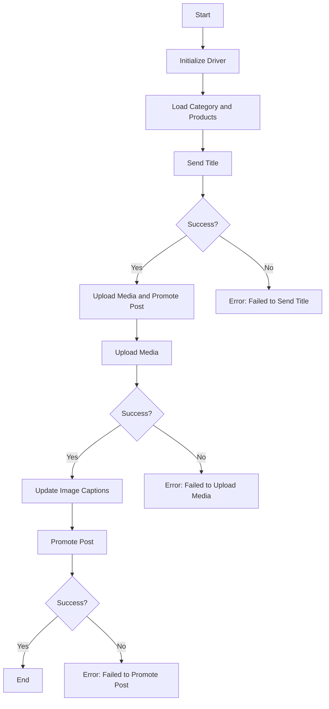

# Анализ кода модуля `post_message_async`

**Качество кода**
9
-  Плюсы
    -   Хорошо структурированный документ с описанием модуля, функций и логики работы.
    -   Наличие диаграммы Mermaid для визуализации процесса.
    -   Подробное описание каждой функции, её параметров и возвращаемых значений.
    -   Примеры использования и описание зависимостей.
    -   Описаны процессы обработки ошибок и условия для продолжения работы при их возникновении.
    -   Использование RST синтаксиса для документации.
-  Минусы
    -  Отсутствует информация о том, где описана модель `SimpleNamespace` и как она используется.
    -  Не все функции имеют документацию в формате rst.
    -  Некоторые моменты в описании функций и процессов можно было бы сделать более конкретными.
    -  В разделе "Функции" не указаны типы данных для аргументов и возвращаемых значений в формате rst.
    -  Стиль кода в примере использования не соответствует стандарту PEP8.
    -  Необходимо добавить информацию о том, откуда берутся данные для `category` и `products`.

**Рекомендации по улучшению**
1.  Добавить документацию rst для всех функций, включая типы аргументов и возвращаемых значений.
2.  Уточнить, что такое `SimpleNamespace` и откуда берется, добавить документацию в формате rst.
3.  Переписать пример использования с учётом стандартов PEP8.
4.  Добавить информацию о том, откуда берутся данные для `category` и `products` в примере использования.
5.  Использовать более конкретные формулировки при описании процессов и действий.
6.  Сделать описание более формальным, чтобы его было легче парсить и использовать в документации.

**Оптимизированный код**
```markdown
```rst
.. module:: src.endpoints.advertisement.facebook.post_message_async
   :platform: Unix, Windows
   :synopsis: Модуль для асинхронной отправки сообщений в Facebook.

"""
[Русский]()

## Asynchronous Facebook Post Message Scenario

### Overview

This script is part of the `hypotez/src/endpoints/advertisement/facebook/scenarios` directory and is designed to automate the process of posting messages on Facebook. The script interacts with the Facebook page by using locators to perform various actions such as sending messages, uploading media files, and updating captions.

### Key Features

1.  **Sending Title and Description**: Sends the title and description of a campaign to the Facebook post message box.
2.  **Uploading Media Files**: Uploads media files (images and videos) to the Facebook post and updates their captions.
3.  **Promoting Post**: Manages the entire process of promoting a post with a title, description, and media files.

### Module Structure



### Legend

1.  **Start**: Start of script execution.
2.  **InitDriver**: Create an instance of the `Driver` class.
3.  **LoadCategoryAndProducts**: Load category and product data.
4.  **SendTitle**: Call the `post_title` function to send the title.
5.  **CheckTitleSuccess**: Check if the title was sent successfully.
    -   **Yes**: Proceed to upload media and promote the post.
    -   **No**: Output error "Failed to send title".
6.  **UploadMediaAndPromotePost**: Call the `promote_post` function.
7.  **UploadMedia**: Call the `upload_media` function to upload media files.
8.  **CheckMediaSuccess**: Check if media was uploaded successfully.
    -   **Yes**: Proceed to update image captions.
    -   **No**: Output error "Failed to upload media".
9.  **UpdateCaptions**: Call the `update_images_captions` function to update captions.
10. **PromotePost**: Complete the post promotion process.
11. **CheckPromoteSuccess**: Check if the post was promoted successfully.
    -   **Yes**: End of script execution.
    -   **No**: Output error "Failed to promote post".

-----------------------

#### Functions

-   **`post_title(d: Driver, category: SimpleNamespace) -> bool`**:
    -   **Purpose**: Sends the title and description of a campaign to the Facebook post message box.
    -   **Parameters**:
        -   `d` (:obj:`Driver`): The `Driver` instance used for interacting with the webpage.
        -   `category` (:obj:`SimpleNamespace`): The category containing the title and description to be sent.
            `SimpleNamespace` имеет атрибуты `title` (str) и `description` (str).
    -   **Returns**: `True` if the title and description were sent successfully, otherwise `False`.
        - **Return Type:** `bool`

-   **`upload_media(d: Driver, products: List[SimpleNamespace], no_video: bool = False) -> bool`**:
    -   **Purpose**: Uploads media files to the Facebook post and updates their captions.
    -   **Parameters**:
        -   `d` (:obj:`Driver`): The `Driver` instance used for interacting with the webpage.
        -   `products` (:obj:`list` of :obj:`SimpleNamespace`): List of products containing media file paths.
            `SimpleNamespace` имеет атрибуты `local_image_path` (str) и `local_video_path` (str).
        -   `no_video` (:obj:`bool`, optional): Flag indicating whether to skip video uploads. Defaults to `False`.
    -   **Returns**: `True` if media files were uploaded successfully, otherwise `False`.
        - **Return Type:** `bool`

-   **`update_images_captions(d: Driver, products: List[SimpleNamespace], textarea_list: List[WebElement]) -> None`**:
    -   **Purpose**: Asynchronously adds descriptions to uploaded media files.
    -   **Parameters**:
        -   `d` (:obj:`Driver`): The `Driver` instance used for interacting with the webpage.
        -   `products` (:obj:`list` of :obj:`SimpleNamespace`): List of products with details to update.
            `SimpleNamespace` имеет атрибут `description` (str).
        -   `textarea_list` (:obj:`list` of :obj:`WebElement`): List of textareas where captions are added.
    -   **Returns**: None.

-   **`promote_post(d: Driver, category: SimpleNamespace, products: List[SimpleNamespace], no_video: bool = False) -> bool`**:
    -   **Purpose**: Manages the process of promoting a post with a title, description, and media files.
    -   **Parameters**:
        -   `d` (:obj:`Driver`): The `Driver` instance used for interacting with the webpage.
        -   `category` (:obj:`SimpleNamespace`): The category details used for the post title and description.
             `SimpleNamespace` имеет атрибуты `title` (str) и `description` (str).
        -   `products` (:obj:`list` of :obj:`SimpleNamespace`): List of products containing media and details to be posted.
            `SimpleNamespace` имеет атрибуты `local_image_path` (str), `local_video_path` (str) и `description` (str).
        -   `no_video` (:obj:`bool`, optional): Flag indicating whether to skip video uploads. Defaults to `False`.
    -  **Returns**: `True` if the post was promoted successfully, otherwise `False`.
        - **Return Type:** `bool`

### Usage

To use this script, follow these steps:

1.  **Initialize Driver**: Create an instance of the `Driver` class.
2.  **Load Locators**: Load the locators from the JSON file.
3.  **Call Functions**: Use the provided functions to send the title, upload media, and promote the post.

#### Example

```python
from src.webdriver.driver import Driver
from types import SimpleNamespace
from pathlib import Path

# Initialize Driver
driver = Driver(...)

# Load category and products
# Данные для category и products должны быть загружены из внешнего источника
# например, из файла или базы данных
category = SimpleNamespace(title="Campaign Title", description="Campaign Description")
products = [
    SimpleNamespace(
        local_image_path=Path('path/to/image1.jpg'),
        description='Description for image 1'
    ),
    SimpleNamespace(
       local_image_path=Path('path/to/image2.jpg'),
       description='Description for image 2'
    ),
    SimpleNamespace(
        local_video_path=Path('path/to/video.mp4'),
        description='Description for video'
    ),
]

# Send title
post_title(driver, category)

# Upload media and promote post
await promote_post(driver, category, products)
```

### Dependencies

-   `selenium`: For web automation.
-   `asyncio`: For asynchronous operations.
-   `pathlib`: For handling file paths.
-   `types`: For creating simple namespaces.
-   `typing`: For type annotations.

### Error Handling

The script includes robust error handling to ensure that the execution continues even if certain elements are not found or if there are issues with the web page. This is particularly useful for handling dynamic or unstable web pages.

### Contributing

Contributions to this script are welcome. Please ensure that any changes are well-documented and include appropriate tests.

### License

This script is licensed under the MIT License. See the `LICENSE` file for more details.
```