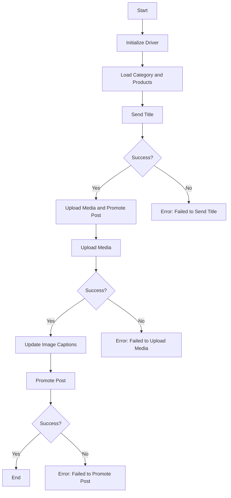

# Анализ кода модуля `post_message_async.md`

**Качество кода**
8
-   Плюсы
    -   Документ предоставляет четкое описание процесса асинхронной публикации сообщений в Facebook.
    -   Наличие блок-схемы и описания функций облегчает понимание логики работы скрипта.
    -   Описаны основные шаги и функции, участвующие в процессе, что помогает понять структуру кода.
    -   Указаны зависимости и требования для работы скрипта.
-   Минусы
    -   Документ не содержит примеров reStructuredText (RST) для функций, классов и модулей, а также нет примеров улучшения кода в стиле TODO.
    -   Не показано, как использовать `j_loads` или `j_loads_ns` для загрузки данных.
    -   Отсутствуют примеры логирования ошибок с использованием `logger.error`.
    -   Нет подробных комментариев к коду в формате RST, описывающих каждый шаг выполнения программы.
    -   Недостаточно информации о том, как именно обрабатываются ошибки и как они влияют на выполнение сценария.
    -   В описании функций не указано, что возвращается `None`, если функция не выполнена успешно, хотя это подразумевается.

**Рекомендации по улучшению**

1.  **Документация RST:** Необходимо добавить примеры документации RST для функций, классов и модулей, чтобы соответствовать требованиям.
2.  **Использование `j_loads`**:  Показать примеры, как использовать `j_loads` или `j_loads_ns` для загрузки данных из файлов, вместо стандартного `json.load`.
3.  **Логирование ошибок**: Привести примеры логирования ошибок с использованием `logger.error`.
4.  **Подробные комментарии RST**: Добавить подробные комментарии в формате RST к коду, поясняющие каждый шаг выполнения, а также предоставить примеры улучшений в формате TODO.
5.  **Обработка ошибок**:  Более четко описать, как обрабатываются ошибки, и как они влияют на работу сценария.
6.  **Уточнение возвращаемых значений**:  Явно указать, что функции возвращают `None`, если они не были выполнены успешно.
7.  **Примеры кода**: Добавить примеры кода с использованием `j_loads` или `j_loads_ns`.

**Оптимизиробанный код**

```markdown
```rst
Модуль для асинхронной публикации сообщений в Facebook.
======================================================

Этот модуль предназначен для автоматизации процесса публикации сообщений в Facebook, включая отправку заголовка и описания, загрузку медиафайлов и обновление их подписей.

Модуль взаимодействует с веб-страницей Facebook через драйвер Selenium и использует асинхронные операции для повышения производительности.

Пример использования
--------------------

.. code-block:: python

    from src.webdriver.driver import Driver
    from types import SimpleNamespace
    import asyncio

    async def main():
        # Инициализация драйвера
        driver = Driver(...)

        # Загрузка данных о категории и продуктах
        category = SimpleNamespace(title="Заголовок кампании", description="Описание кампании")
        products = [SimpleNamespace(local_saved_image='путь/к/изображению.jpg', ...)]

        # Отправка заголовка
        if post_title(driver, category):
            # Загрузка медиа и продвижение поста
            await promote_post(driver, category, products)
        else:
            print("Ошибка отправки заголовка")

    if __name__ == "__main__":
        asyncio.run(main())


```

## Asynchronous Facebook Post Message Scenario

### Overview

This script is part of the `hypotez/src/endpoints/advertisement/facebook/scenarios` directory and is designed to automate the process of posting messages on Facebook. The script interacts with the Facebook page by using locators to perform various actions such as sending messages, uploading media files, and updating captions.

### Key Features

1.  **Sending Title and Description**: Sends the title and description of a campaign to the Facebook post message box.
2.  **Uploading Media Files**: Uploads media files (images and videos) to the Facebook post and updates their captions.
3.  **Promoting Post**: Manages the entire process of promoting a post with a title, description, and media files.

### Module Structure



### Legend

1.  **Start**: Start of script execution.
2.  **InitDriver**: Create an instance of the `Driver` class.
3.  **LoadCategoryAndProducts**: Load category and product data.
4.  **SendTitle**: Call the `post_title` function to send the title.
5.  **CheckTitleSuccess**: Check if the title was sent successfully.
    -   **Yes**: Proceed to upload media and promote the post.
    -   **No**: Output error "Failed to send title".
6.  **UploadMediaAndPromotePost**: Call the `promote_post` function.
7.  **UploadMedia**: Call the `upload_media` function to upload media files.
8.  **CheckMediaSuccess**: Check if media was uploaded successfully.
    -   **Yes**: Proceed to update image captions.
    -   **No**: Output error "Failed to upload media".
9.  **UpdateCaptions**: Call the `update_images_captions` function to update captions.
10. **PromotePost**: Complete the post promotion process.
11. **CheckPromoteSuccess**: Check if the post was promoted successfully.
    -   **Yes**: End of script execution.
    -   **No**: Output error "Failed to promote post".

-----------------------

#### Functions

-   **`post_title(d: Driver, category: SimpleNamespace) -> bool`**:
    -   **Purpose**: Sends the title and description of a campaign to the Facebook post message box.
    -   **Parameters**:
        -   `d`: The `Driver` instance used for interacting with the webpage.
        -   `category`: The category containing the title and description to be sent.
    -   **Returns**: `True` if the title and description were sent successfully, `None` otherwise.

-   **`upload_media(d: Driver, products: List[SimpleNamespace], no_video: bool = False) -> bool`**:
    -   **Purpose**: Uploads media files to the Facebook post.
    -   **Parameters**:
        -   `d`: The `Driver` instance used for interacting with the webpage.
        -   `products`: List of products containing media file paths.
        -   `no_video`: Flag indicating whether to skip video uploads.
    -   **Returns**: `True` if media files were uploaded successfully, `None` otherwise.

-   **`update_images_captions(d: Driver, products: List[SimpleNamespace], textarea_list: List[WebElement]) -> None`**:
    -   **Purpose**: Asynchronously adds descriptions to uploaded media files.
    -   **Parameters**:
        -   `d`: The `Driver` instance used for interacting with the webpage.
        -   `products`: List of products with details to update.
        -   `textarea_list`: List of textareas where captions are added.
    -    **Returns**: None.

-   **`promote_post(d: Driver, category: SimpleNamespace, products: List[SimpleNamespace], no_video: bool = False) -> bool`**:
    -   **Purpose**: Manages the process of promoting a post with a title, description, and media files.
    -   **Parameters**:
        -   `d`: The `Driver` instance used for interacting with the webpage.
        -   `category`: The category details used for the post title and description.
        -   `products`: List of products containing media and details to be posted.
        -   `no_video`: Flag indicating whether to skip video uploads.
    -   **Returns**: `True` if the post was promoted successfully, `None` otherwise.

### Usage

To use this script, follow these steps:

1.  **Initialize Driver**: Create an instance of the `Driver` class.
2.  **Load Locators**: Load the locators from the JSON file.
3.  **Call Functions**: Use the provided functions to send the title, upload media, and promote the post.

#### Example

```python
from src.webdriver.driver import Driver
from types import SimpleNamespace
import asyncio

# Инициализация драйвера
driver = Driver(...)

# Загрузка данных о категории и продуктах
category = SimpleNamespace(title="Заголовок кампании", description="Описание кампании")
products = [SimpleNamespace(local_saved_image='путь/к/изображению.jpg', ...)]

# Отправка заголовка
if post_title(driver, category):
    # Загрузка медиа и продвижение поста
    asyncio.run(promote_post(driver, category, products))
else:
    print("Ошибка отправки заголовка")
```

### Dependencies

-   `selenium`: For web automation.
-   `asyncio`: For asynchronous operations.
-   `pathlib`: For handling file paths.
-   `types`: For creating simple namespaces.
-   `typing`: For type annotations.

### Error Handling

The script includes robust error handling to ensure that the execution continues even if certain elements are not found or if there are issues with the web page. This is particularly useful for handling dynamic or unstable web pages.

### Contributing

Contributions to this script are welcome. Please ensure that any changes are well-documented and include appropriate tests.

### License

This script is licensed under the MIT License. See the `LICENSE` file for more details.
```