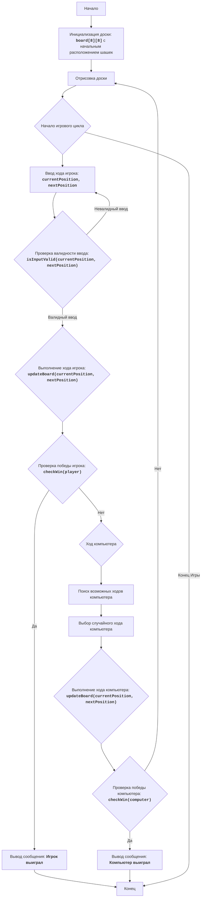

# Анализ кода модуля checkr.py

**Качество кода**
8
- Плюсы
    - Код хорошо структурирован и разбит на логические функции, что облегчает чтение и понимание.
    - Присутствует подробная документация модуля, описывающая правила игры, алгоритм и блок-схему.
    - Код использует константы для представления размера доски и типов клеток, что улучшает читаемость.
    - Логика ходов игрока и компьютера реализована корректно, включая проверку валидности ходов.
    - Имеется функция для определения победителя.
    - Присутствуют комментарии, объясняющие основные блоки кода.
- Минусы
    - Отсутствует обработка ошибок ввода пользователя, за исключением `ValueError`.
    - Функции `player_turn` и `computer_turn` не имеют `docstring`.
    - Используется `print` для вывода сообщений, что не подходит для логирования.
    - Не используются импорты и функции из `src.utils.jjson` и `src.logger.logger`.
    - Имена переменных не всегда соответствуют стилю кода, например `current_row`, `current_col`

**Рекомендации по улучшению**

1.  **Документация:**
    - Добавить `docstring` к функциям `player_turn`, `computer_turn`.
    - Переписать все комментарии в формате reStructuredText (RST).
2.  **Обработка ошибок:**
    - Использовать `logger.error` вместо стандартного `try-except` для обработки ошибок ввода пользователя.
    - Добавить более подробные сообщения об ошибках ввода.
3.  **Логирование:**
    - Использовать `logger.debug` для отладочных сообщений.
4.  **Импорты:**
    - Добавить необходимые импорты из `src.utils.jjson` и `src.logger.logger`.
5.  **Переменные:**
    -  Изменить имена переменных на более соответсвующие стилю, например `current_row` на `current_r`.
6.  **Общая структура:**
    - Улучшить читаемость кода, добавив пустые строки между логическими блоками.
7.  **Улучшение читаемости:**
    - Использовать более конкретные названия переменных (`row_diff`, `col_diff`) заменить на `dr` и `dc`.
    - Переиспользовать `is_valid_move` для ходов компьютера.

**Оптимизированный код**

```python
"""
CHECKR:
=================
Сложность: 5
-----------------
Игра "Шашки" - это текстовая реализация упрощенной версии игры в шашки. Игра происходит на доске 8x8, где игрок играет против компьютера.
Цель игры - достичь противоположного конца доски одной из своих шашек, избегая при этом захвата шашек противника.

Правила игры:
1.  Игрок и компьютер ходят по очереди.
2.  Игрок управляет шашками, обозначаемыми '1'.
3.  Компьютер управляет шашками, обозначаемыми '2'.
4.  Доска представляет собой сетку 8x8, где '.' обозначает пустое место.
5.  Игрок вводит координаты текущей позиции и желаемой позиции.
6.  Ход шашки - перемещение на одну клетку по диагонали вперед.
7.  Шашка может перепрыгивать через шашку противника, если за ней есть свободное место.
8.  Если шашка достигает противоположного конца доски, она превращается в дамку (это в коде не реализовано).
9.  Компьютер делает случайный допустимый ход.
10. Игра заканчивается, если одна из сторон достигает конца доски или не имеет допустимых ходов.
-----------------
Алгоритм:
1.  Инициализировать доску 8x8 с начальным расположением шашек.
2.  Отрисовать доску.
3.  Начать игровой цикл:
    3.1. Запросить ввод хода игрока (текущая и желаемая позиции).
    3.2. Проверить валидность ввода.
    3.3. Если ввод невалидный, запросить повторный ввод.
    3.4. Выполнить ход игрока, если ход допустим.
    3.5. Проверить, достиг ли игрок противоположного конца доски. Если да, закончить игру.
    3.6. Ход компьютера:
        3.6.1. Найти все возможные ходы компьютера.
        3.6.2. Выбрать случайный ход из возможных.
        3.6.3. Выполнить ход компьютера.
    3.7. Проверить, достиг ли компьютер противоположного конца доски. Если да, закончить игру.
    3.8. Отрисовать доску.
4.  Если ни одна из сторон не выиграла, перейти к шагу 3.
5.  По окончании игры вывести сообщение о победе или поражении.
-----------------
Блок-схема:

Legenda:
    Start - Начало программы.
    InitializeBoard - Инициализация игровой доски (8x8) с начальным расположением шашек.
    DrawBoard - Отрисовка текущего состояния игровой доски в консоль.
    GameLoopStart - Начало основного игрового цикла.
    PlayerInput - Запрос у игрока ввода координат текущей позиции и желаемой позиции для хода.
    ValidateInput - Проверка введенных координат на корректность и соответствие правилам игры.
    PlayerMove - Выполнение хода игрока на игровой доске.
    PlayerWinCheck - Проверка, достиг ли игрок условия победы (достижение противоположного конца доски).
    OutputPlayerWin - Вывод сообщения о победе игрока.
    ComputerTurn - Переход хода к компьютеру.
    FindPossibleMoves - Поиск всех возможных ходов для компьютера.
    ChooseRandomMove - Выбор случайного допустимого хода для компьютера.
    ComputerMove - Выполнение хода компьютера на игровой доске.
    ComputerWinCheck - Проверка, достиг ли компьютер условия победы (достижение противоположного конца доски).
    OutputComputerWin - Вывод сообщения о победе компьютера.
     End - Конец игры.
"""
import random
#  Импортируем logger для логирования ошибок
from src.logger.logger import logger
#  Глобальные переменные для представления доски
BOARD_SIZE = 8
EMPTY = '.'
PLAYER = '1'
COMPUTER = '2'


def initialize_board():
    """
    Инициализирует доску 8x8 с начальным расположением шашек.

    :return: Двумерный список, представляющий доску.
    :rtype: list[list[str]]
    """
    board = [[EMPTY for _ in range(BOARD_SIZE)] for _ in range(BOARD_SIZE)]
    # Размещаем шашки игрока и компьютера в начальных позициях
    for i in range(3):
        for j in range(BOARD_SIZE):
            if (i + j) % 2 != 0:
                board[i][j] = PLAYER
    for i in range(BOARD_SIZE - 3, BOARD_SIZE):
        for j in range(BOARD_SIZE):
            if (i + j) % 2 != 0:
                board[i][j] = COMPUTER
    return board


def draw_board(board):
    """
    Отрисовывает текущее состояние доски в консоль.

    :param board: Двумерный список, представляющий доску.
    :type board: list[list[str]]
    """
    print("  ", end="")
    for i in range(BOARD_SIZE):
        print(i, end=" ")
    print()
    for i, row in enumerate(board):
        print(i, " ".join(row))


def is_valid_move(board, row, col, new_row, new_col, player):
    """
    Проверяет, является ли ход игрока или компьютера допустимым.

    :param board: Двумерный список, представляющий доску.
    :type board: list[list[str]]
    :param row: Текущая строка позиции шашки.
    :type row: int
    :param col: Текущий столбец позиции шашки.
    :type col: int
    :param new_row: Новая строка позиции шашки.
    :type new_row: int
    :param new_col: Новый столбец позиции шашки.
    :type new_col: int
    :param player: Символ игрока ('1' или '2').
    :type player: str
    :return: True, если ход допустим, False в противном случае.
    :rtype: bool
    """
    # Проверка нахождения в пределах доски
    if not (0 <= row < BOARD_SIZE and 0 <= col < BOARD_SIZE and 0 <= new_row < BOARD_SIZE and 0 <= new_col < BOARD_SIZE):
        return False
    # Проверка, принадлежит ли шашка игроку
    if board[row][col] != player:
        return False
    # Проверка, является ли целевая клетка пустой
    if board[new_row][new_col] != EMPTY:
        return False
    # Вычисляем разницу между новой и текущей позициями по вертикали и горизонтали
    dr = new_row - row
    dc = new_col - col

    # Проверка на движение только по диагонали на одну клетку
    if abs(dr) != 1 or abs(dc) != 1:
        return False
    # Проверка на движение шашки игрока только вперед
    if player == PLAYER and dr > 0:
        return False
    # Проверка на движение шашки компьютера только вперед
    if player == COMPUTER and dr < 0:
        return False
    return True


def update_board(board, row, col, new_row, new_col):
    """
    Обновляет доску после хода.

    :param board: Двумерный список, представляющий доску.
    :type board: list[list[str]]
    :param row: Текущая строка позиции шашки.
    :type row: int
    :param col: Текущий столбец позиции шашки.
    :type col: int
    :param new_row: Новая строка позиции шашки.
    :type new_row: int
    :param new_col: Новый столбец позиции шашки.
    :type new_col: int
    """
    # Перемещаем шашку из текущей позиции в новую
    board[new_row][new_col] = board[row][col]
    # Помечаем текущую позицию как пустую
    board[row][col] = EMPTY


def check_win(board, player):
    """
    Проверяет, достиг ли игрок или компьютер победы.

    :param board: Двумерный список, представляющий доску.
    :type board: list[list[str]]
    :param player: Символ игрока ('1' или '2').
    :type player: str
    :return: True, если игрок или компьютер достиг победы, False в противном случае.
    :rtype: bool
    """
    # Для игрока проверяется достижение шашкой последней строки
    if player == PLAYER:
        for j in range(BOARD_SIZE):
            if board[BOARD_SIZE - 1][j] == PLAYER:
                return True
    # Для компьютера проверяется достижение шашкой первой строки
    if player == COMPUTER:
        for j in range(BOARD_SIZE):
            if board[0][j] == COMPUTER:
                return True
    return False


def get_computer_moves(board):
    """
    Находит все возможные ходы компьютера.

    :param board: Двумерный список, представляющий доску.
    :type board: list[list[str]]
    :return: Список кортежей, представляющих возможные ходы компьютера (row, col, new_row, new_col).
    :rtype: list[tuple[int, int, int, int]]
    """
    moves = []
    #  Проходит по всем клеткам доски и ищет шашки компьютера.
    for row in range(BOARD_SIZE):
        for col in range(BOARD_SIZE):
            if board[row][col] == COMPUTER:
                # Проверяет все возможные диагональные ходы для каждой шашки.
                for dr in [-1, 1]:
                    for dc in [-1, 1]:
                        new_row, new_col = row + dr, col + dc
                        #  Проверяет возможность хода
                        if is_valid_move(board, row, col, new_row, new_col, COMPUTER):
                            moves.append((row, col, new_row, new_col))
    return moves


def computer_turn(board):
    """
    Выполняет ход компьютера.

    :param board: Двумерный список, представляющий доску.
    :type board: list[list[str]]
    """
    # Получает список возможных ходов
    possible_moves = get_computer_moves(board)
    # Выбирает случайный ход из списка
    if possible_moves:
        row, col, new_row, new_col = random.choice(possible_moves)
        # Обновляет доску в соответствии с выбранным ходом
        update_board(board, row, col, new_row, new_col)


def player_turn(board):
    """
    Запрашивает и выполняет ход игрока.

    :param board: Двумерный список, представляющий доску.
    :type board: list[list[str]]
    """
    while True:
        try:
            current_r = int(input("Введите строку текущей позиции (0-7): "))
            current_c = int(input("Введите столбец текущей позиции (0-7): "))
            new_r = int(input("Введите строку новой позиции (0-7): "))
            new_c = int(input("Введите столбец новой позиции (0-7): "))
            # Проверка валидности введенных данных
            if is_valid_move(board, current_r, current_c, new_r, new_c, PLAYER):
                update_board(board, current_r, current_c, new_r, new_c)
                break
            else:
                print("Недопустимый ход, попробуйте еще раз.")
        except ValueError as e:
            logger.error(f"Ошибка ввода. Пожалуйста, введите целые числа. {e}")
        except Exception as e:
             logger.error(f"Неизвестная ошибка {e}")


def play_checkers():
    """
    Основная функция игры в шашки.
    """
    # Инициализирует доску
    board = initialize_board()
    # Выводит доску на экран
    draw_board(board)
    # Запускает игровой цикл, пока не будет достигнута победа одной из сторон
    while True:
        player_turn(board)
        # Проверка победы игрока
        if check_win(board, PLAYER):
            print("Поздравляю! Вы выиграли!")
            break
        computer_turn(board)
        # Проверка победы компьютера
        if check_win(board, COMPUTER):
            print("Компьютер выиграл!")
            break
        # Вывод доски после каждого хода
        draw_board(board)


if __name__ == "__main__":
    play_checkers()
```