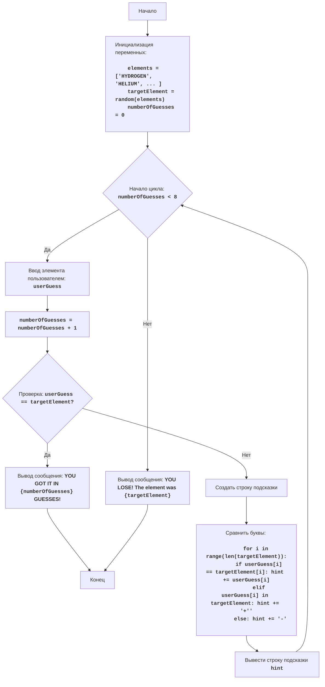

# Анализ кода модуля `chemst.py`

**Качество кода**
9
-  Плюсы
    - Код хорошо структурирован, логика игры четко прослеживается.
    - Присутствует подробное описание алгоритма и блок-схема в начале файла.
    - Комментарии объясняют основные шаги алгоритма.
    - Используется `random.choice` для выбора случайного элемента.
    - Код легко читаемый и понятный.
-  Минусы
    - Отсутствует обработка ошибок (например, если пользователь введет не буквенные символы).
    - Не используется `j_loads` для загрузки данных.
    - Не используется `logger` для логирования ошибок и отладки.
    - Комментарии не соответствуют стандарту reStructuredText (RST).

**Рекомендации по улучшению**

1.  **Добавить импорты:** Добавить `from src.utils.jjson import j_loads_ns` и `from src.logger.logger import logger` для обработки данных и логирования.
2.  **Использовать `j_loads_ns`:** Если есть необходимость загружать данные из файла, использовать `j_loads_ns` для этого.
3.  **Использовать `logger`:** Заменить стандартные `print` на `logger.info` и `logger.error` для более гибкого логирования.
4.  **Обработка ошибок:** Добавить обработку ошибок для ввода пользователя, например, проверять, что введено только буквенное значение.
5.  **Документирование:**  Переписать все комментарии и docstring в формате reStructuredText (RST).

**Оптимизированный код**
```python
"""
CHEMST:
=================
Сложность: 7
-----------------
Игра "CHEMST" (Химик) - это игра, в которой игрок пытается угадать химические элементы, основываясь на подсказках.
Компьютер выбирает случайный элемент из заданного списка, а игрок делает попытки угадать его.
Игра не является реалистичным симулятором химии, скорее это игра на угадывание слова с ограниченным количеством попыток.
После каждой попытки игроку сообщается, есть ли в его догадке буквы из загаданного элемента и на каких позициях.

Правила игры:
1.  Компьютер выбирает случайный химический элемент из списка.
2.  Игрок пытается угадать элемент, вводя название элемента.
3.  После каждой попытки компьютер показывает, сколько букв из предположения игрока совпадают с буквами загаданного элемента, и на каких позициях.
4.  Игрок имеет максимум 8 попыток.
5.  Игра заканчивается, когда игрок угадывает элемент или исчерпывает все попытки.
-----------------
Алгоритм:
1.  Задать список химических элементов.
2.  Выбрать случайный элемент из списка.
3.  Установить количество попыток равным 0.
4.  Начать цикл "пока число попыток меньше 8":
    4.1 Запросить у игрока ввод названия элемента.
    4.2 Увеличить число попыток на 1.
    4.3 Если введенное название элемента равно загаданному элементу, вывести сообщение о победе и выйти из цикла.
    4.4 Иначе, создать строку подсказки.
    4.5 Сравнить каждую букву из предположения игрока с соответствующей буквой из загаданного элемента.
        - Если буквы совпадают и находятся на одинаковых позициях, поставить букву на эту же позицию в строке подсказки.
        - Если буквы совпадают но не находятся на одинаковых позициях, поставить символ `+` на эту же позицию в строке подсказки.
        - Если буквы не совпадают, поставить символ `-` на эту же позицию в строке подсказки.
    4.6 Вывести строку подсказки.
5. Если цикл завершился, но элемент не угадан, вывести сообщение о проигрыше и правильный ответ.
6. Конец игры.
-----------------
Блок-схема:


Legenda:
    Start - Начало программы.
    InitializeVariables - Инициализация переменных: список элементов elements, выбор случайного элемента targetElement, и установка количества попыток numberOfGuesses в 0.
    LoopStart - Начало цикла, который продолжается, пока количество попыток numberOfGuesses меньше 8.
    InputGuess - Запрос у пользователя ввода названия элемента и сохранение его в переменной userGuess.
    IncreaseGuesses - Увеличение счетчика количества попыток numberOfGuesses на 1.
    CheckGuess - Проверка, равно ли введенное название элемента userGuess загаданному элементу targetElement.
    OutputWin - Вывод сообщения о победе, если названия элементов равны, с указанием количества попыток.
    End - Конец программы.
    CreateHint - Создание строки подсказки для пользователя.
    CompareLetters - Сравнение букв в введенном элементе с буквами в загаданном элементе и формирование строки подсказки.
    OutputHint - Вывод строки подсказки.
    OutputLose - Вывод сообщения о проигрыше, если количество попыток исчерпано, и показ правильного ответа.
"""
import random
# импортируем j_loads_ns для загрузки данных и logger для логирования
from src.utils.jjson import j_loads_ns
from src.logger.logger import logger

# Список химических элементов
elements = ['HYDROGEN', 'HELIUM', 'LITHIUM', 'BERYLLIUM', 'BORON', 'CARBON', 'NITROGEN', 'OXYGEN', 'FLUORINE', 'NEON', 'SODIUM', 'MAGNESIUM', 'ALUMINUM', 'SILICON', 'PHOSPHORUS', 'SULFUR', 'CHLORINE', 'ARGON', 'POTASSIUM', 'CALCIUM']
# Выбираем случайный элемент из списка
targetElement = random.choice(elements)
# Инициализируем количество попыток
numberOfGuesses = 0

# Основной игровой цикл
while numberOfGuesses < 8:
    # Запрашиваем ввод элемента у пользователя
    try:
        userGuess = input("Введите название элемента: ").upper()
        # Проверка, что введенное значение является буквенным
        if not userGuess.isalpha():
            logger.error('Введенное значение должно содержать только буквы')
            continue
    except Exception as ex:
         # Логируем ошибку, если что-то пошло не так
        logger.error(f'Ошибка ввода данных: {ex}')
        continue

    # Увеличиваем количество попыток
    numberOfGuesses += 1

    # Проверяем, угадан ли элемент
    if userGuess == targetElement:
        # Код выводит сообщение о победе
        logger.info(f"ПОЗДРАВЛЯЮ! Вы угадали элемент за {numberOfGuesses} попыток!")
        break  # Завершаем цикл, если элемент угадан
    else:
        # Создаем строку подсказки
        hint = ""
        # Сравниваем каждую букву предположения с буквами загаданного элемента
        for i in range(len(targetElement)):
            if i < len(userGuess):
              if userGuess[i] == targetElement[i]:
                  hint += userGuess[i]  # Если буквы совпадают и находятся на одинаковых позициях, добавляем букву
              elif userGuess[i] in targetElement:
                  hint += "+"   # Если буквы совпадают, но не на одинаковых позициях, добавляем +
              else:
                  hint += "-"  # Если буквы не совпадают, добавляем -
            else:
                hint += "-"
        # Код выводит строку подсказку
        logger.info(hint)

# Если попытки закончились, а элемент не угадан
if numberOfGuesses == 8:
    # Код выводит сообщение о проигрыше и правильный ответ
    logger.info(f"ВЫ ПРОИГРАЛИ! Загаданный элемент был {targetElement}")

"""
Объяснение кода:
1.  **Импорт модуля `random`**::

    -   `import random`: Импортирует модуль `random`, который используется для выбора случайного элемента из списка.

2.  **Импорт `j_loads_ns` и `logger`**::

    -   `from src.utils.jjson import j_loads_ns`: Импортирует функцию `j_loads_ns` для обработки JSON.
    -   `from src.logger.logger import logger`: Импортирует объект `logger` для логирования.

3.  **Список химических элементов `elements`**::

    -   `elements = [...]`: Создает список химических элементов.

4.  **Выбор случайного элемента**::

    -   `targetElement = random.choice(elements)`: Выбирает случайный элемент из списка `elements` и сохраняет его в переменной `targetElement`.

5.  **Инициализация количества попыток**::

    -   `numberOfGuesses = 0`: Устанавливает начальное количество попыток равным 0.

6.  **Основной игровой цикл `while numberOfGuesses < 8:`**::

    -   Цикл выполняется, пока количество попыток `numberOfGuesses` меньше 8.

7.  **Ввод предположения игрока**::
    -  `try:`:  блок обработки исключений.
        -  `userGuess = input("Введите название элемента: ").upper()`: Запрашивает у пользователя ввод названия элемента, преобразует ввод в верхний регистр и сохраняет в переменной `userGuess`.
        -   `if not userGuess.isalpha():`: Проверяет, состоит ли введенная строка только из букв.
        -    `logger.error('Введенное значение должно содержать только буквы')`: логирует ошибку, если ввод некорректен.
    - `except Exception as ex:`: блок обработки исключений.
        -  `logger.error(f'Ошибка ввода данных: {ex}')`: Логирует ошибку, если что-то пошло не так.

8.  **Увеличение количества попыток**::

    -   `numberOfGuesses += 1`: Увеличивает счетчик количества попыток на 1.

9.  **Проверка на победу**::

    -   `if userGuess == targetElement:`: Проверяет, совпадает ли введенный пользователем элемент с загаданным.
    -   `logger.info(f"ПОЗДРАВЛЯЮ! Вы угадали элемент за {numberOfGuesses} попыток!")`: Выводит сообщение о победе с количеством попыток используя logger.
    -   `break`: Завершает цикл, если элемент угадан.

10. **Создание строки подсказки**::

    -   `else:`:  Если элемент не угадан, выполняется блок else.
    -   `hint = ""`: Инициализирует пустую строку для подсказки.
    -   `for i in range(len(targetElement)):`: Цикл для перебора всех букв в загаданном элементе.
        -  `if i < len(userGuess):`: Проверяет, не выходит ли индекс за длину введенного пользователем слова.
        -   `if userGuess[i] == targetElement[i]:`: Если буквы совпадают и на тех же позициях, добавляем букву в строку hint.
        -    `elif userGuess[i] in targetElement:`: Если буква из догадки присутствует в загаданном элементе но не на той же позиции, добавляем "+".
        -    `else:`: Если буквы не совпадают, добавляем "-".
        -  `else:`: Если индекс выходит за рамки длины введенного слова, ставим "-".
    -    `logger.info(hint)`: Выводит строку подсказки.

11. **Проверка на проигрыш**::

    -   `if numberOfGuesses == 8:`: После завершения цикла проверяется, закончились ли попытки.
    -   `logger.info(f"ВЫ ПРОИГРАЛИ! Загаданный элемент был {targetElement}")`: Выводит сообщение о проигрыше и показывает правильный ответ.
"""
```