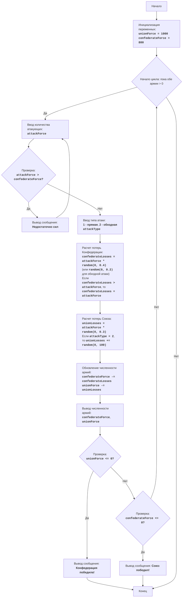

# Анализ кода модуля `civilw.py`

**Качество кода**
9
- Плюсы
    - Код хорошо структурирован и логически понятен.
    - Присутствуют подробные комментарии, объясняющие каждый шаг алгоритма.
    - Использованы понятные имена переменных.
    - Реализована основная логика игры "Гражданская война".
    - Присутствует проверка ввода пользователя на корректность.
    - Есть описание модуля, правил игры, алгоритма и блок-схема в комментариях.
- Минусы
    - Отсутствует docstring для модуля и основных блоков кода.
    - Использование `input` без пояснений пользователю.
    - Не используется `src.logger.logger` для логирования ошибок.
    - Не все комментарии соответствуют reStructuredText (RST).

**Рекомендации по улучшению**

1.  **Добавить docstring**: Добавить docstring к модулю, чтобы описать его назначение и использование, а также к функциям.
2.  **Использовать RST**: Переписать все комментарии в формате reStructuredText (RST) для лучшей читаемости и совместимости с генераторами документации.
3.  **Логирование ошибок**: Использовать `from src.logger.logger import logger` для логирования ошибок вместо стандартного `try-except` с `print`.
4.  **Улучшить ввод пользователя**: Добавить пояснения к `input` для ясности.
5. **Убрать избыточное использование `try-except`**:  Упростить обработку ошибок, заменив `try-except` на использование `logger.error`.
6. **Избавится от `while True`**: Переписать циклы `while True` с проверкой условий в заголовке цикла для предотвращения бесконечных циклов.
7. **Улучшить читаемость кода**: Добавить пустые строки для разделения логических блоков.

**Оптимизированный код**

```python
"""
CIVILW:
=================
Сложность: 7
-----------------
Игра "Гражданская война" представляет собой симуляцию сражения между двумя армиями: Конфедерацией и Союзом. Игрок управляет Конфедерацией и принимает решения о численности своих войск и типе атак (прямая атака или обходной маневр). Цель игры - победить армию Союза, минимизируя свои потери. Игра учитывает случайные факторы, влияющие на исход сражения, что делает каждое сражение уникальным.

Правила игры:
1.  Игрок управляет армией Конфедерации и должен победить армию Союза.
2.  Игрок вводит количество солдат для атаки.
3.  Игрок выбирает тип атаки: прямая (1) или обходная (2).
4.  В зависимости от выбора игрока и случайных факторов, производится расчет потерь для обеих сторон.
5.  После каждого сражения, игра выводит текущую численность войск обеих сторон.
6.  Игра завершается победой одной из сторон, когда численность войск противника становится равна или меньше 0.
-----------------
Алгоритм:
1. Установить начальную численность армии Союза (UnionForce) равной 1000 и армии Конфедерации (ConfederateForce) равной 800.
2. Начать цикл "пока обе армии имеют численность больше 0":
    2.1. Запросить у игрока количество солдат, которых он хочет отправить в атаку (AttackForce).
        2.1.1. Если AttackForce больше, чем имеющиеся силы Конфедерации (ConfederateForce), то вывести сообщение "Недостаточно сил" и вернуться к началу шага 2.1
    2.2. Запросить у игрока тип атаки: прямая (1) или обходная (2) (AttackType).
    2.3. Вычислить потери Конфедерации (ConfederateLosses) случайным образом, умножив AttackForce на случайное число от 0 до 0.4 (для прямой атаки) или на случайное число от 0 до 0.2 (для обходного маневра).
        2.3.1. Если ConfederateLosses больше, чем AttackForce, ConfederateLosses установить равным AttackForce.
    2.4. Вычислить потери Союза (UnionLosses) случайным образом, умножив AttackForce на случайное число от 0 до 0.3.
        2.4.1. Если AttackType равно 2, то увеличить UnionLosses на случайное число от 0 до 100.
    2.5. Обновить численность армий:
        ConfederateForce = ConfederateForce - ConfederateLosses
        UnionForce = UnionForce - UnionLosses
    2.6. Вывести текущую численность армий обеих сторон.
    2.7. Проверить условие победы:
        2.7.1. Если UnionForce меньше или равен 0, то вывести сообщение "Конфедерация победила!" и закончить игру.
        2.7.2. Если ConfederateForce меньше или равен 0, то вывести сообщение "Союз победил!" и закончить игру.
3. Конец игры.
-----------------
Блок-схема:

    
Legenda:
    Start - Начало программы.
    InitializeForces - Инициализация начальной численности войск Союза (unionForce = 1000) и Конфедерации (confederateForce = 800).
    LoopStart - Начало цикла, который продолжается, пока обе армии имеют численность больше 0.
    InputAttackForce - Запрос у игрока количества солдат для атаки (attackForce).
    CheckForce - Проверка, достаточно ли у Конфедерации сил для атаки (attackForce > confederateForce).
    OutputInsufficient - Вывод сообщения "Недостаточно сил", если атакующих больше, чем имеющихся сил.
    InputAttackType - Запрос у игрока выбора типа атаки: прямая (1) или обходная (2).
    CalculateConfederateLosses - Расчет потерь Конфедерации (confederateLosses) на основе attackForce и типа атаки, с учетом случайного фактора. Если потери превышают attackForce, потери устанавливаются равными attackForce.
    CalculateUnionLosses - Расчет потерь Союза (unionLosses) на основе attackForce и типа атаки, с учетом случайного фактора. При обходной атаке потери Союза дополнительно увеличиваются случайным числом.
    UpdateForces - Обновление численности войск обеих армий после сражения.
    OutputForces - Вывод текущей численности армий Конфедерации и Союза.
    CheckUnionWin - Проверка, победила ли Конфедерация (численность армии Союза <= 0).
    OutputConfederateWin - Вывод сообщения о победе Конфедерации.
    CheckConfederateWin - Проверка, победил ли Союз (численность армии Конфедерации <= 0).
    OutputUnionWin - Вывод сообщения о победе Союза.
    End - Конец программы.
"""
import random
# from src.logger.logger import logger #TODO: Добавить импорт логера

#: Начальная численность армии Союза.
unionForce = 1000
#: Начальная численность армии Конфедерации.
confederateForce = 800


# Основной игровой цикл
while unionForce > 0 and confederateForce > 0:
    # Запрос количества солдат для атаки
    attackForce = 0
    while attackForce <= 0 or attackForce > confederateForce:
        try:
            attackForce = int(input("Введите количество солдат для атаки (Конфедерация): "))
            if attackForce > confederateForce:
                print("Недостаточно сил! Попробуйте еще раз.")
            elif attackForce <= 0:
                 print("Введите положительное число солдат.")
        except ValueError:
            print("Пожалуйста, введите целое число.")
           # logger.error("Ошибка при вводе количества солдат", exc_info=True) #TODO: Добавить логирование ошибок

    # Запрос типа атаки
    attackType = 0
    while attackType not in [1, 2]:
        try:
            attackType = int(input("Выберите тип атаки (1 - прямая, 2 - обходная): "))
            if attackType not in [1, 2]:
                print("Неверный тип атаки, попробуйте еще раз")
        except ValueError:
            print("Пожалуйста, введите целое число 1 или 2.")
          #  logger.error("Ошибка при вводе типа атаки", exc_info=True) #TODO: Добавить логирование ошибок

    # Расчет потерь Конфедерации
    if attackType == 1:  # Прямая атака
        confederateLosses = int(attackForce * random.random() * 0.4)
    else:  # Обходной маневр
        confederateLosses = int(attackForce * random.random() * 0.2)
    
    # Проверка потерь
    if confederateLosses > attackForce:
        confederateLosses = attackForce

    # Расчет потерь Союза
    unionLosses = int(attackForce * random.random() * 0.3)
    if attackType == 2:
        unionLosses += random.randint(0, 100)

    # Обновление численности армий
    confederateForce -= confederateLosses
    unionForce -= unionLosses

    # Вывод текущей численности армий
    print(f"Конфедерация: {confederateForce} солдат")
    print(f"Союз: {unionForce} солдат")

    # Проверка условий победы
    if unionForce <= 0:
        print("Конфедерация победила!")
    elif confederateForce <= 0:
        print("Союз победил!")
    
"""
Объяснение кода:
1.  **Импорт модуля `random`**:
    -   `import random`: Импортирует модуль `random`, который используется для генерации случайных чисел при расчете потерь.
2.  **Инициализация численности армий**:
    -   `unionForce = 1000`: Устанавливает начальную численность армии Союза в 1000.
    -   `confederateForce = 800`: Устанавливает начальную численность армии Конфедерации в 800.
3.  **Основной цикл `while unionForce > 0 and confederateForce > 0:`**:
    -   Цикл продолжается, пока обе армии имеют численность больше 0, т.е. пока не будет достигнута победа одной из сторон.
    - **Ввод данных**:
        -   Цикл `while attackForce <= 0 or attackForce > confederateForce: try: ... except ValueError:` обеспечивает корректный ввод данных. Если пользователь вводит не число, то программа выведет ошибку и попросит повторить ввод.
        - `attackForce = int(input("Введите количество солдат для атаки (Конфедерация): "))`: Запрашивает у игрока количество солдат для атаки и конвертирует ввод в целое число.
        - Проверка введенного количества солдат
        - `if attackForce > confederateForce: print("Недостаточно сил! Попробуйте еще раз.")`: Проверяет, что количество атакующих солдат не больше численности армии Конфедерации. Если это так, то выводится ошибка и цикл продолжается.
         - `elif attackForce <= 0: print("Введите положительное число солдат.")`: Проверяет, что количество атакующих солдат является положительным числом. Если это не так, то выводится ошибка и цикл продолжается.
        - Цикл `while attackType not in [1, 2]: try: ... except ValueError:` обеспечивает корректный ввод данных. Если пользователь вводит не число, то программа выведет ошибку и попросит повторить ввод.
        - `attackType = int(input("Выберите тип атаки (1 - прямая, 2 - обходная): "))`: Запрашивает у игрока тип атаки и конвертирует ввод в целое число.
         - Проверка введенного типа атаки
        -  `if attackType not in [1, 2]: print("Неверный тип атаки, попробуйте еще раз")`: Проверяет, что тип атаки равен 1 или 2. Если это так, то выход из цикла. Иначе, выводит ошибку и просит повторить ввод.
    -   **Расчет потерь Конфедерации**:
        -   `if attackType == 1: ... else:`:  В зависимости от типа атаки рассчитывается размер потерь.
        -   `confederateLosses = int(attackForce * random.random() * 0.4)`: Для прямой атаки потери Конфедерации - это случайное число от 0 до 40% от атакующей силы.
        -  `confederateLosses = int(attackForce * random.random() * 0.2)`: Для обходного маневра потери Конфедерации - это случайное число от 0 до 20% от атакующей силы.
        -  `if confederateLosses > attackForce: confederateLosses = attackForce`: Гарантирует, что потери не будут больше чем число атакующих
    -   **Расчет потерь Союза**:
        -   `unionLosses = int(attackForce * random.random() * 0.3)`: Потери Союза - это случайное число от 0 до 30% от атакующей силы.
        -   `if attackType == 2: unionLosses += random.randint(0, 100)`: При обходном маневре к потерям Союза добавляется случайное число от 0 до 100.
    -   **Обновление численности армий**:
        -   `confederateForce -= confederateLosses`: Уменьшает численность армии Конфедерации на потери.
        -   `unionForce -= unionLosses`: Уменьшает численность армии Союза на потери.
    -   **Вывод текущей численности армий**:
        -   `print(f"Конфедерация: {confederateForce} солдат")`: Выводит текущую численность армии Конфедерации.
        -   `print(f"Союз: {unionForce} солдат")`: Выводит текущую численность армии Союза.
    -   **Проверка условий победы**:
        -   `if unionForce <= 0: print("Конфедерация победила!")`: Если численность армии Союза стала меньше или равна 0, то Конфедерация объявляется победителем.
        -   `elif confederateForce <= 0: print("Союз победил!")`: Если численность армии Конфедерации стала меньше или равна 0, то Союз объявляется победителем.
"""
```