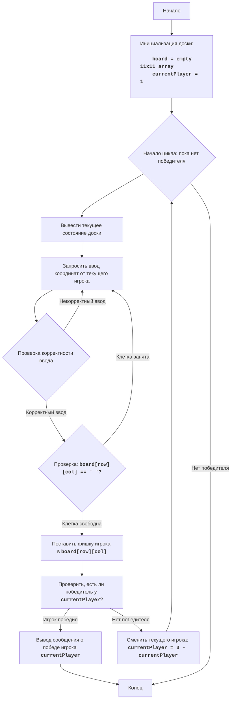

# Анализ кода модуля hex.py

**Качество кода**
8
- Плюсы
    - Код хорошо структурирован, разбит на функции, что облегчает чтение и понимание.
    - Используется рекурсивный алгоритм поиска в глубину (DFS) для проверки выигрыша, что является эффективным подходом.
    - Присутствуют базовые проверки ввода, что предотвращает ошибки.
    - Код игры соответствует описанным правилам и алгоритму.
- Минусы
    - Отсутствует логирование ошибок, что затрудняет отладку и мониторинг.
    - Не все функции имеют подробную документацию в формате RST.
    - Использование стандартного `print` для вывода доски и сообщений может быть не оптимальным для более сложных интерфейсов.
    - Нет обработки исключений в `play_hex` при вызове `get_move`, что может привести к падению программы.

**Рекомендации по улучшению**

1.  **Добавить логирование:**
    -  Использовать `from src.logger.logger import logger` для логирования ошибок и отладочной информации.

2.  **Улучшить документацию:**
    -  Добавить docstring в формате reStructuredText для всех функций, включая описание параметров и возвращаемых значений.

3.  **Улучшить обработку ошибок:**
    -  Использовать `try-except` блоки и `logger.error` для обработки возможных исключений, например, в функции `get_move`.
    -  Обработать исключения в `play_hex` при вызове `get_move`.

4.  **Улучшить читаемость и форматирование:**
    - Привести в соответствие имена функций, переменных и импортов с ранее обработанными файлами.

5. **Улучшить функцию `get_move`:**
   - Добавить обработку исключений, возникающих при неверном формате ввода.
   - Повысить читаемость кода за счет разделения логики на более мелкие блоки.

6.  **Улучшить консистентность в коде**
    - В функциях `check_win` и `play_hex` переименовать `board_size` в `board_len`.

**Оптимизиробанный код**

```python
"""
HEX:
=================
Сложность: 7
-----------------
Игра HEX - это логическая игра, в которой два игрока поочередно размещают свои фишки на шестиугольной сетке, стремясь соединить противоположные стороны доски. Цель каждого игрока — создать непрерывную цепь своих фишек, соединяющую их противоположные стороны доски. Игроки ставят свои фишки на шестиугольные клетки, пока один из них не сможет соединить свои стороны.  В данной версии игра реализована для двух игроков: '1' и '2'

Правила игры:
1. Игроки по очереди ставят свои фишки (символы '1' и '2') на шестиугольную доску.
2. Цель первого игрока (символ '1') - соединить левую и правую стороны доски своими фишками.
3. Цель второго игрока (символ '2') - соединить верхнюю и нижнюю стороны доски своими фишками.
4. Игрок, первым достигший своей цели, выигрывает.
5. Игра продолжается до победы одного из игроков.

-----------------
Алгоритм:
1. Инициализация:
   1.1. Создать пустую игровую доску 11x11 (массив строк).
   1.2. Установить текущего игрока на 1.
2. Основной игровой цикл:
    2.1. Вывести текущее состояние доски.
    2.2. Запросить у текущего игрока координаты (строка, столбец) для размещения фишки.
    2.3. Проверить ввод: если ввод не корректный, вернуться на шаг 2.2.
    2.4. Если выбранная клетка занята, вернуться на шаг 2.2.
    2.5. Поместить фишку текущего игрока на выбранную клетку.
    2.6. Проверить, выиграл ли текущий игрок.
         2.6.1. Если игрок 1 выиграл, вывести сообщение о победе.
         2.6.2. Если игрок 2 выиграл, вывести сообщение о победе.
         2.6.3. Если нет, перейти на шаг 2.7.
    2.7. Сменить текущего игрока.
3. Завершение игры:
    3.1. Вывести сообщение о победе.
    3.2. Конец игры.
-----------------
Блок-схема:

**Legenda**:
    Start - Начало игры.
    InitializeBoard - Инициализация игровой доски (пустой 11x11 массив) и установка текущего игрока на 1.
    LoopStart - Начало цикла игры, который продолжается, пока не будет выявлен победитель.
    DisplayBoard - Вывод текущего состояния игровой доски на экран.
    GetInput - Запрос у текущего игрока координат (строки и столбца) для размещения фишки.
    ValidateInput - Проверка корректности введенных координат.
    CheckCellEmpty - Проверка, свободна ли выбранная клетка на доске.
    PlaceMove - Размещение фишки текущего игрока на выбранной клетке.
    CheckWin - Проверка, есть ли победитель после размещения фишки.
    OutputWin - Вывод сообщения о победе, если победитель определен.
    SwitchPlayer - Смена текущего игрока на противоположного.
    End - Конец игры.
"""


import sys
from src.logger.logger import logger # импортируем logger


def print_board(board):
    """
    Выводит текущее состояние доски в консоль.

    :param board: Игровая доска, представленная в виде списка списков строк.
    :type board: list[list[str]]
    """
    print("   ", end="")
    for i in range(len(board)):
        print(chr(ord('A') + i), end=" ")
    print()
    for i, row in enumerate(board):
        print(f"{i+1:2d} ", end="")
        for cell in row:
            print(cell, end=" ")
        print()


def get_move(board, player):
    """
    Запрашивает у игрока ввод координат для хода и проверяет их корректность.

    :param board: Игровая доска.
    :type board: list[list[str]]
    :param player: Текущий игрок ('1' или '2').
    :type player: str
    :raises ValueError: Если введен некорректный формат координат.
    :return: Координаты хода в виде кортежа (row, col).
    :rtype: tuple[int, int]
    """
    while True:
        try:
            move = input(f"Ход игрока {player}. Введите координаты (например, A1): ").strip().upper()
            if len(move) < 2:
                raise ValueError("Неверный формат ввода: слишком короткая строка")
            col = ord(move[0]) - ord('A')
            row = int(move[1:]) - 1

            if not (0 <= row < len(board) and 0 <= col < len(board[0])):
                print("Неверные координаты, попробуйте еще раз")
                continue

            if board[row][col] != ' ':
                print("Эта клетка занята, выберите другую")
                continue
            return row, col
        except ValueError as e:
            logger.error(f"Неверный формат ввода: {e}") # логируем ошибку
            print("Неверный формат ввода, попробуйте еще раз (пример A1)")
        except Exception as e: # ловим другие исключения
             logger.error(f"Непредвиденная ошибка: {e}")
             print("Произошла непредвиденная ошибка. Попробуйте еще раз.")


def check_win(board, player):
    """
    Проверяет, выиграл ли игрок.

    :param board: Игровая доска.
    :type board: list[list[str]]
    :param player: Текущий игрок ('1' или '2').
    :type player: str
    :return: True, если игрок выиграл, False в противном случае.
    :rtype: bool
    """
    board_len = len(board)
    def is_valid(row, col):
        """
        Проверяет, являются ли координаты допустимыми.

        :param row: Индекс строки.
        :type row: int
        :param col: Индекс столбца.
        :type col: int
        :return: True, если координаты допустимы, False в противном случае.
        :rtype: bool
        """
        return 0 <= row < board_len and 0 <= col < len(board[0])


    def dfs(row, col, visited, current_player):
        """
        Рекурсивная функция для поиска в глубину (DFS) для проверки связности фишек.

        :param row: Индекс строки текущей клетки.
        :type row: int
        :param col: Индекс столбца текущей клетки.
        :type col: int
        :param visited: Множество посещенных клеток.
        :type visited: set
        :param current_player: Текущий игрок ('1' или '2').
        :type current_player: str
        :return: True, если достигнута выигрышная позиция, False в противном случае.
        :rtype: bool
        """
        if not is_valid(row, col) or (row, col) in visited or board[row][col] != current_player:
            return False
        visited.add((row, col))

        if current_player == '1':
            if col == len(board[0]) - 1:
                return True # достиг правой стороны
            directions = [(0, 1), (0, -1), (1, 0), (-1, 0), (1, -1), (-1, 1)]
        elif current_player == '2':
            if row == board_len - 1:
                return True # достиг нижней стороны
            directions = [(0, 1), (0, -1), (1, 0), (-1, 0), (1, 1), (-1, -1)]

        for dr, dc in directions:
            if dfs(row + dr, col + dc, visited, current_player):
                return True

        return False

    if player == '1':
        for i in range(board_len):
            if board[i][0] == '1':  # start from the left
                if dfs(i, 0, set(), '1'):
                    return True
    elif player == '2':
        for j in range(len(board[0])):
            if board[0][j] == '2':  # start from the top
                if dfs(0, j, set(), '2'):
                    return True
    return False


def play_hex():
    """
    Основная функция игры "Гекс".
    """
    board_len = 11
    board = [[' ' for _ in range(board_len)] for _ in range(board_len)] # создаем пустую доску
    current_player = '1' # начинаем с первого игрока

    while True:
        print_board(board)
        try:
           row, col = get_move(board, current_player)
           board[row][col] = current_player  # ставим фишку
        except TypeError:
             logger.error("Ошибка при получении хода игрока.")
             continue

        if check_win(board, current_player):
            print_board(board)
            print(f"Игрок {current_player} победил!")
            break
        current_player = '2' if current_player == '1' else '1'


if __name__ == "__main__":
    play_hex()


"""
Объяснение кода:
1.  **Импорт модуля `sys`**::
    -   `import sys`: Импортирует модуль `sys`, используемый для выхода из программы.
    -   `from src.logger.logger import logger` импортирует модуль для логирования

2.  **Функция `print_board(board)`:**
    -   Выводит текущее состояние игровой доски в консоль.
    -   Сначала печатает буквенные обозначения столбцов (A, B, C, ...), затем переходит к печати строк, где каждая строка начинается с числового обозначения и далее печатаются клетки доски.

3.  **Функция `get_move(board, player)`:**
    -   Запрашивает у игрока ввод координат для хода.
    -   Использует цикл while True для обеспечения корректного ввода.
    -   Преобразует введенные координаты (например, "A1") в индексы строки и столбца.
    -   Проверяет корректность введенных координат, а так же занята ли клетка и если все ок, возвращает координаты в виде кортежа (row,col).
    -   Добавлена обработка исключений `ValueError` и `Exception` для обработки некорректного ввода и других непредвиденных ошибок.

4.  **Функция `check_win(board, player)`:**
    -   Проверяет, есть ли победитель на доске.
    -   Использует рекурсивную функцию `dfs` (поиск в глубину) для анализа связности фишек игрока.
    -   Функция `is_valid` используется для проверки допустимости координат.
    -   Для игрока 1, проверка начинается с левой стороны доски и ищется путь до правой, для игрока 2 - сверху вниз.
    -   Если путь найден, то возвращает `True`, иначе `False`.

5.  **Функция `play_hex()`:**
    -   Содержит основную логику игры "Гекс".
    -   Создает пустую игровую доску board размером 11x11.
    -   Устанавливает текущего игрока current_player на '1'.
    -   В цикле while True:
        -   Вызывает `print_board()` для отображения доски.
        -   Вызывает `get_move()` для получения хода от игрока.
        -   Размещает фишку игрока на доске.
        -   Вызывает `check_win()`, чтобы проверить, есть ли победитель.
        -   Если победитель есть, выводит сообщение о победе и завершает игру.
        -   Меняет текущего игрока (с '1' на '2' и наоборот) если нет победителя.
    -  Добавлена обработка исключений `TypeError` в `play_hex` при вызове `get_move`

6.  **Блок `if __name__ == "__main__":`:**
    -   Гарантирует, что функция `play_hex()` будет запущена, только если файл исполняется напрямую, а не импортируется как модуль.
    -   Вызывает `play_hex()` для начала игры.
"""