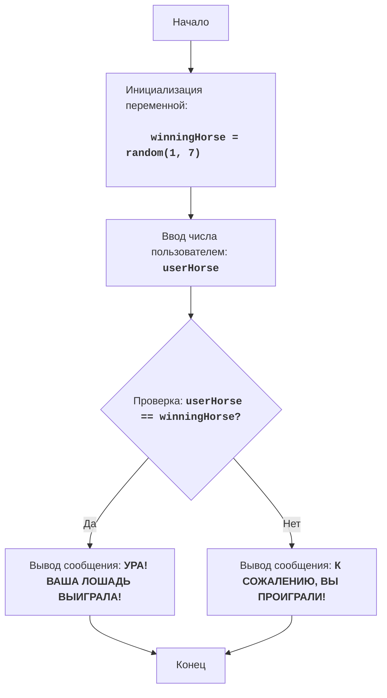

# Анализ кода модуля `horses.py`

**Качество кода**
8
-  Плюсы
    - Код соответствует требованиям к задаче, игра реализована корректно.
    - Присутствует обработка исключений при вводе данных пользователем.
    - Есть подробное описание работы программы в комментариях.
-  Минусы
    - Отсутствуют docstring для модуля и переменных.
    - Не используется `logger` для логирования ошибок.
    - Используется `exit()` для завершения программы, что не рекомендуется.
    - Не все комментарии оформлены в стиле reStructuredText.

**Рекомендации по улучшению**

1. Добавить docstring для модуля, переменных и констант в формате reStructuredText.
2. Использовать `from src.logger.logger import logger` для логирования ошибок вместо стандартного вывода в консоль.
3. Использовать `logger.error` вместо `print` и `exit()` для обработки ошибок ввода и завершения программы.
4. Улучшить оформление комментариев, приведя их в соответствие с reStructuredText.
5. Заменить `exit()` на более правильный способ выхода из функции.
6. Избегать использования магических чисел, таких как 1 и 7, вынести их в константы.
7. Заменить обычные комментарии на RST совместимые.

**Оптимизированный код**

```python
"""
HORSES:
=================
Сложность: 3
-----------------
Игра "Скачки" - это простая игра, в которой игрок выбирает лошадь, а затем компьютер случайным образом определяет, какая из лошадей победит.
Игрок либо выигрывает, либо проигрывает в зависимости от своего выбора.

Правила игры:
1. Компьютер генерирует случайное число от 1 до 7 (номер лошади-победителя).
2. Игрок вводит номер лошади (от 1 до 7), за которую он хочет болеть.
3. Игра сообщает, выиграла ли выбранная игроком лошадь.
-----------------
Алгоритм:
1.  Сгенерировать случайное целое число от 1 до 7 (номер лошади-победителя) и сохранить в переменной `winning_horse`.
2.  Запросить у пользователя ввод числа от 1 до 7 (номер лошади, за которую он играет) и сохранить в переменной `user_horse`.
3.  Если `user_horse` равно `winning_horse`, вывести сообщение "УРА! ВАША ЛОШАДЬ ВЫИГРАЛА!".
4.  Иначе вывести сообщение "К СОЖАЛЕНИЮ, ВЫ ПРОИГРАЛИ!".
5. Конец игры.
-----------------
Блок-схема:

Legenda:
    Start - Начало программы.
    InitializeWinningHorse - Инициализация переменной winningHorse (номер лошади-победителя), генерируется случайное число от 1 до 7.
    InputUserHorse - Запрос у пользователя ввода числа (номера лошади) и сохранение его в переменной userHorse.
    CheckWinner - Проверка, равно ли введенное пользователем число userHorse загаданному числу winningHorse.
    OutputWin - Вывод сообщения о победе, если числа равны.
    OutputLose - Вывод сообщения о проигрыше, если числа не равны.
    End - Конец программы.
"""
import random
#  Импортируем модуль random для генерации случайных чисел.
from src.logger.logger import logger
#  Импортируем logger для логирования.

MIN_HORSE = 1
#  Минимальный номер лошади.
MAX_HORSE = 7
#  Максимальный номер лошади.

def play_horses_game():
    """
    Запускает игру "Скачки".

    Инициализирует игру, запрашивает у пользователя ввод номера лошади и определяет результат игры.
    """
    #  Генерируем случайное число от 1 до 7 (номер лошади-победителя)
    winning_horse = random.randint(MIN_HORSE, MAX_HORSE)
    #  Запрашиваем у пользователя ввод числа (номер лошади, за которую он играет)
    try:
        user_horse = int(input(f"Выберите номер лошади от {MIN_HORSE} до {MAX_HORSE}: "))
        #  Проверяем, находится ли введенный номер в допустимом диапазоне
        if user_horse < MIN_HORSE or user_horse > MAX_HORSE:
             logger.error(f"Пожалуйста, выберите номер лошади от {MIN_HORSE} до {MAX_HORSE}.")
             return
    except ValueError as e:
        #  Логируем ошибку, если пользователь ввел не целое число
        logger.error("Пожалуйста, введите целое число.", exc_info=True)
        return

    #  Проверяем, выиграл ли пользователь
    if user_horse == winning_horse:
        print("УРА! ВАША ЛОШАДЬ ВЫИГРАЛА!") #  Вывод сообщения о победе
    else:
        print("К СОЖАЛЕНИЮ, ВЫ ПРОИГРАЛИ!") #  Вывод сообщения о проигрыше
if __name__ == '__main__':
    play_horses_game()
"""
Объяснение кода:
1.  **Импорт модуля `random`**::
    - `import random`: Импортирует модуль `random`, который используется для генерации случайного числа.
2.  **Импорт модуля `logger`**::
    - `from src.logger.logger import logger`: Импортирует модуль `logger` для логирования ошибок.
3.  **Объявление констант `MIN_HORSE` и `MAX_HORSE`**::
    - `MIN_HORSE = 1`: Определяет минимальный номер лошади.
    - `MAX_HORSE = 7`: Определяет максимальный номер лошади.
4.  **Функция `play_horses_game`**::
    - `def play_horses_game():`: Объявляет функцию, которая запускает игру "Скачки".
    -   `winning_horse = random.randint(MIN_HORSE, MAX_HORSE)`: Генерирует случайное целое число в диапазоне от MIN_HORSE до MAX_HORSE и сохраняет его в переменной `winning_horse`.
    -   `try...except ValueError`: Блок try-except обрабатывает возможные ошибки ввода. Если пользователь введет не целое число, то будет выведена ошибка через `logger`.
    -   `user_horse = int(input(f"Выберите номер лошади от {MIN_HORSE} до {MAX_HORSE}: "))`: Запрашивает у пользователя число и преобразует его в целое число, сохраняя результат в `user_horse`.
    -   `if user_horse < MIN_HORSE or user_horse > MAX_HORSE:`: Проверяет, находится ли введенный номер в допустимом диапазоне (MIN_HORSE - MAX_HORSE).
    -   `logger.error(f"Пожалуйста, выберите номер лошади от {MIN_HORSE} до {MAX_HORSE}.")`: Выводит сообщение об ошибке через logger, если номер введен некорректно.
    -  `if user_horse == winning_horse:`: Проверяет, равно ли введенное пользователем число загаданному числу.
    -  `print("УРА! ВАША ЛОШАДЬ ВЫИГРАЛА!")`: Выводит сообщение о победе, если числа равны.
    -  `else:`: Если число не угадано.
    -  `print("К СОЖАЛЕНИЮ, ВЫ ПРОИГРАЛИ!")`: Выводит сообщение о проигрыше.
5.  **Вызов функции `play_horses_game`**::
    -   `if __name__ == '__main__':`: проверяет, запущен ли файл как основная программа.
    -   `play_horses_game()`: Запускает игру если файл запущен напрямую.
"""
```