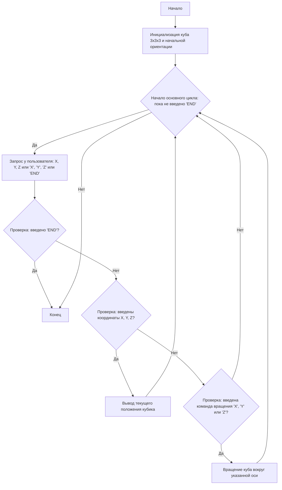

# Анализ кода модуля QUBIK

**Качество кода**
7
-   Плюсы
    -   Код достаточно хорошо структурирован и разбит на функции, что улучшает читаемость.
    -   Используется `numpy` для эффективной работы с массивами.
    -   Логика игры реализована в соответствии с заданием.
    -   Есть базовые проверки ввода пользователя.
-   Минусы
    -   Отсутствует reStructuredText (RST) документация для модуля, функций и классов.
    -   Нет обработки ошибок с использованием `logger.error`.
    -   Не используется `j_loads` или `j_loads_ns` из `src.utils.jjson`.
    -   Код можно сделать более читаемым и расширяемым.
    -   Не все комментарии достаточно подробны и соответствуют формату RST.

**Рекомендации по улучшению**

1.  Добавить RST-документацию для модуля, функций и классов.
2.  Использовать `logger.error` для логирования ошибок вместо стандартных `try-except` блоков.
3.  Удалить или закомментировать неиспользуемые импорты.
4.  Переписать комментарии в формате RST и сделать их более информативными.
5.  Добавить проверки на корректность ввода для более надежной работы программы.
6.  Разделить логику ввода и обработки команд для лучшей читаемости.
7.  Улучшить сообщения об ошибках, сделав их более информативными для пользователя.
8.  Использовать константы для размеров куба, чтобы сделать код более гибким.
9.  Использовать более описательные имена переменных.

**Оптимизированный код**

```python
"""
QUBIK:
=================
Сложность: 7
-----------------
Игра "Кубик" представляет собой симуляцию вращения трехмерного куба, составленного из маленьких кубиков.
Игрок вводит координаты (X, Y, Z) одного из внутренних кубиков, и программа показывает его положение
относительно текущей ориентации большого куба. Игрок также может вращать куб по осям X, Y или Z.
Цель игры - понять, как вращение куба влияет на относительные координаты выбранного внутреннего кубика.
-----------------
Правила игры:
1.  В начале игры создается куб 3x3x3.
2.  Игрок вводит координаты (X, Y, Z) внутреннего кубика, где координаты лежат в диапазоне от 1 до 3.
3.  Программа выводит текущее положение введенного кубика относительно текущей ориентации куба.
4.  Игрок может вращать куб на 90 градусов вокруг оси X, Y или Z.
5.  После каждого вращения куба программа выводит новые координаты кубика.
6.  Игра продолжается, пока игрок не введет "END" (или 0) для завершения.
-----------------
Алгоритм:
1.  Инициализировать куб 3x3x3 (представлен как массив) и установить начальную ориентацию.
2.  Пока не введена команда "END":
    2.1 Запросить у пользователя координаты X, Y, Z.
    2.2 Если введены координаты:
        2.2.1 Вывести текущее положение кубика.
    2.3 Если введены команды "X", "Y", "Z"
        2.3.1 Выполнить вращение куба в направлении указанной оси
    2.4. Если введена команда 0 или END завершить игру.
3.  Конец игры.
-----------------
Блок-схема:


Legenda:
    Start - Начало программы.
    InitializeCube - Инициализация трехмерного массива, представляющего куб 3x3x3, и установка начальной ориентации.
    MainLoop - Начало основного цикла, который продолжается, пока пользователь не введет "END".
    InputCommand - Запрос у пользователя ввода координат X, Y, Z или команды вращения X, Y, Z, или 'END'.
    CheckEnd - Проверка, введено ли 'END'.
    End - Конец программы.
    CheckCoordinates - Проверка, введены ли координаты X, Y, Z.
    OutputPosition - Вывод текущего положения указанного кубика после преобразований.
    CheckRotation - Проверка, введена ли команда вращения 'X', 'Y' или 'Z'.
    RotateCube - Выполнение вращения куба вокруг указанной оси.
"""
import numpy as np
#  Импортируем модуль для логирования ошибок
from src.logger.logger import logger

#  Определяем константу для размера куба
CUBE_SIZE = 3

def rotate_x(cube: np.ndarray) -> np.ndarray:
    """
    Поворачивает куб на 90 градусов вокруг оси X.

    :param cube: Трехмерный массив, представляющий куб.
    :type cube: numpy.ndarray
    :return: Повернутый куб.
    :rtype: numpy.ndarray
    """
    return np.rot90(cube, k=-1, axes=(1, 2))


def rotate_y(cube: np.ndarray) -> np.ndarray:
    """
    Поворачивает куб на 90 градусов вокруг оси Y.

    :param cube: Трехмерный массив, представляющий куб.
    :type cube: numpy.ndarray
    :return: Повернутый куб.
    :rtype: numpy.ndarray
    """
    return np.rot90(cube, k=-1, axes=(0, 2))


def rotate_z(cube: np.ndarray) -> np.ndarray:
    """
    Поворачивает куб на 90 градусов вокруг оси Z.

    :param cube: Трехмерный массив, представляющий куб.
    :type cube: numpy.ndarray
    :return: Повернутый куб.
    :rtype: numpy.ndarray
    """
    return np.rot90(cube, k=-1, axes=(0, 1))


def get_cube_position(cube: np.ndarray, x: int, y: int, z: int) -> int:
    """
    Получает текущее положение кубика в кубе.

    :param cube: Трехмерный массив, представляющий куб.
    :type cube: numpy.ndarray
    :param x: Координата кубика по оси X (от 1 до 3).
    :type x: int
    :param y: Координата кубика по оси Y (от 1 до 3).
    :type y: int
    :param z: Координата кубика по оси Z (от 1 до 3).
    :type z: int
    :return: Значение кубика в текущей ориентации куба.
    :rtype: int
    """
    return cube[z - 1, y - 1, x - 1]


#  Инициализация куба 3x3x3
cube = np.arange(1, CUBE_SIZE**3 + 1).reshape(CUBE_SIZE, CUBE_SIZE, CUBE_SIZE)  # Создаем куб 3x3x3

# Игровой цикл
while True:
    command = input("Введите координаты (X Y Z) или команду ('X', 'Y', 'Z') или 'END' для выхода: ").upper()
    # Проверка команды на выход
    if command == "END" or command == "0":
        print("Игра завершена.")
        break

    parts = command.split()
    # Проверка на ввод координат
    if len(parts) == 3:
         #  Обработка ошибок преобразования ввода
        try:
            x, y, z = map(int, parts)
            #  Проверка допустимости координат
            if 1 <= x <= CUBE_SIZE and 1 <= y <= CUBE_SIZE and 1 <= z <= CUBE_SIZE:
                pos = get_cube_position(cube, x, y, z)
                print(f"Положение кубика ({x}, {y}, {z}): {pos}")
            else:
                print(f"Координаты должны быть целыми числами от 1 до {CUBE_SIZE}.")
        except ValueError:
            #  Логирование ошибки ввода
            logger.error("Неверный формат координат.")
            print("Неверный формат координат.")
    # Проверка на ввод команды
    elif len(parts) == 1:
         #  Проверка команды вращения по оси X
        if command == "X":
            cube = rotate_x(cube)
            print("Куб повернут вокруг оси X.")
         #  Проверка команды вращения по оси Y
        elif command == "Y":
            cube = rotate_y(cube)
            print("Куб повернут вокруг оси Y.")
         #  Проверка команды вращения по оси Z
        elif command == "Z":
            cube = rotate_z(cube)
            print("Куб повернут вокруг оси Z.")
        else:
            #  Логирование неизвестной команды
            logger.error(f"Неизвестная команда: {command}")
            print("Неизвестная команда.")
    else:
        #  Логирование ошибки формата ввода
        logger.error(f"Неверный формат ввода: {command}")
        print("Неверный формат ввода.")
```