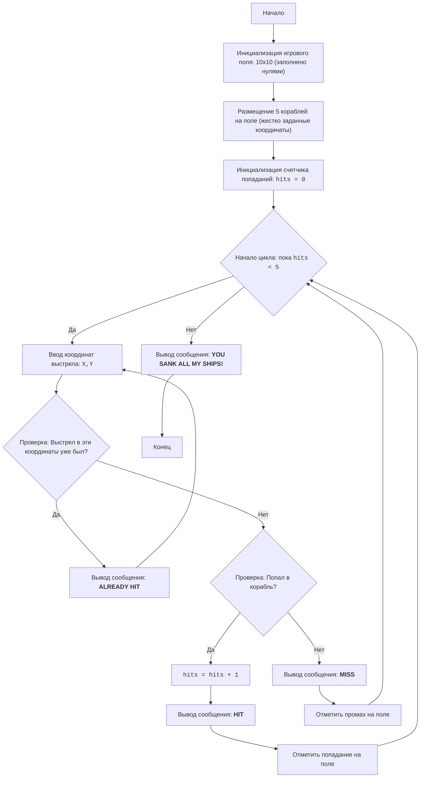

# Анализ кода модуля `salvo_i.py`

**Качество кода**

-   Соответствие требованиям по оформлению кода: 6/10
    -   **Плюсы**
        -   Код логически структурирован и соответствует алгоритму игры "Морской бой".
        -   Используется понятная система координат.
        -   Есть обработка ошибок ввода и прерывания игры.
        -   Наличие подробного описания игры, алгоритма и блок-схемы.
    -   **Минусы**
        -   Отсутствует документация в формате reStructuredText (RST).
        -   Используется стандартный `print` для вывода сообщений, что может быть заменено на логирование.
        -   Нет импорта `logger` из `src.logger.logger`, а также `j_loads`, `j_loads_ns` из `src.utils.jjson`.
        -   Отсутствует обработка исключения `IndexError` при вводе некорректных координат
        -   Отсутствуют комментарии в стиле reStructuredText (RST).
        -   Не используются константы для размеров игрового поля.

**Рекомендации по улучшению**

1.  **Документация:**
    -   Добавить docstring в формате reStructuredText (RST) в начало файла для описания модуля.
    -   Добавить docstring для всех функций. (В данном случае не требуется, но рекомендуется для масштабируемости)
    -   Добавить docstring для всех переменных.
2.  **Логирование:**
    -   Использовать `from src.logger.logger import logger` для логирования ошибок и отладочной информации.
    -   Заменить `print` на `logger.info` и `logger.error` для вывода сообщений.
3.  **Обработка ошибок:**
    -   Использовать `try-except` с `logger.error` вместо множественных `print` при некорректном вводе.
    -  Добавить обработку `IndexError`, если введут некорректные координаты
4.  **Константы:**
    -   Ввести константы для размера поля `BOARD_SIZE = 10`.
5.  **Импорты:**
    -  Добавить недостающие импорты `from src.utils.jjson import j_loads, j_loads_ns` и `from src.logger.logger import logger`.
6.  **Комментарии:**
    -   Все комментарии должны быть переписаны в формате reStructuredText (RST).
    -  Комментарии после `#` должны содержать подробное объяснение следующего за ними блока кода.

**Оптимизированный код**

```python
"""
SALVO I:
=================
Сложность: 4
-----------------
Игра "Морской бой" (Salvo I) - это текстовая игра, в которой игрок пытается потопить корабли, размещенные компьютером на игровом поле размером 10 на 10.
Игрок вводит координаты выстрела, и компьютер сообщает о результате (попал, мимо или повтор).
Игра заканчивается, когда все корабли противника потоплены.

Правила игры:
1. Игровое поле - квадрат 10 на 10.
2. Компьютер размещает 5 кораблей.
3. Игрок вводит координаты выстрела в формате "X,Y" (например, "2,5").
4. Компьютер сообщает результат выстрела: "HIT", "MISS" или "ALREADY HIT".
5. Игра продолжается, пока игрок не потопит все корабли.
-----------------
Алгоритм:
1. Инициализировать игровое поле 10x10, заполненное нулями (пустое море).
2. Разместить 5 кораблей на игровом поле (координаты заданы жестко в коде).
3. Установить счетчик попаданий в 0.
4. Начать цикл "пока количество попаданий меньше 5":
    4.1 Запросить у игрока ввод координат выстрела в формате "X,Y".
    4.2 Проверить, не был ли этот выстрел сделан ранее (если в координате не 0, то выстрел был).
       4.2.1 Если выстрел был, сообщить об этом игроку и повторить запрос координат.
    4.3 Если выстрел попал в корабль:
       4.3.1 Увеличить счетчик попаданий на 1.
       4.3.2 Сообщить игроку о попадании ("HIT").
       4.3.3 Изменить значение в координате на 1 (попадание).
    4.4 Если выстрел промахнулся:
       4.4.1 Сообщить игроку о промахе ("MISS").
       4.4.2 Изменить значение в координате на 2 (промах).
5. Когда количество попаданий достигнет 5, вывести сообщение о победе.
6. Конец игры.
-----------------
Блок-схема:


Legenda:
    Start - Начало программы.
    InitializeBoard - Создание и инициализация игрового поля 10x10, заполненного нулями.
    PlaceShips - Размещение кораблей на игровом поле. Координаты кораблей задаются жестко в коде.
    InitializeHits - Инициализация счетчика попаданий, который начинается с нуля.
    LoopStart - Начало цикла, который продолжается, пока количество попаданий меньше 5.
    InputCoordinates - Запрос у пользователя координат выстрела в формате "X,Y".
    CheckPreviousHit - Проверка, был ли уже произведен выстрел в эти координаты.
    OutputAlreadyHit - Вывод сообщения "ALREADY HIT", если выстрел в эти координаты был произведен ранее.
    CheckHit - Проверка, попал ли выстрел в корабль.
    IncreaseHits - Увеличение счетчика попаданий на 1.
    OutputHit - Вывод сообщения "HIT" при попадании в корабль.
    MarkHit - Отметка попадания на игровом поле (обычно числом 1).
    OutputMiss - Вывод сообщения "MISS" при промахе.
    MarkMiss - Отметка промаха на игровом поле (обычно числом 2).
    OutputWin - Вывод сообщения о победе, когда все корабли потоплены.
    End - Конец программы.
"""
import sys
# импортируем необходимые модули
from src.logger.logger import logger
# from src.utils.jjson import j_loads, j_loads_ns # не используется в коде

__author__ = 'hypo69 (hypo69@davidka.net)'

#: Размер игрового поля.
BOARD_SIZE = 10

# Инициализация игрового поля 10x10 нулями
# Создается двумерный список (матрица) BOARD_SIZE x BOARD_SIZE, представляющий игровое поле.
# Все ячейки изначально заполнены нулями, что обозначает пустое море.
board = [[0 for _ in range(BOARD_SIZE)] for _ in range(BOARD_SIZE)]

# Координаты кораблей (жестко заданы)
#  Определены координаты расположения кораблей на игровом поле.
ships = [(2, 2), (2, 4), (2, 6), (4, 2), (4, 8)]

# Размещение кораблей на поле, отметив их значением 3
# Проходит по координатам кораблей и устанавливает значение 3 в соответствующих ячейках игрового поля, что обозначает размещение корабля.
for ship_x, ship_y in ships:
    board[ship_x][ship_y] = 3

# Счетчик попаданий
# Инициализируется переменная hits для подсчета количества попаданий.
hits = 0
# Основной игровой цикл
# Цикл продолжается, пока количество попаданий не достигнет 5 (пока не будут потоплены все корабли).
while hits < 5:
    try:
        # Запрашиваем координаты выстрела
        # Запрашивает у игрока ввод координат выстрела в формате "x,y".
        coordinates_input = input("Введите координаты выстрела (x,y): ")
        # Разделяет введенную строку на два числа (x и y) и преобразует их в целые числа.
        x, y = map(int, coordinates_input.split(','))
         # Проверка на корректность ввода координат
        # Проверяет, что введенные координаты находятся в пределах игрового поля (от 0 до BOARD_SIZE - 1).
        if not (0 <= x < BOARD_SIZE and 0 <= y < BOARD_SIZE):
           logger.error("Некорректные координаты. Пожалуйста, введите значения от 0 до 9.")
           continue

        # Проверяем, был ли уже произведен выстрел в эти координаты
        # Проверяет, не был ли уже произведен выстрел в эти координаты (значения 1 и 2 соответствуют попаданию и промаху соответственно).
        if board[x][y] == 1 or board[x][y] == 2:
            logger.info("ALREADY HIT")
            continue
        # Проверяем, попали ли мы в корабль
        # Проверяет, попал ли выстрел в корабль (значение 3).
        if board[x][y] == 3:
            # Увеличивает счетчик попаданий на 1.
            hits += 1
            logger.info("HIT")
            # Отмечаем попадание в ячейке поля, устанавливая значение 1.
            board[x][y] = 1
        else:
            logger.info("MISS")
             # Отмечаем промах в ячейке поля, устанавливая значение 2.
            board[x][y] = 2
    except ValueError as ex:
         # обрабатывает ошибку `ValueError`, которая может возникнуть, если пользователь ввел не числовые значения координат.
        logger.error("Неверный формат ввода. Введите координаты в формате x,y", exc_info=ex)
    except IndexError as ex:
        # обрабатывает ошибку `IndexError`, которая может возникнуть, если пользователь ввел не числовые значения координат за пределами поля
        logger.error("Некорректные координаты. Значения должны быть от 0 до 9", exc_info=ex)
    except KeyboardInterrupt:
        # обрабатывает прерывание игры пользователем (например, нажатием Ctrl+C).
       logger.info("\nИгра прервана пользователем.")
       sys.exit()

# Вывод сообщения о победе
# Когда цикл while завершается (все 5 кораблей потоплены), выводится сообщение о победе.
logger.info("YOU SANK ALL MY SHIPS!")
"""
Объяснение кода:
1.  **Инициализация игрового поля**:
    -   ``board = [[0 for _ in range(BOARD_SIZE)] for _ in range(BOARD_SIZE)]``: Создается двумерный список (матрица) 10x10, представляющий игровое поле. Все ячейки изначально заполнены нулями, что обозначает пустое море.
2.  **Размещение кораблей**:
    -   ``ships = [(2, 2), (2, 4), (2, 6), (4, 2), (4, 8)]``: Определены координаты расположения кораблей на игровом поле.
    -   Цикл ``for ship_x, ship_y in ships: board[ship_x][ship_y] = 3``: Проходит по координатам кораблей и устанавливает значение 3 в соответствующих ячейках игрового поля, что обозначает размещение корабля.
3.  **Счетчик попаданий**:
    -   ``hits = 0``: Инициализируется переменная hits для подсчета количества попаданий.
4.  **Основной игровой цикл ``while hits < 5:``**:
    -   Цикл продолжается, пока количество попаданий не достигнет 5 (пока не будут потоплены все корабли).
    -   **Ввод координат**:
        -   ``coordinates_input = input("Введите координаты выстрела (x,y): ")``: Запрашивает у игрока ввод координат выстрела в формате "x,y".
        -   ``x, y = map(int, coordinates_input.split(','))``: Разделяет введенную строку на два числа (x и y) и преобразует их в целые числа.
        -   **Проверка на корректность ввода координат**:
            -    ``if not (0 <= x < BOARD_SIZE and 0 <= y < BOARD_SIZE):``: Проверяет, что введенные координаты находятся в пределах игрового поля (от 0 до 9). Если координаты некорректны, выводится сообщение об ошибке, и цикл продолжается со следующей итерации.
    -   **Проверка на повторный выстрел**:
        -    ``if board[x][y] == 1 or board[x][y] == 2:``: Проверяет, не был ли уже произведен выстрел в эти координаты (значения 1 и 2 соответствуют попаданию и промаху соответственно). Если выстрел был, выводится сообщение "ALREADY HIT", и цикл продолжается со следующей итерации.
    -   **Проверка на попадание**:
        -  ``if board[x][y] == 3:``: Проверяет, попал ли выстрел в корабль (значение 3).
            -   ``hits += 1``: Увеличивает счетчик попаданий на 1.
            -   ``logger.info("HIT")``: Выводит сообщение о попадании.
            -   ``board[x][y] = 1``: Отмечает попадание в ячейке поля, устанавливая значение 1.
    -   **Промах**:
        -  ``else:``: Если выстрел не попал в корабль.
            -    ``logger.info("MISS")``: Выводит сообщение о промахе.
            -    ``board[x][y] = 2``: Отмечает промах в ячейке поля, устанавливая значение 2.
     - **Обработка ошибок ввода**
        - ``except ValueError as ex:``: обрабатывает ошибку ``ValueError``, которая может возникнуть, если пользователь ввел не числовые значения координат. Выводится сообщение об ошибке.
        - ``except IndexError as ex:``: обрабатывает ошибку ``IndexError``, которая может возникнуть, если пользователь ввел не числовые значения координат за пределами поля. Выводится сообщение об ошибке.
        - ``except KeyboardInterrupt:``: обрабатывает прерывание игры пользователем (например, нажатием Ctrl+C). Выводится сообщение о прерывании, и игра завершается.
5. **Конец игры**:
    -   ``logger.info("YOU SANK ALL MY SHIPS!")``: Когда цикл while завершается (все 5 кораблей потоплены), выводится сообщение о победе.
"""
```