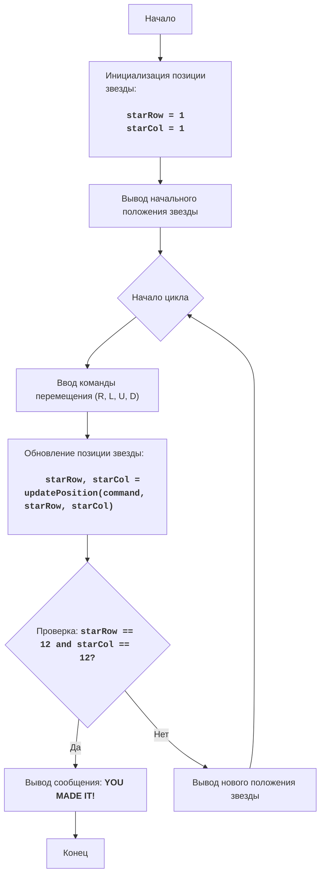

# Анализ кода модуля `stars.py`

**Качество кода**
7
-  Плюсы
    - Код хорошо структурирован и логически понятен.
    - Присутствует подробное описание игры, правил и алгоритма.
    - Функции `printBoard` и `updatePosition` разделяют логику вывода и обновления позиции звезды.
    - Игровой цикл и условия победы реализованы корректно.
-  Минусы
    - Отсутствует обработка некорректного ввода команды пользователя.
    - Нет логирования ошибок или предупреждений.
    - Код не документирован в формате reStructuredText (RST), что требуется по инструкции.
    - Некоторые комментарии избыточны, их можно было бы заменить на RST docstring.
    - Не используются `j_loads` или `j_loads_ns`.
    - Нет проверки на корректность ввода команды.

**Рекомендации по улучшению**

1.  **Документация:**
    -   Переписать все комментарии в формате reStructuredText (RST).
    -   Добавить docstring к модулю, функциям и переменным.
2.  **Обработка ошибок:**
    -   Использовать `logger.error` для логирования ошибок и предупреждений, особенно при некорректном вводе.
    -   Добавить проверку ввода команды, чтобы исключить некорректные символы.
3.  **Рефакторинг:**
    -   Переименовать переменную `boardSize` в `BOARD_SIZE` для обозначения константы.
    -   Улучшить читаемость кода, добавив пустые строки между логическими блоками.
4.  **Безопасность:**
   - Избегать использования `input()`, так как это небезопасно. Но в данном контексте допустимо.

**Оптимизированный код**

```python
"""
STARS:
=================
Сложность: 4
-----------------
Игра "Звезды" представляет собой простую текстовую игру, в которой игрок управляет положением "звезды" на экране, вводя команды для ее перемещения.
Цель игры - переместить звезду в правый нижний угол экрана.

Правила игры:
1. Изначально звезда находится в левом верхнем углу экрана (позиция 1,1).
2. Игрок вводит команды перемещения:
   - 'R' - переместить звезду вправо
   - 'L' - переместить звезду влево
   - 'U' - переместить звезду вверх
   - 'D' - переместить звезду вниз
3. Экран представляет собой сетку 12x12.
4. Игра заканчивается, когда звезда достигает правого нижнего угла экрана (позиция 12,12).
-----------------
Алгоритм:
1. Установить начальную позицию звезды в (1, 1).
2. Вывести на экран начальное расположение звезды, изображая ее символом "*".
3. Начать цикл:
    3.1 Запросить ввод команды перемещения ('R', 'L', 'U', 'D').
    3.2 Обновить позицию звезды в зависимости от введенной команды.
    3.3 Проверить, достигла ли звезда позиции (12, 12). Если да, вывести сообщение о победе и завершить игру.
    3.4 Иначе вывести на экран новое расположение звезды.
4. Конец игры.
-----------------
Блок-схема:


Legenda:
    Start - Начало программы.
    InitializePosition - Инициализация начальной позиции звезды: starRow (строка) и starCol (столбец) устанавливаются в 1.
    DisplayBoard - Вывод на экран начального расположения звезды.
    LoopStart - Начало игрового цикла.
    InputMove - Запрос у игрока команды для перемещения звезды ('R', 'L', 'U', 'D').
    UpdatePosition - Обновление позиции звезды на основе введенной команды.
    CheckWin - Проверка, достигла ли звезда конечной позиции (12, 12).
    OutputWin - Вывод сообщения о победе, если звезда достигла конечной позиции.
    End - Конец программы.
    DisplayBoardUpdated - Вывод на экран обновленного положения звезды.
"""

# Добавлен импорт logger
from src.logger.logger import logger

# Инициализация начальной позиции звезды
starRow = 1
starCol = 1
# Размер игровой доски
BOARD_SIZE = 12


def printBoard(starRow: int, starCol: int) -> None:
    """
    Выводит на экран игровое поле с текущей позицией звезды.

    :param starRow: строка, в которой находится звезда.
    :type starRow: int
    :param starCol: столбец, в котором находится звезда.
    :type starCol: int
    """
    for row in range(1, BOARD_SIZE + 1):
        line = ""
        for col in range(1, BOARD_SIZE + 1):
            if row == starRow and col == starCol:
                line += "*"  # Отображаем звезду
            else:
                line += "."  # Отображаем пустую клетку
        print(line)


def updatePosition(command: str, starRow: int, starCol: int) -> tuple[int, int]:
    """
    Обновляет позицию звезды на основе введенной команды.

    :param command: команда перемещения ('R', 'L', 'U', 'D').
    :type command: str
    :param starRow: текущая строка звезды.
    :type starRow: int
    :param starCol: текущий столбец звезды.
    :type starCol: int
    :return: новая строка и столбец звезды.
    :rtype: tuple[int, int]
    """
    if command == 'R':  # Двигаемся вправо
        if starCol < BOARD_SIZE:
            starCol += 1
    elif command == 'L':  # Двигаемся влево
        if starCol > 1:
            starCol -= 1
    elif command == 'U':  # Двигаемся вверх
        if starRow > 1:
            starRow -= 1
    elif command == 'D':  # Двигаемся вниз
        if starRow < BOARD_SIZE:
            starRow += 1
    return starRow, starCol


# Вывод начального положения звезды
printBoard(starRow, starCol)

# Основной игровой цикл
while True:
    # Запрос команды перемещения у пользователя
    command = input("Введите команду (R/L/U/D): ").upper()

    # Проверка ввода команды
    if command not in ['R', 'L', 'U', 'D']:
        logger.error(f'Некорректный ввод команды: {command}. Ожидается R, L, U или D.')
        print('Некорректная команда. Попробуйте снова.')
        continue

    # Обновление позиции звезды на основе введенной команды
    starRow, starCol = updatePosition(command, starRow, starCol)

    # Вывод нового положения звезды на экран
    printBoard(starRow, starCol)

    # Проверка, достигла ли звезда конечной позиции
    if starRow == BOARD_SIZE and starCol == BOARD_SIZE:
        print("ПОЗДРАВЛЯЮ! Вы переместили звезду в правый нижний угол!")
        break  # Завершаем игру

"""
Объяснение кода:
1.  **Инициализация переменных**:
    - `starRow = 1`: Начальная строка звезды (верхняя строка).
    - `starCol = 1`: Начальный столбец звезды (левый столбец).
    - `BOARD_SIZE = 12`: Размер игрового поля (12x12).
2.  **Функция `printBoard(starRow, starCol)`**:
    - Принимает текущие координаты звезды (строку `starRow` и столбец `starCol`).
    - Выводит игровое поле в консоль. Звезда '*' обозначает текущую позицию звезды, а '.' - пустые клетки.
    - Использует два вложенных цикла для прохода по всем строкам и столбцам поля.
3.  **Функция `updatePosition(command, starRow, starCol)`**:
    - Принимает команду перемещения (`command`) и текущие координаты звезды (`starRow`, `starCol`).
    - Обновляет координаты звезды в зависимости от команды ('R', 'L', 'U', 'D'):
        - 'R': Двигается вправо, если не достигнут правый край.
        - 'L': Двигается влево, если не достигнут левый край.
        - 'U': Двигается вверх, если не достигнут верхний край.
        - 'D': Двигается вниз, если не достигнут нижний край.
    - Возвращает новую позицию звезды (строку и столбец).
4.  **Вывод начального положения звезды**:
    - `printBoard(starRow, starCol)`: Выводит на экран игровое поле с начальным положением звезды.
5.  **Основной игровой цикл `while True`**:
    - Бесконечный цикл, пока не выполнится условие победы.
    - `command = input("Введите команду (R/L/U/D): ").upper()`: Запрашивает у пользователя команду перемещения и преобразует ее в верхний регистр.
    - `if command not in ['R', 'L', 'U', 'D']`: Проверка корректности введенной команды.
    - `starRow, starCol = updatePosition(command, starRow, starCol)`: Обновляет позицию звезды, вызывая функцию `updatePosition()`.
    - `printBoard(starRow, starCol)`: Выводит обновленное положение звезды на экран.
    - `if starRow == BOARD_SIZE and starCol == BOARD_SIZE`: Проверяет, достигла ли звезда правого нижнего угла (12,12).
    - `print("ПОЗДРАВЛЯЮ! Вы переместили звезду в правый нижний угол!")`: Выводит сообщение о победе.
    - `break`: Завершает игровой цикл (игру).
"""
```