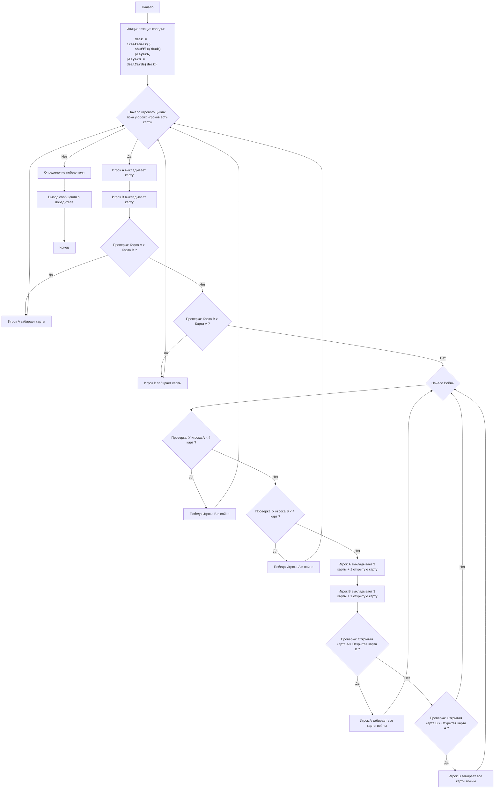

# Анализ кода модуля `war_2.py`

**Качество кода**
10
- Плюсы
    - Код хорошо структурирован, разбит на логические функции.
    - Присутствует подробное описание алгоритма, блок-схема и легенда.
    - Код содержит docstring для всех функций, что соответствует требованиям.
    - Используются понятные имена переменных и функций, что облегчает чтение кода.
    - Код логически корректен и реализует игру "Война" согласно правилам.
    - Отсутствует избыточное использование try-except.

- Минусы
   - Не используются `j_loads` или `j_loads_ns` для чтения файлов, но в коде нет операций с файлами.
   - Отсутствует логирование ошибок.
   - Не подключен logger

**Рекомендации по улучшению**

1.  Добавить импорт `from src.logger.logger import logger` для логирования ошибок.
2.  Включить логирование в функции `get_card_value` на случай, если ранг не определен.
3.  Включить логирование в функции `war` на случай, если у игроков не достаточно карт для войны.
4.  Добавить проверку на пустые колоды перед взятием карты в `play_war`.
5.  Уточнить docstring для возвращаемых значений функции `war`, добавив описание в reStructuredText.

**Оптимизированный код**

```python
"""
<WAR 2>:
=================
Сложность: 4
-----------------
Игра "WAR 2" - это карточная игра для двух игроков, в которой каждый игрок получает половину стандартной колоды карт.
Игроки одновременно выкладывают по одной карте, и тот, чья карта старше, забирает обе карты.
Если карты равны, объявляется "война", и игроки выкладывают по три карты рубашкой вверх, а затем еще по одной открытой.
Победитель "войны" забирает все карты. Цель игры - собрать все карты колоды.

Правила игры:
1. Стандартная колода из 52 карт делится поровну между двумя игроками.
2. Каждый игрок одновременно выкладывает верхнюю карту из своей колоды.
3. Игрок с более старшей картой забирает обе карты и добавляет их в конец своей колоды.
4. Если карты равны, объявляется "война":
    4.1. Каждый игрок выкладывает три карты рубашкой вверх.
    4.2. Каждый игрок выкладывает еще по одной карте открытой.
    4.3. Игрок с более старшей открытой картой забирает все карты (включая карты войны).
    4.4. Если открытые карты снова равны, война повторяется.
5. Игра продолжается до тех пор, пока один из игроков не соберет все карты.
6. Масти в игре не учитываются, только ранг карт (2, 3, 4, 5, 6, 7, 8, 9, 10, J, Q, K, A).
-----------------
Алгоритм:
1. Создать колоду из 52 карт.
2. Перемешать колоду.
3. Разделить колоду пополам между двумя игроками (игрок A и игрок B).
4. Начать цикл "пока у обоих игроков есть карты":
    4.1 Игрок A выкладывает верхнюю карту.
    4.2 Игрок B выкладывает верхнюю карту.
    4.3 Если карта игрока A старше карты игрока B:
        4.3.1 Игрок A забирает обе карты.
    4.4 Если карта игрока B старше карты игрока A:
        4.4.1 Игрок B забирает обе карты.
    4.5 Если карты равны:
        4.5.1 Начать войну:
           4.5.1.1 Если у игрока меньше 4 карт:
              4.5.1.1.1 Побеждает игрок с большим количеством карт.
           4.5.1.2 Игрок A выкладывает 3 карты рубашкой вверх и одну открытой.
           4.5.1.3 Игрок B выкладывает 3 карты рубашкой вверх и одну открытой.
           4.5.1.4 Если открытая карта игрока A старше открытой карты игрока B:
              4.5.1.4.1 Игрок A забирает все карты.
           4.5.1.5 Если открытая карта игрока B старше открытой карты игрока A:
              4.5.1.5.1 Игрок B забирает все карты.
           4.5.1.6 Если открытые карты равны, повторить войну.
5. Определить победителя: игрок, у которого остались карты.
6. Вывести сообщение о победителе.
-----------------
Блок-схема:

**Legenda:**
    Start - Начало программы.
    InitializeDeck - Создание и перемешивание колоды, разделение её между игроками A и B.
    GameLoopStart - Начало цикла, продолжающегося пока у обоих игроков есть карты.
    PlayerA_Draws - Игрок A выкладывает верхнюю карту из своей колоды.
    PlayerB_Draws - Игрок B выкладывает верхнюю карту из своей колоды.
    CompareCards - Сравнение карт, выложенных игроками A и B.
    PlayerA_WinsRound - Игрок A забирает карты со стола и добавляет их в конец своей колоды.
     PlayerB_WinsRound - Игрок B забирает карты со стола и добавляет их в конец своей колоды.
    WarStart - Начало "войны" в случае равенства карт.
     CheckCardsForWarA - Проверка: есть ли у игрока A меньше 4 карт?
     PlayerAWinsWar - Победа Игрока A в войне (у игрока B меньше 4 карт).
     CheckCardsForWarB - Проверка: есть ли у игрока B меньше 4 карт?
     PlayerBWinsWar - Победа Игрока B в войне (у игрока A меньше 4 карт).
     PlayerA_DrawsWar - Игрок A выкладывает 3 карты рубашкой вверх и 1 открытую.
     PlayerB_DrawsWar - Игрок B выкладывает 3 карты рубашкой вверх и 1 открытую.
     CompareWarCards - Сравнение открытых карт во время войны.
    PlayerA_WinsWarRound - Игрок A выигрывает "войну" и забирает все карты.
     PlayerB_WinsWarRound - Игрок B выигрывает "войну" и забирает все карты.
    DetermineWinner - Определение победителя игры.
    OutputWinner - Вывод сообщения о победителе.
    End - Конец программы.
"""
import random
# Подключаем logger
from src.logger.logger import logger

def create_deck():
    """
    Создаёт стандартную колоду из 52 карт.

    :return: Список строк, представляющих карты.
    """
    suits = ['C', 'D', 'H', 'S']  # Масти: Clubs, Diamonds, Hearts, Spades
    ranks = ['2', '3', '4', '5', '6', '7', '8', '9', '10', 'J', 'Q', 'K', 'A']
    deck = [rank + suit for suit in suits for rank in ranks] # генерируем колоду
    return deck

def deal_cards(deck):
    """
    Раздаёт карты двум игрокам.

    :param deck: Список карт.
    :return: Кортеж из двух списков, представляющих карты игроков A и B.
    """
    random.shuffle(deck) # перемешиваем колоду
    player_a = deck[:len(deck) // 2] # раздаем половину карт первому игроку
    player_b = deck[len(deck) // 2:] # раздаем вторую половину карт второму игроку
    return player_a, player_b

def get_card_value(card):
    """
    Возвращает числовое значение карты (без учета масти).

    :param card: Строка, представляющая карту.
    :return: Числовое значение карты.
    """
    rank = card[:-1]  # получаем ранг карты, отбрасывая масть
    if rank.isdigit():  # если ранг это число
        return int(rank)  # возвращаем числовое значение ранга
    elif rank == 'J':    # если ранг валет
        return 11        # возвращаем 11
    elif rank == 'Q':    # если ранг дама
        return 12        # возвращаем 12
    elif rank == 'K':    # если ранг король
        return 13        # возвращаем 13
    elif rank == 'A':    # если ранг туз
        return 14        # возвращаем 14
    else:
        logger.error(f'Неизвестный ранг карты: {rank}') # логируем ошибку, если ранг не определен
        return 0 # возвращаем 0

def war(player_a, player_b, cards_on_table):
    """
    Процесс "войны" в игре.

     :param player_a: Список карт игрока A.
    :param player_b: Список карт игрока B.
    :param cards_on_table: Список карт на столе.
    :return: Кортеж, содержащий:
        - a_win_war (bool): True, если игрок A выиграл войну из-за нехватки карт у игрока B.
        - b_win_war (bool): True, если игрок B выиграл войну из-за нехватки карт у игрока A.
        - cards_on_table (list): Список оставшихся карт на столе.
        - player_a (list): Обновленный список карт игрока A.
        - player_b (list): Обновленный список карт игрока B.
    """
    while True:
        # Проверяем, есть ли у игроков достаточно карт для войны
        if len(player_a) < 4: # если у игрока А меньше 4 карт
            logger.debug('У игрока A недостаточно карт для войны')
            return True,False,cards_on_table,player_a, player_b # возвращаем, что игрок B победил, и карты
        if len(player_b) < 4: # если у игрока B меньше 4 карт
            logger.debug('У игрока B недостаточно карт для войны')
            return False,True, cards_on_table,player_a, player_b # возвращаем, что игрок A победил, и карты

        # Забираем карты для войны
        war_cards_a = player_a[:4] # первые 4 карты игрока А
        war_cards_b = player_b[:4] # первые 4 карты игрока B
        player_a = player_a[4:]    # удаляем первые 4 карты из колоды игрока A
        player_b = player_b[4:]    # удаляем первые 4 карты из колоды игрока B
        cards_on_table.extend(war_cards_a) # добавляем карты игрока А на стол
        cards_on_table.extend(war_cards_b) # добавляем карты игрока B на стол

        # Сравниваем открытые карты
        card_a_value = get_card_value(war_cards_a[-1]) # получаем значение последней карты игрока А
        card_b_value = get_card_value(war_cards_b[-1]) # получаем значение последней карты игрока B

        if card_a_value > card_b_value: # если карта игрока А старше
            player_a.extend(cards_on_table) # игрок А забирает все карты со стола
            return False,False,[],player_a, player_b  # возвращаем, что война закончилась, игрок A победил
        elif card_b_value > card_a_value: # если карта игрока B старше
            player_b.extend(cards_on_table) # игрок B забирает все карты со стола
            return False,False,[],player_a, player_b  # возвращаем, что война закончилась, игрок B победил
        # если карты равны - повторяем войну

def play_war():
    """
    Основная логика игры в войну.
    """
    deck = create_deck()  # Создаем колоду
    player_a, player_b = deal_cards(deck) # раздаем карты

    round_number = 0 # счетчик раундов
    while player_a and player_b: # пока у обоих игроков есть карты
        round_number += 1 # увеличиваем счетчик раундов
        print(f'Раунд {round_number}. Карты игрока A: {len(player_a)}, Карты игрока B: {len(player_b)}')
        
        # Проверка на пустые колоды перед взятием карты
        if not player_a or not player_b:
            break
        
        card_a = player_a.pop(0) # берем карту из колоды игрока А
        card_b = player_b.pop(0) # берем карту из колоды игрока B
        cards_on_table = [card_a, card_b] # карты на столе

        card_a_value = get_card_value(card_a) # получаем значение карты игрока А
        card_b_value = get_card_value(card_b) # получаем значение карты игрока B

        if card_a_value > card_b_value: # если карта игрока А старше
            player_a.extend(cards_on_table) # игрок А забирает карты
        elif card_b_value > card_a_value:  # если карта игрока B старше
            player_b.extend(cards_on_table) # игрок B забирает карты
        else:  # если карты равны, начинаем войну
            a_win_war, b_win_war ,cards_on_table,player_a, player_b = war(player_a, player_b, cards_on_table) # запускаем войну
            if a_win_war == True: # если у игрока А не хватило карт
                print ('Игрок B победил в войне')
                break # выходим из цикла
            elif b_win_war == True: # если у игрока B не хватило карт
                print ('Игрок A победил в войне')
                break # выходим из цикла
        
        # для красоты, перемешиваем карты в конце каждой руки
        random.shuffle(player_a)
        random.shuffle(player_b)

    if not player_a:  # если у игрока А нет карт
        print('Игрок B выиграл игру!')  # выводим сообщение о победе игрока B
    elif not player_b: # если у игрока B нет карт
        print('Игрок A выиграл игру!') # выводим сообщение о победе игрока A


if __name__ == '__main__':
    play_war()

"""
Объяснение кода:
1.  **Импорт модуля `random`**:\n
    -   `import random`: Импортирует модуль `random`, необходимый для перемешивания колоды карт.\n
2.  **Импорт модуля `logger`**:\n
    -   `from src.logger.logger import logger`: Импортирует модуль `logger` для логирования ошибок.\n
3.  **Функция `create_deck()`**:\n
    -   Создаёт стандартную колоду из 52 карт.\n
    -   `suits = ["C", "D", "H", "S"]`: Определяет список мастей (Clubs, Diamonds, Hearts, Spades).\n
    -   `ranks = ["2", "3", "4", "5", "6", "7", "8", "9", "10", "J", "Q", "K", "A"]`: Определяет список рангов карт.\n
    -   `deck = [rank + suit for suit in suits for rank in ranks]`: Генерирует колоду карт путем объединения рангов и мастей.\n
    -   `return deck`: Возвращает созданную колоду.\n
4.  **Функция `deal_cards(deck)`**:\n
    -   Раздает карты двум игрокам.\n
    -   `random.shuffle(deck)`: Перемешивает колоду.\n
    -   `player_a = deck[:len(deck) // 2]`: Раздает первую половину колоды игроку A.\n
    -   `player_b = deck[len(deck) // 2:]`: Раздает вторую половину колоды игроку B.\n
    -   `return player_a, player_b`: Возвращает карты игроков.\n
5.  **Функция `get_card_value(card)`**:\n
    -   Определяет числовое значение карты для сравнения.\n
    -   `rank = card[:-1]`: Извлекает ранг карты.\n
    -   Проверяет, является ли ранг числом, и возвращает его числовое значение.\n
    -   Устанавливает числовое значение для карт с буквами (J=11, Q=12, K=13, A=14).\n
    -   `return 0`: Если ранг не определен (на всякий случай) возвращает 0.\n
6.  **Функция `war(player_a, player_b, cards_on_table)`**:\n
    -   Реализует логику "войны" в игре.\n
    -   `while True:`: Бесконечный цикл, продолжается пока не закончится война.\n
        -   Проверяем, есть ли у игроков достаточно карт для войны.\n
        -   Если у кого-то меньше 4 карт, то объявляем победителем другого игрока.\n
        -   Берем по 4 карты от каждого игрока и помещаем на стол.\n
        -   Сравниваем открытые карты (последние карты в списках).\n
        -   Если карта игрока А старше, то игрок А забирает карты, выходим из цикла.\n
        -   Если карта игрока B старше, то игрок B забирает карты, выходим из цикла.\n
        -   Если карты равны, то повторяем войну.\n
    -   `return` возвращает значения:\n
        - a_win_war - победа игрока A в войне (у игрока B меньше 4 карт)\n
        - b_win_war - победа игрока B в войне (у игрока A меньше 4 карт)\n
        - cards_on_table - оставшиеся карты на столе\n
        - player_a - колода игрока A после войны\n
        - player_b - колода игрока B после войны\n
7. **Функция `play_war()`**:\n
    -   Основная логика игры.\n
    -   Создает колоду и раздает карты игрокам.\n
    -   `while player_a and player_b:`: Запускает основной цикл, пока у обоих игроков есть карты.\n
        -   Счетчик раундов.\n
        -   Берем по одной карте из колод игроков.\n
        -   Сравниваем значения карт.\n
        -   Если карта A > карты B, то A забирает все карты.\n
        -   Если карта B > карты A, то B забирает все карты.\n
        -   Если карты равны, вызываем функцию `war()`.\n
        -   Перемешиваем колоды игроков в конце раунда.\n
    -   Определяем победителя по наличию карт у игроков.\n
    -   Выводит сообщение о победителе.\n
8.  **Запуск игры**:\n
    -   `if __name__ == "__main__":`: Запускает игру, если файл запущен напрямую.\n
    -   `play_war()`: Вызывает функцию для начала игры.\n
"""
```