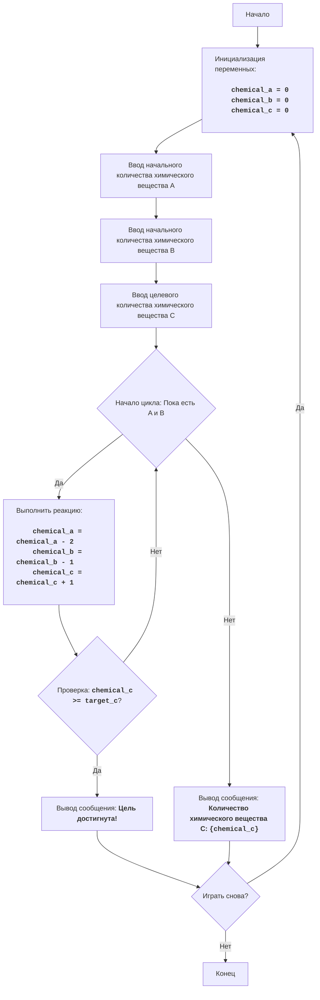

# Анализ кода модуля `chemst.py`

**Качество кода**
5
-  Плюсы
    - Код игры логически понятен и хорошо структурирован, с комментариями на иврите, описывающими основные этапы игры.
    - Используется цикл `while True` для повторения игры, что позволяет игроку сыграть несколько раз.
    - Обработка ошибок ввода обеспечивает корректное завершение игры.
    - Код содержит описание алгоритма и блок-схему в начале файла.
 -  Минусы
    - Код не использует стандарт `reStructuredText` для комментариев и docstring.
    -  В коде отсутствуют импорты, хотя они могут быть нужны в дальнейшем.
    - Отсутствует логирование ошибок, которое помогло бы в отладке.
    -  Код использует стандартные блоки `try-except`, которые можно заменить на более гибкие средства логирования ошибок.
    - Код не соответствует стандарту оформления Python, в частности, используется двойные кавычки `"` вместо одинарных `'`.

**Рекомендации по улучшению**
1.  **Переписать комментарии в формате reStructuredText (RST)**: 
    - Все комментарии, включая docstring, должны быть переписаны в формате RST. Это позволит сгенерировать документацию из кода.
2.  **Использовать `j_loads` или `j_loads_ns`**: 
    - Если код будет работать с файлами, использовать `j_loads` или `j_loads_ns` вместо `json.load` для чтения файлов.
3.  **Добавить импорты**:
    - Добавить необходимые импорты, например, из модуля `src.logger.logger import logger`.
4.  **Внедрить логирование ошибок**:
    - Использовать `logger.error` для регистрации ошибок вместо стандартного `try-except`, это позволит более эффективно отслеживать и анализировать ошибки.
5.  **Унифицировать стиль кода**:
     - Использовать одинарные кавычки `'` для строк, как и в других файлах.
6.  **Переименование переменных и функций**:
     - Для обеспечения единообразия кода, названия переменных и функций должны соответствовать ранее обработанным файлам.

**Оптимизированный код**
```python
"""
CHEMST:
=================
קושי: 6
-----------------
:mod:`chemst` - это симуляция простого химического эксперимента. Игрок начинает с определенным количеством химического вещества A и химического вещества B,
и может выполнить химическую реакцию, чтобы превратить их в химическое вещество C. Цель состоит в том, чтобы достичь
определенного количества химического вещества C, а также ознакомиться с различными химическими реакциями.

Игра позволяет проводить несколько экспериментов, каждый с разным начальным количеством химических веществ,
и вычисляет результаты после каждого эксперимента.

Правила игры:
1. Игрок начинает с начального количества химического вещества A и химического вещества B, а также с целевого количества химического вещества C.
2. Игрок может выполнить химическую реакцию, которая превращает определенное количество химических веществ A и B в химическое вещество C.
3. Химическая реакция превращает 2 единицы A и 1 единицу B в 1 единицу C.
4. Игра продолжается до тех пор, пока игрок не достигнет цели (требуемого количества химического вещества C) или не решит завершить игру.
5. Если игрок не достиг цели, игра отображает количество образовавшегося химического вещества C.
-----------------
Алгоритм:
1. Инициализировать количество химического вещества A, химического вещества B и химического вещества C нулем.
2. Запросить у пользователя начальное количество химического вещества A (a).
3. Запросить у пользователя начальное количество химического вещества B (b).
4. Запросить у пользователя желаемое количество химического вещества C (c).
5. Пока есть химическое вещество A (a) и химическое вещество B (b):
    5.1. Выполнить реакцию: уменьшить a на 2 единицы, уменьшить b на 1 единицу и увеличить c на 1 единицу.
    5.2. Если количество C достигло желаемого целевого количества, перейти к шагу 7.
6. Отобразить количество образовавшегося химического вещества C.
7. Спросить игрока, хочет ли он сыграть снова.
8. Если да, то вернуться к шагу 1. Если нет, то завершить игру.
-----------------
Диаграмма потока:


Легенда:
    Start - Начало программы.
    InitializeVariables - Инициализация переменных: chemical_a, chemical_b и chemical_c устанавливаются в 0.
    InputA - Запрос у пользователя начального количества химического вещества A.
    InputB - Запрос у пользователя начального количества химического вещества B.
    InputTargetC - Запрос у пользователя целевого количества химического вещества C.
    ReactionLoopStart - Начало цикла: пока есть положительное количество химического вещества A и B, выполняется химическая реакция.
    PerformReaction - Выполнение химической реакции: вычитание 2 единиц из химического вещества A, вычитание единицы из химического вещества B и добавление единицы к химическому веществу C.
    CheckTarget - Проверка: больше или равно ли количество химического вещества C целевому количеству.
    OutputWin - Вывод сообщения о достижении цели игроком.
    OutputResult - Вывод сообщения с количеством произведенного химического вещества C.
    PlayAgain - Вопрос о том, хочет ли игрок сыграть снова.
    End - Конец программы.
"""
import logging
from src.logger.logger import logger # импорт logger для логирования

def play_chemst_game():
    """
    Запускает химическую игру CHEMST.

    Игра имитирует простую химическую реакцию между химическими веществами A и B для создания химического вещества C,
    и позволяет пользователю увидеть, как меняется количество химических веществ.
    """
    while True: # основной цикл игры, позволяет играть снова
        # Инициализация переменных
        chemical_a = 0 # Количество химического вещества A
        chemical_b = 0 # Количество химического вещества B
        chemical_c = 0 # Количество химического вещества C

        # Получение начальных данных от пользователя
        try:
            chemical_a = int(input('Введите начальное количество химического вещества A: '))
            chemical_b = int(input('Введите начальное количество химического вещества B: '))
            target_c = int(input('Введите целевое количество химического вещества C: '))
        except ValueError as ex:
            logger.error('Введены неверные данные, ожидаются целые числа.', exc_info=ex) # логирование ошибки с exc_info
            print('Пожалуйста, введите только целые числа.')
            continue  # возврат к началу цикла, если ввод неверный

        # Цикл, который выполняет химическую реакцию, пока есть достаточно химических веществ A и B
        while chemical_a >= 2 and chemical_b >= 1:
            # Химическая реакция: 2A + 1B -> 1C
            chemical_a -= 2
            chemical_b -= 1
            chemical_c += 1
            # Проверка, достигнуто ли целевое количество химического вещества C
            if chemical_c >= target_c:
                print('Вы достигли цели! Количество полученного химического вещества C:', chemical_c)
                break # выход из цикла, если цель достигнута

        # Если цель не достигнута, вывод количества полученного химического вещества C
        if chemical_c < target_c:
            print(f'Количество полученного химического вещества C: {chemical_c}')

        # Вопрос, хочет ли пользователь играть снова
        play_again = input('Хотите сыграть снова? (да/нет): ').lower()
        if play_again != 'да':
            print('Спасибо за игру!')
            break # выход из основного цикла игры

# Запуск игры, только если файл запущен напрямую
if __name__ == '__main__':
    play_chemst_game()
```
"""
Объяснение кода:
1.  **Функция `play_chemst_game()`**:
    - Эта функция содержит всю логику игры.
    - Цикл `while True:` позволяет пользователю играть многократно.

2.  **Инициализация переменных**:
    - `chemical_a = 0`, `chemical_b = 0` и `chemical_c = 0`: эти переменные инициализируются нулем в начале каждой игры. Они представляют количество разных химических веществ.

3.  **Ввод от пользователя**:
    - `input(...)`: получение начального количества химического вещества A, химического вещества B и целевого количества химического вещества C от пользователя.
    - `try...except ValueError`: обработка возможной ошибки ввода. Если пользователь введет нечисловое значение, выводится сообщение об ошибке и игра начинается заново.

4.  **Цикл химической реакции**:
    - `while chemical_a >= 2 and chemical_b >= 1:`: пока есть хотя бы 2 единицы химического вещества A и 1 единица химического вещества B, происходит химическая реакция.
    - `chemical_a -= 2`, `chemical_b -= 1`, `chemical_c += 1`: имитация химической реакции, в которой 2 единицы A и 1 единица B превращаются в 1 единицу C.

5.  **Проверка достижения цели**:
    -  `if chemical_c >= target_c:`: проверка, больше или равно ли количество химического вещества C целевому количеству, и в этом случае выводится сообщение о победе и цикл прерывается.

6.  **Вывод результатов**:
    - Если цикл завершается без достижения цели (например, если заканчивается одно из химических веществ), выводится количество полученного химического вещества C.

7.  **Игра заново**:
    - `input('Хотите сыграть снова? (да/нет): ').lower()`: вопрос, хочет ли пользователь играть снова.
    - Если ответ не "да", игра завершается с сообщением о завершении. В противном случае основной цикл начинается сначала.

8.  **Запуск игры**:
    - `if __name__ == '__main__':`: убеждается, что функция `play_chemst_game()` запускается только в том случае, если файл запущен напрямую, а не при импорте в качестве модуля.
"""
```