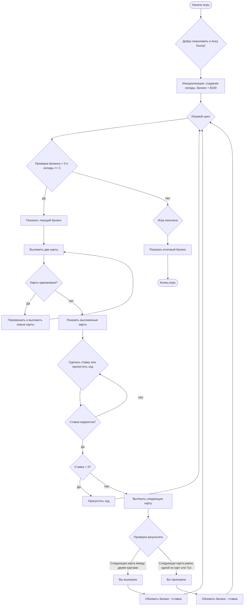

# Анализ кода модуля `acedu.mmd`

**Качество кода**
8
-  Плюсы
    -  Диаграмма потока в формате `mermaid` наглядно отображает логику игры.
    -  Пошагово описан процесс игры от инициализации до завершения.
-  Минусы
    -  Отсутствует описание игровых правил, и как определяется выигрыш/проигрыш.
    -  Диаграмма не отражает детали реализации, такие как структура данных колоды, обработка ввода пользователя, или конкретные механизмы вычисления выигрыша.
    -  Нет описания возможных граничных случаев или ошибок в процессе игры.

**Рекомендации по улучшению**

1.  **Добавить описание правил игры**: Включить текстовое описание правил игры Acey Ducey.
2.  **Уточнить логику игры**: Дополнить описание блоков `CheckResult` и `UpdateBalance`.
3.  **Улучшить читаемость**: Добавить комментарии для каждого блока.
4.  **Включить описание структуры данных**: Описать структуру колоды карт.
5.  **Добавить описание граничных случаев**: Добавить обработку случаев с нулевой ставкой и когда в колоде заканчиваются карты.
6.  **Описать взаимодействие с пользователем**: Как пользователь делает ставки, как отображается информация на экране.
7.  **Уточнить условия выигрыша и проигрыша**: Добавить, что туз может быть как старшей, так и младшей картой.
8. **Разбить сложную логику на части**: разделить один большой блок на несколько более мелких, чтобы повысить читаемость и упростить понимание логики

**Оптимизированный код**

```markdown
# Анализ кода модуля acedu.mmd

