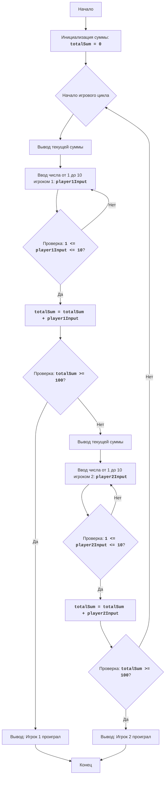

# Анализ кода модуля batnum.py

**Качество кода: 7/10**

-   **Плюсы:**
    *   Код содержит подробное описание игры и алгоритма в docstring.
    *   Имеется блок-схема в формате mermaid.
    *   Код игры разбит на логические блоки с комментариями.
    *   Ввод данных проверяется на корректность (число от 1 до 10, целое число).
-   **Минусы:**
    *   Отсутствует импорт модуля `logger` из `src.logger.logger`.
    *   Используются стандартные блоки `try-except` вместо обработки ошибок через `logger.error`.
    *   Комментарии не соответствуют стандарту reStructuredText (RST).
    *   Не используются docstring для переменных и всего модуля.

**Рекомендации по улучшению:**

1.  **Импорт `logger`:** Добавить `from src.logger.logger import logger` для логирования ошибок.
2.  **Обработка ошибок:** Заменить стандартные блоки `try-except` на использование `logger.error` для более информативного логирования.
3.  **RST Docstring:** Переписать комментарии в формате reStructuredText (RST) для модуля, функций и переменных.
4.  **Документирование переменных:** Добавить docstring для переменных.

**Оптимизированный код:**

```python
"""
BATNUM: BATNUM
=================
Сложность: 2
-----------------
Игра "BATNUM" (Битва чисел) представляет собой простую игру, в которой два игрока по очереди вводят числа от 1 до 10.
Цель игры - получить число 100. Каждый игрок добавляет свое число к общей сумме, и игрок, доведящий сумму до 100 или выше, проигрывает.

Правила игры:
1. Два игрока по очереди вводят целые числа от 1 до 10.
2. Каждое введенное число прибавляется к общей сумме.
3. Игрок, после ввода которого сумма достигает 100 или более, проигрывает.
4. Начинает игру первый игрок.
-----------------
Алгоритм:
1. Установить начальную сумму в 0.
2. Начать игровой цикл.
3. Вывести текущую сумму.
4. Запросить у первого игрока ввод числа от 1 до 10.
5. Если введенное число не в диапазоне от 1 до 10, запросить повторный ввод.
6. Добавить введенное число к общей сумме.
7. Проверить, не превысила ли сумма 100. Если превысила, первый игрок проиграл, завершить игру.
8. Вывести текущую сумму.
9. Запросить у второго игрока ввод числа от 1 до 10.
10. Если введенное число не в диапазоне от 1 до 10, запросить повторный ввод.
11. Добавить введенное число к общей сумме.
12. Проверить, не превысила ли сумма 100. Если превысила, второй игрок проиграл, завершить игру.
13. Повторить с шага 3, если сумма не превысила 100.
-----------------
Блок-схема:

    
**Legenda**:
    Start - Начало программы.
    InitializeSum - Инициализация переменной totalSum (сумма) в 0.
    GameLoopStart - Начало игрового цикла.
    OutputCurrentSum1 - Вывод текущего значения суммы для игрока 1.
    InputPlayer1 - Запрос у игрока 1 ввода числа от 1 до 10.
    ValidateInput1 - Проверка, что введенное число игрока 1 находится в диапазоне от 1 до 10.
    AddInput1 - Добавление введенного числа игрока 1 к общей сумме.
    CheckSum1 - Проверка, не превысила ли сумма 100 после хода игрока 1.
    OutputPlayer1Lose - Вывод сообщения о проигрыше игрока 1, если сумма равна 100 или более.
    End - Конец программы.
     OutputCurrentSum2 - Вывод текущего значения суммы для игрока 2.
    InputPlayer2 - Запрос у игрока 2 ввода числа от 1 до 10.
    ValidateInput2 - Проверка, что введенное число игрока 2 находится в диапазоне от 1 до 10.
    AddInput2 - Добавление введенного числа игрока 2 к общей сумме.
    CheckSum2 - Проверка, не превысила ли сумма 100 после хода игрока 2.
    OutputPlayer2Lose - Вывод сообщения о проигрыше игрока 2, если сумма равна 100 или более.
"""
__author__ = 'hypo69 (hypo69@davidka.net)'
from src.logger.logger import logger

#: Инициализация общей суммы
totalSum = 0

# Основной игровой цикл
while True:
    # Ход первого игрока
    print(f"Текущая сумма: {totalSum}")
    while True:
        try:
            # Запрос ввода числа от первого игрока
            player1Input = int(input("Игрок 1, введите число от 1 до 10: "))
            # Проверка, находится ли число в допустимом диапазоне
            if 1 <= player1Input <= 10:
                break
            else:
                 # Вывод сообщения об ошибке, если число вне диапазона
                print("Пожалуйста, введите число от 1 до 10.")
        except ValueError as e:
            # Логирование ошибки, если ввод не целое число
             logger.error("Ошибка ввода числа", exc_info=True)
             print("Пожалуйста, введите целое число.")
    # Добавление введенного числа к общей сумме
    totalSum += player1Input

    # Проверка, не проиграл ли первый игрок
    if totalSum >= 100:
        print("Игрок 1 проиграл!")
        break

    # Ход второго игрока
    print(f"Текущая сумма: {totalSum}")
    while True:
        try:
            # Запрос ввода числа от второго игрока
            player2Input = int(input("Игрок 2, введите число от 1 до 10: "))
            # Проверка, находится ли число в допустимом диапазоне
            if 1 <= player2Input <= 10:
                break
            else:
                # Вывод сообщения об ошибке, если число вне диапазона
                print("Пожалуйста, введите число от 1 до 10.")
        except ValueError as e:
             # Логирование ошибки, если ввод не целое число
             logger.error("Ошибка ввода числа", exc_info=True)
             print("Пожалуйста, введите целое число.")
    # Добавление введенного числа к общей сумме
    totalSum += player2Input

    # Проверка, не проиграл ли второй игрок
    if totalSum >= 100:
        print("Игрок 2 проиграл!")
        break
```