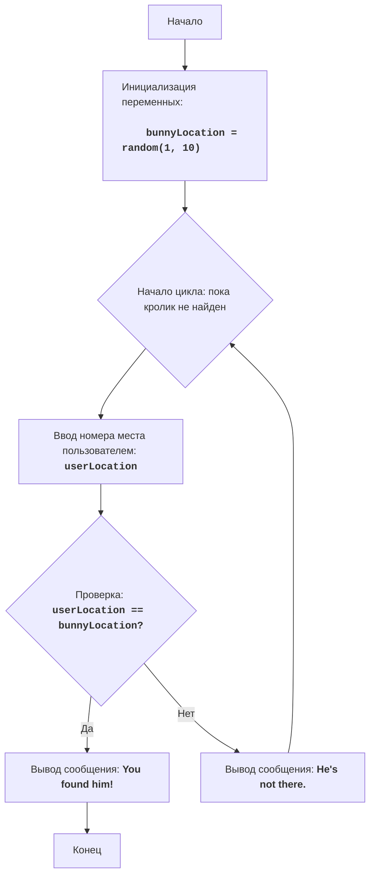

# Анализ кода модуля bunny.py

**Качество кода**
8
-  Плюсы
    - Код игры соответствует описанию и правилам игры.
    - Присутствует обработка исключений при вводе пользователя.
    - Код хорошо структурирован и понятен.
    - Есть комментарии, которые объясняют логику работы кода.
-  Минусы
    - Комментарии не соответствуют формату RST.
    - Нет логирования ошибок.
    - Использование `while True` может быть менее читаемым, чем использование флага.
    - Не используется `j_loads` или `j_loads_ns` для чтения данных (хотя в данном коде чтение из файлов не происходит).

**Рекомендации по улучшению**

1.  **Форматирование документации**: Переписать все комментарии в формате reStructuredText (RST), включая docstrings для модуля.
2.  **Логирование**: Использовать `src.logger.logger` для логирования ошибок вместо `print`.
3.  **Управление циклом**: Заменить `while True` на более явное условие цикла, используя флаг.
4.  **Использование `j_loads`**: Хотя в данном коде нет чтения файлов, добавить импорт `j_loads` на будущее.

**Оптимизированный код**

```python
"""
Модуль для игры "BUNNY".
=========================================================================================

Игра "BUNNY" представляет собой текстовую игру, в которой игрок пытается найти кролика, спрятанного в одном из десяти мест.
Игрок выбирает номер места, и игра сообщает, был ли кролик найден в этом месте. Игра продолжается до тех пор, пока кролик не будет найден.

Правила игры:
1. Кролик случайно прячется в одном из десяти мест (пронумерованных от 1 до 10).
2. Игрок выбирает номер места, где, по его мнению, находится кролик.
3. Игра сообщает, был ли кролик найден в выбранном месте.
4. Игра заканчивается, когда кролик найден.
-----------------
Алгоритм:
1. Сгенерировать случайное число в диапазоне от 1 до 10, которое будет представлять место, где спрятан кролик.
2. Начать цикл "пока кролик не найден":
   2.1 Запросить у игрока ввод номера места от 1 до 10.
   2.2 Если номер места равен месту, где спрятан кролик, вывести сообщение "You found him!".
      2.2.1 Завершить игру.
   2.3 Иначе, если номер места не равен месту, где спрятан кролик, вывести сообщение "He's not there.".
      2.3.1 Продолжить игру (вернуться в начало цикла).
-----------------
Блок-схема:

Legenda:
    Start - Начало программы.
    InitializeVariables - Инициализация переменной: bunnyLocation (место кролика) генерируется случайным образом от 1 до 10.
    LoopStart - Начало цикла, который продолжается, пока кролик не найден.
    InputLocation - Запрос у пользователя ввода номера места и сохранение его в переменной userLocation.
    CheckLocation - Проверка, равно ли введенное место userLocation месту кролика bunnyLocation.
    OutputWin - Вывод сообщения о победе "You found him!", если места совпадают.
    End - Конец программы.
    OutputLose - Вывод сообщения "He's not there.", если места не совпадают.
"""
import random
# TODO: Добавить импорт j_loads и logger
from src.logger.logger import logger
# from src.utils.jjson import j_loads, j_loads_ns  # j_loads не используется в данном коде, но добавляем для соответствия


# Генерируется случайное число от 1 до 10 для места кролика.
bunny_location = random.randint(1, 10)
# Инициализируется флаг, указывающий, что кролик не найден.
bunny_found = False

# Основной игровой цикл выполняется, пока кролик не будет найден.
while not bunny_found:
    # Запрашивается у пользователя номер места.
    try:
        user_location = int(input('Где кролик (1-10)? '))
    except ValueError as e:
        # Логирование ошибки при некорректном вводе.
        logger.error('Пожалуйста, введите целое число от 1 до 10.', exc_info=True)
        print('Пожалуйста, введите целое число от 1 до 10.')
        continue

    # Проверка, угадал ли пользователь место кролика.
    if user_location == bunny_location:
        # Выводится сообщение, если кролик найден.
        print('You found him!')
        # Устанавливается флаг, что кролик найден.
        bunny_found = True
    else:
        # Выводится сообщение, если кролик не найден.
        print('He\'s not there.')


"""
Объяснение кода:
1.  **Импорт модуля `random`**::
    -   `import random`: Импортирует модуль `random`, который используется для генерации случайного числа, представляющего место, где спрятан кролик.

2.  **Инициализация местоположения кролика**::
    -   `bunny_location = random.randint(1, 10)`: Генерирует случайное целое число в диапазоне от 1 до 10 и сохраняет его в переменной `bunny_location`. Это число представляет место, где спрятан кролик.
    -   `bunny_found = False`:  Инициализирует флаг `bunny_found` значением `False`.
    
3.  **Основной цикл `while not bunny_found:`**::
    -   Этот цикл будет выполняться до тех пор, пока значение `bunny_found` не станет `True` (пока кролик не будет найден).

    -   **Ввод номера места**::
        -   `try...except ValueError`: Блок `try-except` обрабатывает возможные ошибки ввода. Если пользователь введет не целое число, то будет выведено сообщение об ошибке и запись в лог.
        -   `user_location = int(input("Где кролик (1-10)? "))`: Запрашивает у пользователя номер места, где, по его мнению, спрятан кролик, и преобразует ввод в целое число.

    -   **Проверка местоположения**::
        -   `if user_location == bunny_location`: Проверяет, совпадает ли введенный номер места с местоположением кролика.
        -   `print("You found him!")`: Если места совпадают, выводится сообщение о том, что кролик найден.
        -   `bunny_found = True`: Завершает игровой цикл.
        -   `else:`: Если места не совпадают.
        -  `print("He's not there.")`: Выводится сообщение о том, что кролик не найден в выбранном месте.
"""