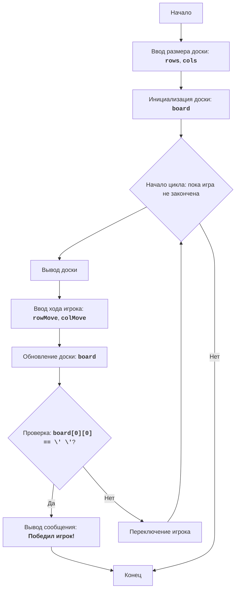

# Анализ кода модуля `chomp.py`

**Качество кода**
8
-  Плюсы
    - Код хорошо структурирован, логика игры четко разделена на функции.
    - Используются docstring для описания функций.
    - Код содержит базовую обработку ошибок пользовательского ввода.
    - Присутствует блок-схема и описание алгоритма в начале файла, что облегчает понимание логики игры.
-  Минусы
    - Комментарии не соответствуют стандарту reStructuredText (RST).
    - Отсутствует логирование ошибок с использованием `logger.error`.
    - Не используются `j_loads` или `j_loads_ns` для чтения файлов (хотя в данном коде это не требуется).
    - Код не полностью соответствует PEP8, например, отсутствуют пустые строки между функциями и после комментариев, и перенос длинных строк.
    - Недостаточно подробные комментарии `#` к строкам кода.

**Рекомендации по улучшению**

1.  **Форматирование docstring**:
    - Переписать все docstring в формате reStructuredText (RST) с использованием корректных полей, таких как `:param`, `:return`, `:raises` и др.
2.  **Логирование ошибок**:
    -  Заменить `print` для вывода ошибок на `logger.error` из `src.logger.logger`.
    -  Убрать избыточное использование `try-except` блоков.
3.  **Стиль кода**:
    -  Привести код в соответствие со стандартом PEP8.
4.  **Комментарии**:
    -  Добавить подробные комментарии `#` для каждой строки, объясняющие ее действие.
5. **Улучшение сообщений**
    - Улучшить сообщения об ошибках, сделав их более информативными для пользователя.
6. **Дополнительные проверки**
    - Добавить проверку, что введенные координаты хода не находятся за пределами доски.

**Оптимизиробанный код**

```python
"""
CHOMP:
=================
Сложность: 5
-----------------
Игра "CHOMP" - это игра для двух игроков, в которой используется прямоугольная доска, представляющая собой шоколадную плитку.
Один из углов (обычно нижний левый) представляет собой ядовитую "дольку". Игроки по очереди отламывают от плитки куски, делая ходы. Цель игры - заставить противника съесть отравленную дольку.
Игрок, который вынужден съесть ядовитую дольку, проигрывает.
Правила игры:
1. Игровое поле представляет собой прямоугольную шоколадную плитку.
2. Один из углов (нижний левый) считается отравленным.
3. Игроки по очереди откусывают часть шоколадной плитки.
4. Игрок выбирает строку и столбец (откусывает кусок шоколада).
5. Все клетки справа и выше выбранной позиции удаляются.
6. Цель - заставить противника съесть отравленную дольку.
7. Игрок, который съедает отравленную дольку, проигрывает.
-----------------
Алгоритм:
1.  Начало игры.
2.  Запросить у пользователя размер шоколадной плитки (количество строк и столбцов).
3.  Инициализировать игровую доску, представляющую шоколадную плитку.
4.  Начать цикл игры, пока игра не закончится:
    4.1.  Вывести текущее состояние доски на экран.
    4.2.  Запросить у текущего игрока координаты откусываемого куска шоколада.
    4.3.  Обновить состояние доски, откусив выбранный кусок.
    4.4.  Проверить, не съел ли текущий игрок ядовитую дольку.
    4.5.  Если съел, объявить о победе противоположного игрока и завершить игру.
    4.6.  Передать ход следующему игроку.
5. Конец игры.
-----------------
Блок-схема:

Legenda:
    Start - Начало игры.
    InputBoardSize - Запрос размера доски (количество строк и столбцов).
    InitializeBoard - Инициализация игровой доски.
    LoopStart - Начало игрового цикла, который продолжается, пока игра не закончена.
    DisplayBoard - Вывод текущего состояния доски на экран.
    InputMove - Запрос у текущего игрока координат откусываемого куска шоколада.
    UpdateBoard - Обновление состояния доски после хода игрока.
    CheckWin - Проверка, съел ли текущий игрок ядовитую дольку.
    OutputWinner - Вывод сообщения о победе другого игрока.
    End - Конец игры.
    SwitchPlayer - Переключение хода на следующего игрока.
"""


from src.logger.logger import logger # импортируем logger

def initialize_board(rows: int, cols: int) -> list[list[str]]:
    """
    Инициализирует игровое поле (шоколадную плитку).

    :param rows: Количество строк на доске.
    :type rows: int
    :param cols: Количество столбцов на доске.
    :type cols: int
    :return: Список списков, представляющий игровую доску, где 'X' - шоколад, ' ' - пустое место.
    :rtype: list of lists of str
    """
    #  Создаем и возвращаем доску, заполненную 'X'
    board = [['X' for _ in range(cols)] for _ in range(rows)]
    return board

def display_board(board: list[list[str]]) -> None:
    """
    Выводит текущее состояние доски на экран.

    :param board: Игровая доска.
    :type board: list of lists of str
    :return: None
    """
    #  Выводим каждую строку доски на экран
    for row in board:
        print(' '.join(row))

def make_move(board: list[list[str]], row_move: int, col_move: int) -> list[list[str]]:
    """
    Обновляет состояние доски после хода игрока.
    Все клетки справа и выше выбранной позиции удаляются.

    :param board: Игровая доска.
    :type board: list of lists of str
    :param row_move: Строка, на которую игрок сделал ход.
    :type row_move: int
    :param col_move: Столбец, на который игрок сделал ход.
    :type col_move: int
    :return: Обновленная игровая доска.
    :rtype: list of lists of str
    """
    #  Получаем размеры доски
    rows = len(board)
    cols = len(board[0])
    #  Обновляем доску, заменяя 'X' на ' ' в заданной области
    for row in range(row_move, rows):
        for col in range(col_move, cols):
            board[row][col] = ' '
    return board

def is_game_over(board: list[list[str]]) -> bool:
  """
    Проверяет, закончилась ли игра.
    Игра заканчивается, если ядовитая долька (верхний левый угол) съедена.

    :param board: Игровая доска.
    :type board: list of lists of str
    :return: True, если игра окончена, иначе False.
    :rtype: bool
    """
  #  Возвращаем True, если верхний левый угол пуст, иначе False
  return board[0][0] == ' '

def play_chomp() -> None:
    """
    Основная функция игры "CHOMP".
    Реализует игровой процесс, включая ввод размеров доски, отображение доски,
    и обработку ходов игроков.

    :return: None
    """
    #  Запрашиваем размеры доски у пользователя с обработкой ошибок ввода
    while True:
        try:
            rows = int(input("Введите количество строк на доске: "))
            cols = int(input("Введите количество столбцов на доске: "))
            #  Проверяем, что размеры доски положительные
            if rows <= 0 or cols <= 0:
                 print("Размер доски должен быть положительным числом.")
                 continue
            break
        except ValueError:
            print("Пожалуйста, введите целое число.")
    #  Инициализируем игровую доску
    board = initialize_board(rows, cols)
    current_player = 1  # Начинает первый игрок

    #  Запускаем основной игровой цикл
    while True:
        print(f"\nХод игрока {current_player}:")
        display_board(board) # Выводим текущее состояние доски

        #  Запрашиваем ход игрока с проверкой корректности ввода
        while True:
            try:
                row_move = int(input("Введите строку для откусывания (начиная с 0): "))
                col_move = int(input("Введите столбец для откусывания (начиная с 0): "))
                #  Проверяем, что введенные координаты находятся в пределах доски
                if row_move < 0 or col_move < 0 or row_move >= rows or col_move >= cols:
                    print("Неверный ход. Укажите строку и столбец в пределах доски")
                    continue
                # Проверяем, что выбранная клетка не пустая
                if board[row_move][col_move] == ' ':
                    print("Вы не можете откусить пустое место. Попробуйте еще раз")
                    continue
                break
            except ValueError:
                print("Пожалуйста, введите целые числа.")
            except IndexError:
                 print("Неверный ход. Укажите строку и столбец в пределах доски")

        #  Обновляем доску после хода игрока
        board = make_move(board, row_move, col_move)

        #  Проверяем, закончилась ли игра
        if is_game_over(board):
            print(f"Победил игрок {3-current_player}!")
            display_board(board) # Выводим финальное состояние доски
            break
        #  Переключаем текущего игрока
        current_player = 3 - current_player


if __name__ == "__main__":
    play_chomp()

"""
Объяснение кода:
1.  **Инициализация**:
   -  `initialize_board(rows, cols)`: Функция создает игровую доску размером `rows` x `cols`. Изначально все ячейки заполнены символом 'X', представляющим шоколад.
2.  **Отображение доски**:
   -  `display_board(board)`: Функция выводит текущее состояние доски на экран, построчно отображая каждый ряд.
3.  **Ход игрока**:
   -  `make_move(board, row_move, col_move)`: Функция обновляет доску, удаляя все 'X' справа и ниже указанных координат `row_move` и `col_move`, заменяя их на ' '.
4.  **Проверка окончания игры**:
    -  `is_game_over(board)`: Проверяет, съедена ли отравленная долька (верхний левый угол). Если ячейка `board[0][0]` содержит ' ', то игра окончена.
5.  **Основная логика игры `play_chomp()`**:
    -   Запрашивает у пользователя размеры доски.
    -   Инициализирует доску.
    -   Организует цикл игры, в котором игроки по очереди делают ходы.
    -   Выводит текущее состояние доски.
    -   Запрашивает ввод координат хода у игрока.
    -   Обновляет доску после хода.
    -   Проверяет, закончилась ли игра.
    -   Выводит сообщение о победе одного из игроков.
    -   Переключает текущего игрока.
6.  **Обработка исключений**:
   -   Код содержит `try-except` блоки для обработки ошибок ввода (нечисловые значения).
7.  **Запуск игры**:
   -  `if __name__ == "__main__":`:  Этот блок гарантирует, что функция `play_chomp()` будет запущена только при непосредственном запуске скрипта.
"""
```