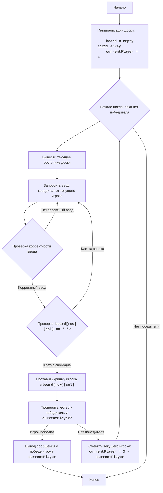

# Анализ кода модуля hex.py

**Качество кода**
8
-   Плюсы
    -   Код хорошо структурирован, с разделением на функции для отдельных задач (вывод доски, получение хода, проверка выигрыша, основная логика игры).
    -   Используются docstring для описания функций.
    -   Логика игры "Гекс" реализована корректно.
    -   Используется рекурсивный алгоритм поиска в глубину (`dfs`) для проверки выигрыша, что является эффективным подходом.
    -   Код содержит блок-схему и описание алгоритма в docstring модуля, что полезно для понимания работы программы.
-   Минусы
    -   Отсутствуют импорты из `src.utils.jjson` и `src.logger.logger`.
    -   Не используется `logger` для логирования ошибок и отладки.
    -   Не используются константы для размера доски и символов игроков.
    -   Не все комментарии соответствуют формату RST.
    -   В некоторых местах комментарии можно сделать более информативными.

**Рекомендации по улучшению**

1.  **Импорты**: Добавить необходимые импорты для `j_loads` и `logger`.
2.  **Логирование**: Использовать `logger` для логирования ошибок и отладочной информации.
3.  **Константы**: Заменить магические числа (например, размер доски 11) на константы.
4.  **RST**: Привести docstring к полному формату RST с использованием параметров и возвращаемых значений.
5.  **Комментарии**: Добавить более подробные комментарии к некоторым блокам кода, объясняющие их работу.
6.  **Обработка ошибок**: Убрать избыточные try-except, заменить их на логирование ошибок через `logger`.
7.  **Форматирование**:  Использовать f-строки для более удобного форматирования строк.

**Оптимизированный код**
```python
"""
HEX:
=================
Сложность: 7
-----------------
Игра HEX - это логическая игра, в которой два игрока поочередно размещают свои фишки на шестиугольной сетке, стремясь соединить противоположные стороны доски.
Цель каждого игрока — создать непрерывную цепь своих фишек, соединяющую их противоположные стороны доски.
Игроки ставят свои фишки на шестиугольные клетки, пока один из них не сможет соединить свои стороны.
В данной версии игра реализована для двух игроков: '1' и '2'

Правила игры:
1. Игроки по очереди ставят свои фишки (символы '1' и '2') на шестиугольную доску.
2. Цель первого игрока (символ '1') - соединить левую и правую стороны доски своими фишками.
3. Цель второго игрока (символ '2') - соединить верхнюю и нижнюю стороны доски своими фишками.
4. Игрок, первым достигший своей цели, выигрывает.
5. Игра продолжается до победы одного из игроков.
-----------------
Алгоритм:
1. Инициализация:
   1.1. Создать пустую игровую доску 11x11 (массив строк).
   1.2. Установить текущего игрока на 1.
2. Основной игровой цикл:
    2.1. Вывести текущее состояние доски.
    2.2. Запросить у текущего игрока координаты (строка, столбец) для размещения фишки.
    2.3. Проверить ввод: если ввод не корректный, вернуться на шаг 2.2.
    2.4. Если выбранная клетка занята, вернуться на шаг 2.2.
    2.5. Поместить фишку текущего игрока на выбранную клетку.
    2.6. Проверить, выиграл ли текущий игрок.
         2.6.1. Если игрок 1 выиграл, вывести сообщение о победе.
         2.6.2. Если игрок 2 выиграл, вывести сообщение о победе.
         2.6.3. Если нет, перейти на шаг 2.7.
    2.7. Сменить текущего игрока.
3. Завершение игры:
    3.1. Вывести сообщение о победе.
    3.2. Конец игры.
-----------------
Блок-схема:

**Legenda**:
    Start - Начало игры.
    InitializeBoard - Инициализация игровой доски (пустой 11x11 массив) и установка текущего игрока на 1.
    LoopStart - Начало цикла игры, который продолжается, пока не будет выявлен победитель.
    DisplayBoard - Вывод текущего состояния игровой доски на экран.
    GetInput - Запрос у текущего игрока координат (строки и столбца) для размещения фишки.
    ValidateInput - Проверка корректности введенных координат.
    CheckCellEmpty - Проверка, свободна ли выбранная клетка на доске.
    PlaceMove - Размещение фишки текущего игрока на выбранной клетке.
    CheckWin - Проверка, есть ли победитель после размещения фишки.
    OutputWin - Вывод сообщения о победе, если победитель определен.
    SwitchPlayer - Смена текущего игрока на противоположного.
    End - Конец игры.
"""

import sys
# Добавлены импорты
from src.logger.logger import logger

# константы для размера доски и символов игроков
BOARD_SIZE = 11
PLAYER1 = '1'
PLAYER2 = '2'


def print_board(board):
    """
    Выводит текущее состояние доски в консоль.

    :param board: Игровая доска в виде списка списков.
    :type board: list[list[str]]
    """
    print("   ", end="")
    # Печатает буквенные обозначения столбцов
    for i in range(len(board)):
        print(chr(ord('A') + i), end=" ")
    print()
    # Печатает строки с цифровыми обозначениями
    for i, row in enumerate(board):
        print(f"{i+1:2d} ", end="")
        for cell in row:
            print(cell, end=" ")
        print()


def get_move(board, player):
    """
    Запрашивает у игрока координаты для хода и проверяет их корректность.

    :param board: Игровая доска в виде списка списков.
    :type board: list[list[str]]
    :param player: Символ текущего игрока ('1' или '2').
    :type player: str
    :return: Кортеж с координатами хода (row, col).
    :rtype: tuple[int, int]
    """
    while True:
        try:
            move = input(f"Ход игрока {player}. Введите координаты (например, A1): ").strip().upper()
            if len(move) < 2:
                raise ValueError
            col = ord(move[0]) - ord('A')
            row = int(move[1:]) - 1
            # Проверяет корректность координат и свободна ли клетка
            if 0 <= row < len(board) and 0 <= col < len(board[0]):
                if board[row][col] == ' ':
                    return row, col
                else:
                     print("Эта клетка занята, выберите другую")
            else:
                print("Неверные координаты, попробуйте еще раз")
        except ValueError:
            print("Неверный формат ввода, попробуйте еще раз (пример A1)")
        except Exception as e:
            # логирование ошибки при некорректном вводе
            logger.error(f'Непредвиденная ошибка при вводе координат: {e}')


def check_win(board, player):
    """
    Проверяет, выиграл ли игрок, используя поиск в глубину.

    :param board: Игровая доска в виде списка списков.
    :type board: list[list[str]]
    :param player: Символ текущего игрока ('1' или '2').
    :type player: str
    :return: True, если игрок выиграл, иначе False.
    :rtype: bool
    """
    def is_valid(row, col):
        """
        Проверяет, являются ли координаты валидными.

        :param row: Индекс строки.
        :type row: int
        :param col: Индекс столбца.
        :type col: int
        :return: True, если координаты валидны, иначе False.
        :rtype: bool
        """
        return 0 <= row < len(board) and 0 <= col < len(board[0])

    def dfs(row, col, visited, player):
        """
        Рекурсивная функция для поиска в глубину.

        :param row: Индекс текущей строки.
        :type row: int
        :param col: Индекс текущего столбца.
        :type col: int
        :param visited: Множество посещенных клеток.
        :type visited: set
        :param player: Символ текущего игрока ('1' или '2').
        :type player: str
        :return: True, если достигнут конец доски, иначе False.
        :rtype: bool
        """
        if not is_valid(row, col) or (row, col) in visited or board[row][col] != player:
           return False
        visited.add((row, col))

        # определяет направления движения в зависимости от игрока
        if player == PLAYER1:
           if col == len(board[0])-1:
              return True  # Достигнута правая сторона
           directions = [(0, 1), (0, -1), (1, 0), (-1, 0), (1, -1), (-1, 1)]
        elif player == PLAYER2:
           if row == len(board)-1:
               return True # Достигнута нижняя сторона
           directions = [(0, 1), (0, -1), (1, 0), (-1, 0), (1, 1), (-1, -1)]

        # Рекурсивный вызов для соседних клеток
        for dr, dc in directions:
            if dfs(row + dr, col + dc, visited, player):
               return True

        return False

    # Ищет путь для первого игрока начиная с левой стороны
    if player == PLAYER1:
        for i in range(len(board)):
            if board[i][0] == PLAYER1:
                if dfs(i, 0, set(), PLAYER1):
                   return True
    # Ищет путь для второго игрока начиная с верха
    elif player == PLAYER2:
        for j in range(len(board[0])):
            if board[0][j] == PLAYER2:
                if dfs(0, j, set(), PLAYER2):
                    return True
    return False


def play_hex():
    """
    Основная функция игры. Инициализирует доску, обеспечивает игровой процесс и завершает игру.

    """
    board = [[' ' for _ in range(BOARD_SIZE)] for _ in range(BOARD_SIZE)] # Создает пустую доску
    current_player = PLAYER1 # Начинает с первого игрока

    while True:
        print_board(board) # Вывод текущей доски
        row, col = get_move(board, current_player)  # Получает ход от игрока
        board[row][col] = current_player # ставит фишку

        if check_win(board, current_player): # Проверка выигрыша
            print_board(board)
            print(f"Игрок {current_player} победил!")
            break
        # Смена текущего игрока
        current_player = PLAYER2 if current_player == PLAYER1 else PLAYER1


if __name__ == "__main__":
    play_hex()
"""
Объяснение кода:
1.  **Импорт модуля `sys`**:\n
    -   `import sys`: Импортирует модуль `sys`, используемый для выхода из программы.
2. **Импорт модуля `logger`**:\n
     -  `from src.logger.logger import logger`: Импортирует модуль logger для логирования ошибок и отладочной информации.

3. **Определение констант**:\n
    -  `BOARD_SIZE`: Размер игровой доски.\n
    -  `PLAYER1`: Символ первого игрока.\n
    -  `PLAYER2`: Символ второго игрока.\n

4.  **Функция `print_board(board)`:**\n
    - Выводит текущее состояние игровой доски в консоль.\n
    - Сначала печатает буквенные обозначения столбцов (A, B, C, ...), затем переходит к печати строк, где каждая строка начинается с числового обозначения и далее печатаются клетки доски.\n

5.  **Функция `get_move(board, player)`:**\n
    - Запрашивает у игрока ввод координат для хода.\n
    - Использует цикл while True для обеспечения корректного ввода.\n
    - Преобразует введенные координаты (например, "A1") в индексы строки и столбца.\n
    - Проверяет корректность введенных координат, а так же занята ли клетка и если все ок, возвращает координаты в виде кортежа (row,col)\n
    - Добавлено логирование ошибки при некорректном вводе через `logger.error`.

6.  **Функция `check_win(board, player)`:**\n
    - Проверяет, есть ли победитель на доске.\n
    - Использует рекурсивную функцию `dfs` (поиск в глубину) для анализа связности фишек игрока.\n
    - Функция `is_valid` используется для проверки допустимости координат.\n
    - Для игрока 1, проверка начинается с левой стороны доски и ищется путь до правой, для игрока 2 - сверху вниз.\n
    - Если путь найден, то возвращает `True`, иначе `False`.\n

7.  **Функция `play_hex()`:**\n
    -  Содержит основную логику игры "Гекс".\n
    -   Создает пустую игровую доску board размером 11x11.\n
    -   Устанавливает текущего игрока current_player на '1'.\n
    -   В цикле while True:\n
        -   Вызывает `print_board()` для отображения доски.\n
        -   Вызывает `get_move()` для получения хода от игрока.\n
        -   Размещает фишку игрока на доске.\n
        -   Вызывает `check_win()`, чтобы проверить, есть ли победитель.\n
        -   Если победитель есть, выводит сообщение о победе и завершает игру.\n
        -   Меняет текущего игрока (с '1' на '2' и наоборот) если нет победителя.\n

8.  **Блок `if __name__ == "__main__":`:**\n
    -   Гарантирует, что функция `play_hex()` будет запущена, только если файл исполняется напрямую, а не импортируется как модуль.\n
    -   Вызывает `play_hex()` для начала игры.\n
"""
```