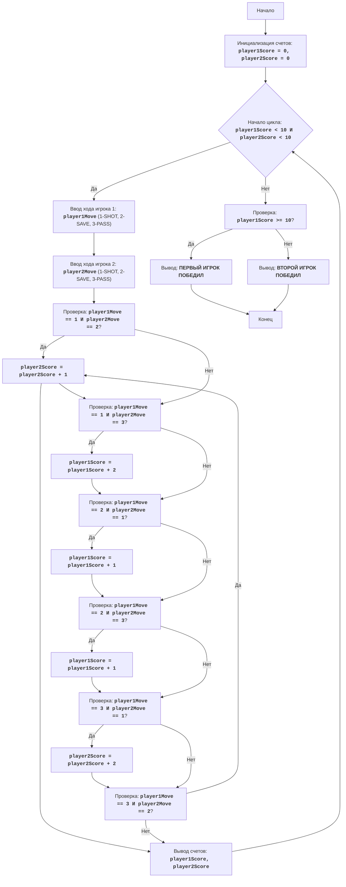

# Анализ кода модуля hockey.py

**Качество кода**
   
   7/10
   - Плюсы
        - Код игры "Хоккей" реализован в соответствии с описанными правилами и алгоритмом.
        - Есть понятные комментарии, описывающие основные этапы игры.
        - Код обрабатывает ввод пользователя, предотвращая ошибки при вводе некорректных данных.
        - Присутствуют блоки `try-except` для обработки `ValueError` при вводе нечисловых значений.
   - Минусы
        - Отсутствует reStructuredText (RST) документация, что затрудняет автоматическую генерацию документации.
        - Используются `print` для вывода информации, что не соответствует стандартам логирования.
        - Нет импорта `logger` для логирования ошибок и отладки.
        - Код не структурирован с использованием функций, что снижает его читаемость и возможность повторного использования.
        - Присутствует дублирование кода при проверке ввода.

**Рекомендации по улучшению**
1.  **Документация в формате reStructuredText (RST)**:
    - Добавить RST docstring для модуля, функций и переменных.
    - Заменить обычные комментарии на RST-совместимые.
2.  **Логирование**:
    - Использовать `from src.logger.logger import logger` для логирования ошибок и отладочной информации.
    - Заменить `print` на `logger.info`, `logger.debug` и `logger.error`.
3.  **Рефакторинг**:
    - Вынести логику ввода ходов игроков в отдельные функции для избежания дублирования кода.
    - Разделить логику проверки ходов и начисления очков в отдельные функции.
    - Оформить основной игровой цикл в отдельную функцию.
4. **Исключения**:
   - Убрать избыточные блоки `try-except` и использовать `logger.error` для логирования ошибок.
5. **Форматирование**:
   - Привести код к единому стилю, используя PEP 8.

**Оптимизированный код**

```python
"""
Модуль HOCKEY:
=================
Сложность: 5
-----------------

Игра "Хоккей" представляет собой простую симуляцию хоккейного матча между двумя игроками.
Игра состоит из нескольких раундов, в каждом из которых игроки по очереди выбирают одно из трех действий:
бросок (SHOT), защиту (SAVE) или пас (PASS). Действия каждого игрока сравниваются, и в зависимости от
комбинации действий начисляются очки. Игра продолжается до тех пор, пока один из игроков не наберет 10 очков.

Правила игры:
1. Играют два игрока, каждый из которых вводит свой ход в каждом раунде.
2. Ходы вводятся в виде числовых кодов: 1 - бросок, 2 - защита, 3 - пас.
3. В каждом раунде сравниваются ходы игроков:
   - Если один игрок бросает, а другой защищается, то защищающийся игрок получает 1 очко.
   - Если один игрок бросает, а другой пасует, то бросающий игрок получает 2 очка.
   - Если оба игрока бросают, то очки не начисляются.
   - Если один игрок защищается, а другой пасует, то защищающийся игрок получает 1 очко.
   - Если оба игрока выбирают одинаковый ход, очки не начисляются.
4. Игра продолжается до тех пор, пока один из игроков не наберет 10 очков.
5. Игрок, первым набравший 10 очков, объявляется победителем.
-----------------
Алгоритм:
1. Инициализировать счет каждого игрока нулем.
2. Начать цикл "пока счет первого игрока меньше 10 И счет второго игрока меньше 10":
    2.1 Запросить у первого игрока ввод хода (1 - бросок, 2 - защита, 3 - пас).
    2.2 Запросить у второго игрока ввод хода (1 - бросок, 2 - защита, 3 - пас).
    2.3 Если первый игрок бросает (1), а второй защищается (2), увеличить счет второго игрока на 1.
    2.4 Если первый игрок бросает (1), а второй пасует (3), увеличить счет первого игрока на 2.
    2.5 Если первый игрок защищается (2), а второй бросает (1), увеличить счет первого игрока на 1.
    2.6 Если первый игрок защищается (2), а второй пасует (3), увеличить счет первого игрока на 1.
    2.7 Если первый игрок пасует (3), а второй бросает (1), увеличить счет второго игрока на 2.
    2.8 Если первый игрок пасует (3), а второй защищается (2), увеличить счет второго игрока на 1.
    2.9 Вывести текущий счет.
3. Если счет первого игрока больше или равен 10, вывести сообщение "ПЕРВЫЙ ИГРОК ПОБЕДИЛ".
4. Если счет второго игрока больше или равен 10, вывести сообщение "ВТОРОЙ ИГРОК ПОБЕДИЛ".
-----------------
Блок-схема:


Legenda:
    Start - Начало программы.
    InitializeScores - Инициализация переменных player1Score и player2Score нулем.
    GameLoopStart - Начало цикла игры, который продолжается пока счет обоих игроков меньше 10.
    Player1Input - Запрос у первого игрока ввода хода (1-бросок, 2-защита, 3-пас) и сохранение его в переменной player1Move.
    Player2Input - Запрос у второго игрока ввода хода (1-бросок, 2-защита, 3-пас) и сохранение его в переменной player2Move.
    CheckMoves1 - Проверка, что первый игрок бросил (1), а второй защищался (2).
    Player2ScoreInc1 - Увеличение счета второго игрока на 1.
    CheckMoves2 - Проверка, что первый игрок бросил (1), а второй пасовал (3).
    Player1ScoreInc2 - Увеличение счета первого игрока на 2.
    CheckMoves3 - Проверка, что первый игрок защищался (2), а второй бросил (1).
    Player1ScoreInc1_1 - Увеличение счета первого игрока на 1.
    CheckMoves4 - Проверка, что первый игрок защищался (2), а второй пасовал (3).
    Player1ScoreInc1_2 - Увеличение счета первого игрока на 1.
    CheckMoves5 - Проверка, что первый игрок пасовал (3), а второй бросил (1).
    Player2ScoreInc2 - Увеличение счета второго игрока на 2.
    CheckMoves6 - Проверка, что первый игрок пасовал (3), а второй защищался (2).
    Player2ScoreInc1 - Увеличение счета второго игрока на 1.
    OutputScores - Вывод текущего счета игроков.
    CheckWinner - Проверка, что счет первого игрока больше или равен 10.
    OutputWinner1 - Вывод сообщения, что первый игрок победил.
    OutputWinner2 - Вывод сообщения, что второй игрок победил.
    End - Конец программы.
"""
__author__ = 'hypo69 (hypo69@davidka.net)'

from src.logger.logger import logger # Импорт логгера

# Инициализация счетов игроков
player1Score = 0
player2Score = 0

def get_player_move(player_num: int) -> int:
    """
    Запрашивает ход игрока.

    :param player_num: Номер игрока (1 или 2).
    :return: Ход игрока (1 - бросок, 2 - защита, 3 - пас).
    :raises ValueError: Если введен неверный формат.
    """
    while True:
        try:
            move = int(input(f"Ход {player_num}-го игрока (1-бросок, 2-защита, 3-пас): "))
            if 1 <= move <= 3:
                return move
            else:
                logger.error("Неверный ввод! Введите число от 1 до 3") # Логируем ошибку ввода
        except ValueError as e:
            logger.error(f"Неверный формат ввода: {e}") # Логируем ошибку формата ввода

def calculate_score(player1_move: int, player2_move: int) -> tuple[int, int]:
    """
    Вычисляет изменения в счете на основе ходов игроков.

    :param player1_move: Ход первого игрока.
    :param player2_move: Ход второго игрока.
    :return: Кортеж с изменениями в счете (изменение для первого, изменение для второго).
    """
    player1_change = 0
    player2_change = 0

    if player1_move == 1 and player2_move == 2:
        player2_change = 1
    elif player1_move == 1 and player2_move == 3:
        player1_change = 2
    elif player1_move == 2 and player2_move == 1:
        player1_change = 1
    elif player1_move == 2 and player2_move == 3:
        player1_change = 1
    elif player1_move == 3 and player2_move == 1:
        player2_change = 2
    elif player1_move == 3 and player2_move == 2:
        player2_change = 1

    return player1_change, player2_change

def play_hockey_game() -> None:
    """
    Запускает игру в хоккей.
    """
    global player1Score, player2Score
    while player1Score < 10 and player2Score < 10:
        # Запрос ввода хода у первого игрока
        player1Move = get_player_move(1)
        # Запрос ввода хода у второго игрока
        player2Move = get_player_move(2)

        # Проверка и начисление очков в зависимости от ходов
        player1_change, player2_change = calculate_score(player1Move, player2Move)
        player1Score += player1_change
        player2Score += player2_change

        # Вывод текущего счета
        logger.info(f"Счет: Игрок 1 - {player1Score}, Игрок 2 - {player2Score}") # логируем текущий счет

    # Определение победителя и вывод сообщения
    if player1Score >= 10:
        logger.info("ПЕРВЫЙ ИГРОК ПОБЕДИЛ") # Логируем победителя
    else:
        logger.info("ВТОРОЙ ИГРОК ПОБЕДИЛ") # Логируем победителя


if __name__ == '__main__':
    # Запускаем игру
    play_hockey_game()
```