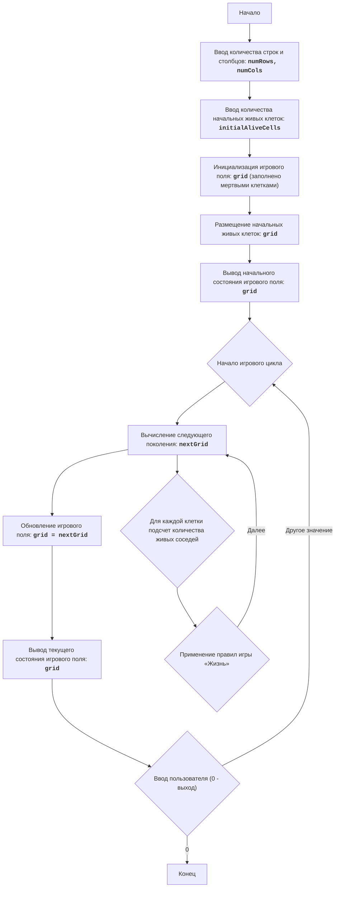

# Анализ кода модуля `life_2.py`

**Качество кода**
7
- Плюсы
    - Код хорошо структурирован, разбит на логические функции.
    - Используются docstring для описания функций, хотя они требуют форматирования в RST.
    - Алгоритм игры реализован согласно описанию.
    - Присутствует подробное описание модуля, блок-схема и алгоритм в виде комментариев.
- Минусы
    - Отсутствуют необходимые импорты, например, `from src.logger.logger import logger`
    - Не используется `j_loads` или `j_loads_ns` для чтения файлов, что не соответствует инструкции.
    - Используются стандартные блоки `try-except`, которые должны быть заменены на обработку ошибок с помощью `logger.error`.
    - Комментарии и docstring не соответствуют стандарту reStructuredText (RST).
    - Не все функции имеют подробное описание в формате RST.

**Рекомендации по улучшению**

1.  Импортировать `from src.logger.logger import logger` для логирования ошибок.
2.  Использовать `j_loads` или `j_loads_ns` (если применимо) для чтения файлов. В данном случае это не требуется, но нужно помнить об этом в дальнейшем.
3.  Заменить стандартные блоки `try-except` на логирование ошибок с помощью `logger.error`.
4.  Переписать все комментарии и docstring в формате reStructuredText (RST), соблюдая стандарты оформления.
5.  Улучшить описания функций и переменных, добавив более подробные комментарии.
6.  Удалить избыточные комментарии, которые дублируют код.
7.  Избегать использования `...` как точек остановки в конечном коде, если они не несут смысловой нагрузки.
8.  Добавить обработку исключений, если это необходимо, с использованием `logger.error`.

**Оптимизированный код**

```python
"""
Модуль LIFE 2:
=================
Сложность: 5
-----------------
Игра "Жизнь 2" - это симуляция клеточного автомата, разработанная Джоном Конвеем.
Она представляет собой поле клеток, каждая из которых может быть либо живой, либо мертвой.
Состояние клетки в следующем поколении зависит от количества живых соседей в текущем поколении.
Игра демонстрирует, как простые правила могут привести к возникновению сложных и интересных паттернов.
Игрок может задавать начальную конфигурацию живых клеток, и наблюдать за эволюцией этой конфигурации с течением времени.

Правила игры:
1. Игровое поле представлено в виде сетки, где каждая клетка может быть либо живой (обозначена как '*'), либо мертвой (обозначена как пробел ' ').
2. В начале игры игроку предлагается ввести количество строк и столбцов для игрового поля, а также количество живых клеток.
3. После ввода начальных параметров поле заполняется мертвыми клетками, а затем случайным образом размещаются живые клетки, количество которых указал игрок.
4. После инициализации поля программа выводит начальное состояние поля.
5. Итерации продолжаются, пока пользователь не введет "0".
6. Для каждого нового поколения:
     - Каждая живая клетка с 2 или 3 живыми соседями остается живой в следующем поколении.
     - Каждая живая клетка с менее чем 2 живыми соседями умирает в следующем поколении.
     - Каждая живая клетка с более чем 3 живыми соседями умирает в следующем поколении.
     - Каждая мертвая клетка рождается в следующем поколении, если у нее ровно 3 живых соседа.
7. Поле отображается после каждой итерации.
-----------------
Алгоритм:
1. Запросить у пользователя количество строк и столбцов для игрового поля.
2. Запросить у пользователя количество начальных живых клеток.
3. Инициализировать игровое поле как матрицу, заполненную мертвыми клетками (' ').
4. Разместить случайным образом указанное пользователем количество живых клеток ('*') на игровом поле.
5. Вывести начальное состояние игрового поля.
6. Запустить бесконечный цикл:
    6.1 Вычислить следующее поколение клеток:
        6.1.1 Создать новое поле, скопировав текущее поле.
        6.1.2 Для каждой клетки в текущем поле:
           6.1.2.1 Подсчитать количество живых соседей.
           6.1.2.2 Применить правила "Жизни", чтобы определить состояние клетки в новом поле.
        6.1.3 Заменить текущее поле новым полем.
    6.2 Вывести текущее состояние игрового поля.
    6.3 Запросить у пользователя ввод. Если введено "0", завершить игру, иначе продолжить.
-----------------
Блок-схема:

Legenda:
    Start - Начало программы.
    InputRowsCols - Запрос у пользователя количества строк и столбцов для игрового поля.
    InputAliveCells - Запрос у пользователя количества начальных живых клеток.
    InitializeGrid - Инициализация игрового поля в виде матрицы, заполненной мертвыми клетками (пробелами).
    PlaceAliveCells - Размещение заданного количества живых клеток (звездочек) на игровом поле в случайных позициях.
    OutputGrid - Вывод начального состояния игрового поля на экран.
    GameLoopStart - Начало основного игрового цикла.
    ComputeNextGeneration - Вычисление следующего поколения клеток на основе текущего состояния поля и правил игры "Жизнь".
     CalculateNeighbors - Для каждой клетки подсчет количества живых соседей.
     ApplyRules - Применение правил игры «Жизнь» для определения состояния клетки в следующем поколении.
    UpdateGrid - Обновление текущего игрового поля, заменяя его новым поколением.
    OutputCurrentGrid - Вывод текущего состояния игрового поля на экран.
    InputUserContinue - Запрос у пользователя на продолжение игры (любое значение, кроме "0") или выход из игры ("0").
    End - Конец программы.
"""
import random
import copy
# добавляем импорт логгера
from src.logger.logger import logger

def initialize_grid(num_rows: int, num_cols: int) -> list[list[str]]:
    """
    Создаёт и инициализирует игровое поле (сетку) с мертвыми клетками.

    :param num_rows: Количество строк в сетке.
    :type num_rows: int
    :param num_cols: Количество столбцов в сетке.
    :type num_cols: int
    :return: Игровое поле, представленное в виде списка списков.
    :rtype: list[list[str]]
    """
    # Инициализация игрового поля как списка списков, заполненного пробелами
    grid = [[' ' for _ in range(num_cols)] for _ in range(num_rows)]
    return grid

def place_alive_cells(grid: list[list[str]], initial_alive_cells: int) -> None:
    """
    Размещает начальные живые клетки на игровом поле случайным образом.

    :param grid: Игровое поле.
    :type grid: list[list[str]]
    :param initial_alive_cells: Количество начальных живых клеток.
    :type initial_alive_cells: int
    """
    # код исполняет получение размеров игрового поля
    num_rows = len(grid)
    num_cols = len(grid[0])
    
    # Инициализация счетчика размещенных клеток
    placed_cells = 0
    # Цикл, который размещает живые клетки, пока не будет достигнуто нужное количество
    while placed_cells < initial_alive_cells:
        # Генерация случайных координат для размещения клетки
        row = random.randint(0, num_rows - 1)
        col = random.randint(0, num_cols - 1)
        # проверка, является ли клетка мертвой
        if grid[row][col] == ' ':
            # Размещение живой клетки
            grid[row][col] = '*'
            placed_cells += 1

def display_grid(grid: list[list[str]]) -> None:
    """
    Выводит текущее состояние игрового поля на экран.

    :param grid: Игровое поле.
    :type grid: list[list[str]]
    """
    # Цикл для перебора всех строк игрового поля
    for row in grid:
        # Вывод строки на экран, объединяя символы пробелами
        print(' '.join(row))
    print()

def count_alive_neighbors(grid: list[list[str]], row: int, col: int) -> int:
    """
    Подсчитывает количество живых соседей у клетки.

    :param grid: Игровое поле.
    :type grid: list[list[str]]
    :param row: Индекс строки клетки.
    :type row: int
    :param col: Индекс столбца клетки.
    :type col: int
    :return: Количество живых соседей.
    :rtype: int
    """
    # код исполняет получение размеров игрового поля
    num_rows = len(grid)
    num_cols = len(grid[0])
    # Инициализация счетчика живых соседей
    alive_neighbors = 0

    # Циклы для перебора соседних клеток
    for i in range(max(0, row - 1), min(num_rows, row + 2)):
        for j in range(max(0, col - 1), min(num_cols, col + 2)):
            # Проверка, является ли соседняя клетка живой и не является ли она текущей клеткой
            if (i, j) != (row, col) and grid[i][j] == '*':
                alive_neighbors += 1
    # Возвращаем количество живых соседей
    return alive_neighbors

def compute_next_generation(grid: list[list[str]]) -> list[list[str]]:
    """
    Вычисляет следующее поколение клеток на основе текущего состояния поля и правил игры "Жизнь".

    :param grid: Текущее игровое поле.
    :type grid: list[list[str]]
    :return: Новое игровое поле, представляющее следующее поколение.
    :rtype: list[list[str]]
    """
    # код исполняет получение размеров игрового поля
    num_rows = len(grid)
    num_cols = len(grid[0])
    # Копирование текущего поля для избежания изменений в процессе вычислений
    next_grid = copy.deepcopy(grid)

    # Циклы для перебора всех клеток поля
    for row in range(num_rows):
        for col in range(num_cols):
            # Подсчет количества живых соседей для текущей клетки
            alive_neighbors = count_alive_neighbors(grid, row, col)
            # Применение правил игры для определения состояния клетки в следующем поколении
            if grid[row][col] == '*':
                # Клетка умирает, если у нее меньше 2 или больше 3 живых соседей
                if alive_neighbors < 2 or alive_neighbors > 3:
                    next_grid[row][col] = ' '
            else:
                # Клетка рождается, если у нее ровно 3 живых соседа
                if alive_neighbors == 3:
                    next_grid[row][col] = '*'
    # Возвращаем новое поле
    return next_grid
    
# Основная логика игры
if __name__ == "__main__":
    # Запрашиваем у пользователя размер поля
    try:
         num_rows = int(input("Введите количество строк: "))
         num_cols = int(input("Введите количество столбцов: "))
    except ValueError as e:
        logger.error(f'Ошибка ввода размера поля: {e}')
        exit()

    # Запрашиваем количество начальных живых клеток
    try:
        initial_alive_cells = int(input("Введите количество начальных живых клеток: "))
    except ValueError as e:
        logger.error(f'Ошибка ввода количества живых клеток: {e}')
        exit()
    # Инициализируем и выводим начальное состояние поля
    grid = initialize_grid(num_rows, num_cols)
    place_alive_cells(grid, initial_alive_cells)
    print("Начальное состояние поля:")
    display_grid(grid)

    # Основной игровой цикл
    while True:
        # Вычисляем следующее поколение
        next_grid = compute_next_generation(grid)
        grid = next_grid
        # Отображаем новое состояние поля
        display_grid(grid)

        # Спрашиваем пользователя, хочет ли он продолжить
        user_input = input("Нажмите Enter для продолжения или введите '0' для выхода: ")
        if user_input == '0':
            break
```