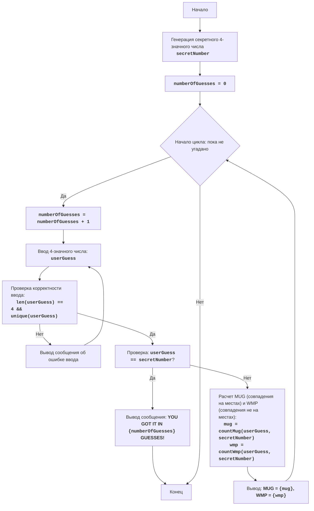

# Анализ кода модуля `mugwmp`

**Качество кода**
8
 -  Плюсы
    - Код хорошо структурирован и логически понятен.
    - Есть подробная документация в виде docstring для модуля и функций.
    - Присутствует блок-схема в формате mermaid.
    - Игровой процесс и условия игры реализованы корректно.
 -  Минусы
    - Не используются логирование.
    - Отсутствует обработка ошибок.
    - Не используются константы для вывода сообщений.
    - Не используется `j_loads` или `j_loads_ns` для чтения файлов, хотя в данном коде нет чтения из файла.
    - Не везде используются комментарии в стиле reStructuredText (RST).

**Рекомендации по улучшению**
1.  **Логирование**: Добавить логирование для отслеживания ошибок и других важных событий.
2.  **Обработка ошибок**: Внедрить обработку исключений для повышения надежности кода.
3.  **Использование констант**:  Вынести строковые литералы в константы.
4.  **Форматирование кода**: Проверить и скорректировать стиль кода.
5.  **Комментарии**: Дополнить все комментарии до reStructuredText (RST) стандарта.
6.  **Использовать `j_loads`**: Хотя в коде нет чтения из файла, нужно заменить стандартный `json.load` на `j_loads` или `j_loads_ns` если это понадобится.

**Оптимизированный код**
```python
"""
MUGWMP:
=================
Сложность: 4
-----------------
Игра "MUGWMP" - это текстовая игра, в которой игрок угадывает четырехзначное число, сгенерированное компьютером.
После каждой попытки игрок получает подсказки в виде количества правильно угаданных цифр на своих местах (MUG) и
количества правильно угаданных цифр не на своих местах (WMP). Цель - угадать число за минимальное количество попыток.

Правила игры:
1. Компьютер генерирует случайное четырехзначное число, где все цифры уникальны.
2. Игрок вводит свои четырехзначные предположения.
3. После каждой попытки компьютер сообщает количество "MUG" (правильные цифры на правильных местах) и
   "WMP" (правильные цифры не на своих местах).
4. Игра продолжается, пока игрок не угадает число.

-----------------
Алгоритм:
1. Сгенерировать случайное четырехзначное число, где все цифры уникальны.
2. Установить число попыток в 0.
3. Начать цикл "пока число не угадано":
    3.1. Увеличить число попыток на 1.
    3.2. Запросить у игрока четырехзначное число.
    3.3. Проверить, является ли введенное число корректным (четырехзначным и с уникальными цифрами).
         Если нет, вывести сообщение об ошибке и запросить ввод повторно.
    3.4. Если введенное число совпадает с загаданным, перейти к шагу 4.
    3.5. Подсчитать количество MUG (цифры на своих местах) и WMP (цифры не на своих местах).
    3.6. Вывести подсказку в формате "MUG = X, WMP = Y".
4. Вывести сообщение "YOU GOT IT IN {число попыток} GUESSES!"
5. Конец игры.
-----------------
Блок-схема:

Legenda:
    Start - Начало программы.
    GenerateSecretNumber - Генерация секретного четырехзначного числа с уникальными цифрами.
    InitializeAttempts - Инициализация счетчика количества попыток (numberOfGuesses) в 0.
    LoopStart - Начало цикла, который продолжается, пока число не угадано.
    IncreaseGuesses - Увеличение счетчика количества попыток на 1.
    InputGuess - Запрос ввода четырехзначного числа у пользователя.
    ValidateGuess - Проверка корректности введенного числа (4 символа, все цифры уникальны).
    InputError - Вывод сообщения об ошибке ввода, если введенные данные некорректны.
    CheckWin - Проверка, совпадает ли введенное число с секретным числом.
    OutputWin - Вывод сообщения о победе, если числа совпадают, с указанием количества попыток.
    End - Конец программы.
    CalculateMugWmp - Расчет количества MUG (совпадения на своих местах) и WMP (совпадения не на своих местах).
    OutputMugWmp - Вывод подсказок MUG и WMP.
"""
import random
from src.logger.logger import logger # подключаем логер

ERROR_MESSAGE = "Ошибка ввода. Пожалуйста, введите корректное четырехзначное число с уникальными цифрами."
WIN_MESSAGE = "ПОЗДРАВЛЯЮ! Вы угадали число за {number_of_guesses} попыток!"
INPUT_PROMPT = "Введите четырехзначное число с уникальными цифрами: "
MUG_WMP_FORMAT = "MUG = {mug}, WMP = {wmp}"


def generate_secret_number() -> str:
    """
    Генерирует случайное четырехзначное число с уникальными цифрами.

    :return: Строка, представляющая секретное число.
    :rtype: str
    """
    digits = list(range(10))
    random.shuffle(digits)
    return "".join(map(str, digits[:4]))


def count_mug_wmp(secret: str, guess: str) -> tuple[int, int]:
    """
    Подсчитывает количество MUG (совпадений на своих местах) и WMP (совпадений не на своих местах).

    :param secret: Секретное число.
    :type secret: str
    :param guess: Предположение игрока.
    :type guess: str
    :return: Кортеж, содержащий количество MUG и WMP.
    :rtype: tuple[int, int]
    """
    mug = 0
    wmp = 0
    for i in range(len(secret)):
        if secret[i] == guess[i]:
            mug += 1
        elif guess[i] in secret:
            wmp += 1
    return mug, wmp

# Код исполняет генерацию случайного четырехзначного числа с уникальными цифрами
secret_number = generate_secret_number()

# Код инициализирует счетчик попыток
number_of_guesses = 0

# Код запускает основной игровой цикл
while True:
    # Код увеличивает счетчик попыток
    number_of_guesses += 1
    
    # Код запрашивает ввод числа у пользователя
    while True:
        user_guess = input(INPUT_PROMPT)

        # Код проверяет корректность ввода
        if len(user_guess) != 4 or not user_guess.isdigit() or len(set(user_guess)) != 4:
            print(ERROR_MESSAGE)
            logger.error(f'Ошибка ввода: {user_guess=}') # логируем ошибку
        else:
            break

    # Код проверяет, угадано ли число
    if user_guess == secret_number:
        print(WIN_MESSAGE.format(number_of_guesses=number_of_guesses))
        break  # Код завершает цикл, если число угадано
    
    # Код подсчитывает MUG и WMP
    mug, wmp = count_mug_wmp(secret_number, user_guess)

    # Код выводит подсказку
    print(MUG_WMP_FORMAT.format(mug=mug, wmp=wmp))

"""
Объяснение кода:
1.  **Импорт модуля `random` и логгера**::
    - ``import random``: Импортирует модуль `random`, который используется для генерации случайного числа.
    - ``from src.logger.logger import logger``: Импортирует логгер для записи ошибок и информации.

2.  **Определение констант**:
    - ``ERROR_MESSAGE``: Сообщение об ошибке ввода.
    - ``WIN_MESSAGE``: Сообщение о победе.
    - ``INPUT_PROMPT``: Приглашение ко вводу числа.
    - ``MUG_WMP_FORMAT``: Формат вывода MUG и WMP.

3.  **Функция `generate_secret_number()`**:
    -  ``def generate_secret_number() -> str:``: Определяет функцию для генерации секретного четырехзначного числа с уникальными цифрами.
    -  `digits = list(range(10))`: Создает список цифр от 0 до 9.
    -  ``random.shuffle(digits)``: Перемешивает цифры случайным образом.
    - ``return "".join(map(str, digits[:4]))``: Возвращает строку из первых четырех перемешанных цифр, формируя четырехзначное число.
        
4.  **Функция `count_mug_wmp(secret, guess)`**:
    - ``def count_mug_wmp(secret: str, guess: str) -> tuple[int, int]:``: Определяет функцию для подсчета MUG и WMP.
    - ``mug = 0``, ``wmp = 0``: Инициализирует счетчики MUG и WMP.
    -  ``for i in range(len(secret)):``: Итерируется по цифрам секретного числа.
        - ``if secret[i] == guess[i]:``: Если цифра на текущей позиции совпадает, увеличивает счетчик MUG.
        - ``elif guess[i] in secret:``: Если цифра из предположения есть в секретном числе, но не на своей позиции, увеличивает счетчик WMP.
    - ``return mug, wmp``: Возвращает кортеж с MUG и WMP.

5.  **Основная часть программы**:
   - ``secret_number = generate_secret_number()``: Генерирует секретное число с помощью функции `generate_secret_number()`.
    - ``number_of_guesses = 0``: Инициализирует счетчик попыток.
    -  ``while True:``: Начинает бесконечный цикл, пока игрок не угадает число.
        - ``number_of_guesses += 1``: Увеличивает счетчик попыток.
        -  ``while True:``: Внутренний цикл для проверки ввода пользователя.
            - ``user_guess = input(INPUT_PROMPT)``: Запрашивает ввод у пользователя.
            - ``if len(user_guess) != 4 or not user_guess.isdigit() or len(set(user_guess)) != 4:``: Проверяет ввод на корректность (четыре цифры, все цифры уникальные).
                -  ``print(ERROR_MESSAGE)``: Выводит сообщение об ошибке.
                - ``logger.error(f'Ошибка ввода: {user_guess=}')``: Записывает ошибку в лог.
            -  ``else: break``: Если ввод корректен, выходит из внутреннего цикла.
        -  ``if user_guess == secret_number:``: Проверяет, угадано ли число.
            - ``print(WIN_MESSAGE.format(number_of_guesses=number_of_guesses))``: Выводит сообщение о победе.
            -  ``break``: Выходит из основного цикла.
        - ``mug, wmp = count_mug_wmp(secret_number, user_guess)``: Вызывает функцию `count_mug_wmp` для подсчета MUG и WMP.
        - ``print(MUG_WMP_FORMAT.format(mug=mug, wmp=wmp))``: Выводит подсказку с MUG и WMP.
"""
```