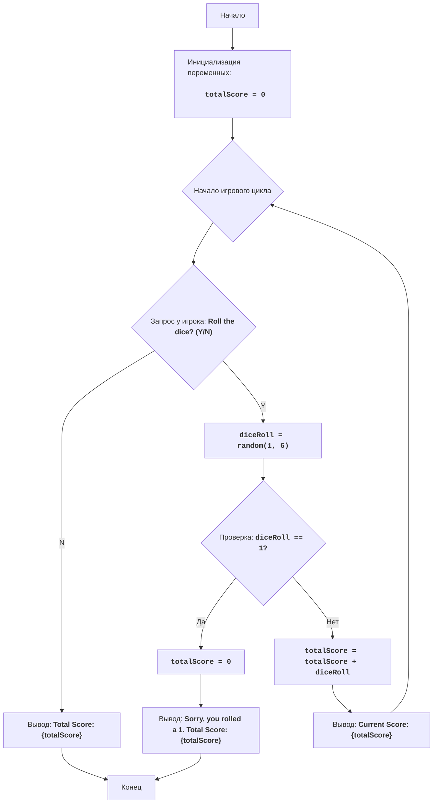

# Анализ кода модуля number.py

**Качество кода**
7
 -  Плюсы
    - Код игры реализован в соответствии с описанием и правилами.
    - Используются информативные сообщения для пользователя.
    - Логика игры понятна и легко читается.
 -  Минусы
    - Отсутствует docstring для модуля.
    - Отсутствует логирование ошибок.
    - Используется глобальная переменная `totalScore`.
    - Код не соответствует стандарту PEP 8.
    - Отсутствуют комментарии в формате RST.

**Рекомендации по улучшению**
1.  Добавить docstring для модуля с описанием его назначения, правил игры и алгоритма.
2.  Добавить docstring для всех переменных.
3.  Заменить глобальную переменную `totalScore` на локальную.
4.  Использовать форматирование f-строк, а не конкатенацию строк.
5.  Добавить логирование ошибок с использованием `logger.error`.
6.  Добавить проверку на корректность ввода пользователя.
7.  Изменить комментарии на формат RST.
8.  Переписать код в соответствии со стандартом PEP 8.
9.  Добавить проверку на корректность ввода пользователя.
10.  Обернуть код в функции для улучшения его структуры и повторного использования.

**Оптимизированный код**

```python
"""
Модуль для игры в кости "ACE"
====================================

Игра "ACE" представляет собой симуляцию игры в кости, где игрок пытается набрать определенное количество очков (цель), бросая кости.
Игрок может либо продолжать бросать кости, либо остановить игру и зафиксировать набранные очки.
Если при броске выпадает 1, то очки обнуляются, и игра заканчивается.
Цель игры - набрать как можно больше очков, не проиграв из-за выпадения 1.

Правила игры:
1. Цель игры - набрать как можно больше очков, не выкинув 1.
2. Игрок начинает с 0 очков.
3. На каждом ходу игрок бросает кость (случайное число от 1 до 6).
4. Если выпадает 1, очки сбрасываются в 0, и игра заканчивается.
5. Если выпало любое другое число (от 2 до 6), оно добавляется к текущим очкам.
6. После каждого броска игрок может решить, бросать ли кость еще раз или остановиться и сохранить текущие очки.
7. Игра продолжается, пока игрок не решит остановиться или пока не выпадет 1.

Алгоритм:
1. Установить общее количество очков в 0.
2. Начать цикл игры:
    2.1 Запросить у игрока, хочет ли он бросить кость (Y/N).
    2.2 Если ответ "N", перейти к шагу 6.
    2.3 Сгенерировать случайное число от 1 до 6 (результат броска кости).
    2.4 Если выпало 1, обнулить общее количество очков и перейти к шагу 5.
    2.5 Если выпало число от 2 до 6, добавить его к общему количеству очков.
3. Перейти к шагу 2.
4. Вывести общее количество очков.
5. Конец игры.

Блок-схема:

"""
import random
from src.logger.logger import logger

def play_ace_game():
    """
    Запускает игру в кости ACE.

    Функция инициализирует счет игрока, запускает игровой цикл,
    в котором игрок может бросать кости и накапливать очки.
    Если игрок выбрасывает 1, очки сбрасываются, и игра заканчивается.
    Игра продолжается до тех пор, пока игрок не решит остановиться
    или не выбросит 1.
    """
    total_score = 0 # Инициализация общего счета
    while True:
        # Запрашиваем ввод от пользователя
        roll_again = input("Roll the dice? (Y/N): ").upper()
        # Проверяем ввод пользователя
        if roll_again == "N":
             # Если игрок не хочет бросать кость, выводим общий счет и заканчиваем игру
            print(f"Total Score: {total_score}")
            break
        elif roll_again != "Y":
            # Если ввод некорректный, выводим сообщение об ошибке и просим повторить ввод
            logger.error(f"Invalid input: {roll_again}")
            print("Please enter 'Y' or 'N'.")
            continue
        # Генерируем случайное число от 1 до 6 (бросок кости)
        dice_roll = random.randint(1, 6)

        # Проверяем, выпала ли 1
        if dice_roll == 1:
            # Если выпала 1, обнуляем счет и заканчиваем игру
            total_score = 0
            print(f"Sorry, you rolled a 1. Total Score: {total_score}")
            break
        else:
             # Если выпало число от 2 до 6, добавляем его к общему счету
            total_score += dice_roll
            print(f"Current Score: {total_score}")

if __name__ == "__main__":
    play_ace_game()
```