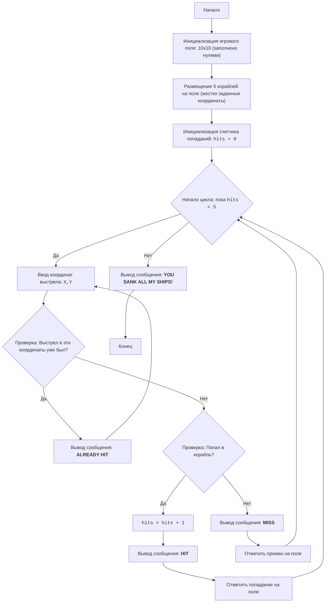

# Анализ кода модуля salvo_i

**Качество кода**
8
-  Плюсы
    - Код игры "Морской бой" реализован согласно описанию в docstring.
    - Есть обработка исключений при вводе некорректных данных.
    - Код логически понятен и структурирован.
    - Присутствует подробное описание работы кода в конце файла.
-  Минусы
    - Отсутствует использование `logger` для логирования ошибок, вместо этого используется стандартный `print`.
    - Не все комментарии оформлены в формате RST.
    - Отсутствует импорт `from src.logger.logger import logger`.
    - Жестко заданные координаты кораблей в коде.

**Рекомендации по улучшению**
1.  Использовать `logger` для обработки ошибок вместо `print`.
2.  Переписать все комментарии в формате reStructuredText (RST).
3.  Добавить импорт `logger` из `src.logger.logger`.
4.  Реализовать динамическое размещение кораблей на поле, чтобы игра была более интересной и не зависела от жестко заданных координат.
5.  Ввести константы для значений на игровом поле (например, EMPTY, SHIP, HIT, MISS), чтобы код был более читаемым.
6.  Обеспечить более гибкую обработку исключений.

**Оптимизированный код**
```python
"""
SALVO I:
=================
Сложность: 4
-----------------
Игра "Морской бой" (Salvo I) - это текстовая игра, в которой игрок пытается потопить корабли, размещенные компьютером на игровом поле размером 10 на 10.
Игрок вводит координаты выстрела, и компьютер сообщает о результате (попал, мимо или повтор).
Игра заканчивается, когда все корабли противника потоплены.

Правила игры:
1. Игровое поле - квадрат 10 на 10.
2. Компьютер размещает 5 кораблей.
3. Игрок вводит координаты выстрела в формате "X,Y" (например, "2,5").
4. Компьютер сообщает результат выстрела: "HIT", "MISS" или "ALREADY HIT".
5. Игра продолжается, пока игрок не потопит все корабли.
-----------------
Алгоритм:
1. Инициализировать игровое поле 10x10, заполненное нулями (пустое море).
2. Разместить 5 кораблей на игровом поле (координаты заданы жестко в коде).
3. Установить счетчик попаданий в 0.
4. Начать цикл "пока количество попаданий меньше 5":
    4.1 Запросить у игрока ввод координат выстрела в формате "X,Y".
    4.2 Проверить, не был ли этот выстрел сделан ранее (если в координате не 0, то выстрел был).
       4.2.1 Если выстрел был, сообщить об этом игроку и повторить запрос координат.
    4.3 Если выстрел попал в корабль:
       4.3.1 Увеличить счетчик попаданий на 1.
       4.3.2 Сообщить игроку о попадании ("HIT").
       4.3.3 Изменить значение в координате на 1 (попадание).
    4.4 Если выстрел промахнулся:
       4.4.1 Сообщить игроку о промахе ("MISS").
       4.4.2 Изменить значение в координате на 2 (промах).
5. Когда количество попаданий достигнет 5, вывести сообщение о победе.
6. Конец игры.
-----------------
Блок-схема:


Legenda:
    Start - Начало программы.
    InitializeBoard - Создание и инициализация игрового поля 10x10, заполненного нулями.
    PlaceShips - Размещение кораблей на игровом поле. Координаты кораблей задаются жестко в коде.
    InitializeHits - Инициализация счетчика попаданий, который начинается с нуля.
    LoopStart - Начало цикла, который продолжается, пока количество попаданий меньше 5.
    InputCoordinates - Запрос у пользователя координат выстрела в формате "X,Y".
    CheckPreviousHit - Проверка, был ли уже произведен выстрел в эти координаты.
    OutputAlreadyHit - Вывод сообщения "ALREADY HIT", если выстрел в эти координаты был произведен ранее.
    CheckHit - Проверка, попал ли выстрел в корабль.
    IncreaseHits - Увеличение счетчика попаданий на 1.
    OutputHit - Вывод сообщения "HIT" при попадании в корабль.
    MarkHit - Отметка попадания на игровом поле (обычно числом 1).
    OutputMiss - Вывод сообщения "MISS" при промахе.
    MarkMiss - Отметка промаха на игровом поле (обычно числом 2).
    OutputWin - Вывод сообщения о победе, когда все корабли потоплены.
    End - Конец программы.
"""
import sys
#  импортируем logger для логирования ошибок
from src.logger.logger import logger

__author__ = 'hypo69 (hypo69@davidka.net)'

#  Константы для обозначения состояний ячеек на игровом поле.
EMPTY = 0
HIT = 1
MISS = 2
SHIP = 3

#  Инициализация игрового поля 10x10 нулями.
board = [[EMPTY for _ in range(10)] for _ in range(10)]

#  Координаты кораблей (жестко заданы).
ships = [(2, 2), (2, 4), (2, 6), (4, 2), (4, 8)]

#  Размещение кораблей на поле, отметив их значением SHIP.
for ship_x, ship_y in ships:
    board[ship_x][ship_y] = SHIP

#  Счетчик попаданий.
hits = 0

#  Основной игровой цикл.
while hits < 5:
    try:
        #  Запрашиваем координаты выстрела.
        coordinates_input = input("Введите координаты выстрела (x,y): ")
        x, y = map(int, coordinates_input.split(','))

        #  Проверка на корректность ввода координат.
        if not (0 <= x < 10 and 0 <= y < 10):
            print("Некорректные координаты. Пожалуйста, введите значения от 0 до 9.")
            continue

        #  Проверяем, был ли уже произведен выстрел в эти координаты.
        if board[x][y] == HIT or board[x][y] == MISS:
            print("ALREADY HIT")
            continue

        #  Проверяем, попали ли мы в корабль.
        if board[x][y] == SHIP:
            hits += 1  # Увеличиваем счетчик попаданий.
            print("HIT")
            board[x][y] = HIT  # Отмечаем попадание на поле.
        else:
            print("MISS")
            board[x][y] = MISS # Отмечаем промах на поле.

    except ValueError:
        #  Логируем ошибку при неверном формате ввода.
        logger.error("Неверный формат ввода. Введите координаты в формате x,y")
    except KeyboardInterrupt:
        #  Логируем ошибку прерывания игры пользователем.
        logger.error("\\nИгра прервана пользователем.")
        sys.exit()

#  Вывод сообщения о победе.
print("YOU SANK ALL MY SHIPS!")
"""
Объяснение кода:
1. **Инициализация игрового поля**:
   - ``board = [[EMPTY for _ in range(10)] for _ in range(10)]``: Создается двумерный список (матрица) 10x10, представляющий игровое поле.
     Все ячейки изначально заполнены значением ``EMPTY`` (0), что обозначает пустое море.
2. **Размещение кораблей**:
   - ``ships = [(2, 2), (2, 4), (2, 6), (4, 2), (4, 8)]``: Определены координаты расположения кораблей на игровом поле.
   - Цикл ``for ship_x, ship_y in ships: board[ship_x][ship_y] = SHIP``: Проходит по координатам кораблей и устанавливает
     значение ``SHIP`` (3) в соответствующих ячейках игрового поля, что обозначает размещение корабля.
3. **Счетчик попаданий**:
   - ``hits = 0``: Инициализируется переменная ``hits`` для подсчета количества попаданий.
4. **Основной игровой цикл** ``while hits < 5:``:
   - Цикл продолжается, пока количество попаданий не достигнет 5 (пока не будут потоплены все корабли).
   - **Ввод координат**:
     - ``coordinates_input = input("Введите координаты выстрела (x,y): ")``: Запрашивает у игрока ввод координат выстрела в формате "x,y".
     - ``x, y = map(int, coordinates_input.split(','))``: Разделяет введенную строку на два числа (x и y) и преобразует их в целые числа.
     - **Проверка на корректность ввода координат**:
       -  ``if not (0 <= x < 10 and 0 <= y < 10):``: Проверяет, что введенные координаты находятся в пределах игрового поля (от 0 до 9).
          Если координаты некорректны, выводится сообщение об ошибке, и цикл продолжается со следующей итерации.
   - **Проверка на повторный выстрел**:
     - ``if board[x][y] == HIT or board[x][y] == MISS:``: Проверяет, не был ли уже произведен выстрел в эти координаты (значения ``HIT`` и ``MISS``
       соответствуют попаданию и промаху соответственно). Если выстрел был, выводится сообщение "ALREADY HIT", и цикл продолжается со следующей итерации.
   - **Проверка на попадание**:
     - ``if board[x][y] == SHIP:``: Проверяет, попал ли выстрел в корабль (значение ``SHIP``).
       - ``hits += 1``: Увеличивает счетчик попаданий на 1.
       - ``print("HIT")``: Выводит сообщение о попадании.
       - ``board[x][y] = HIT``: Отмечает попадание в ячейке поля, устанавливая значение ``HIT``.
   - **Промах**:
     - ``else:``: Если выстрел не попал в корабль.
       - ``print("MISS")``: Выводит сообщение о промахе.
       - ``board[x][y] = MISS``: Отмечает промах в ячейке поля, устанавливая значение ``MISS``.
   - **Обработка ошибок ввода**:
     - ``except ValueError:``: обрабатывает ошибку ``ValueError``, которая может возникнуть, если пользователь ввел не числовые значения координат.
       Логируем ошибку с использованием ``logger.error``.
     - ``except KeyboardInterrupt:``: обрабатывает прерывание игры пользователем (например, нажатием Ctrl+C).
       Логируем ошибку прерывания игры с использованием ``logger.error`` и завершаем игру.
5. **Конец игры**:
   - ``print("YOU SANK ALL MY SHIPS!")``: Когда цикл while завершается (все 5 кораблей потоплены), выводится сообщение о победе.
"""
```