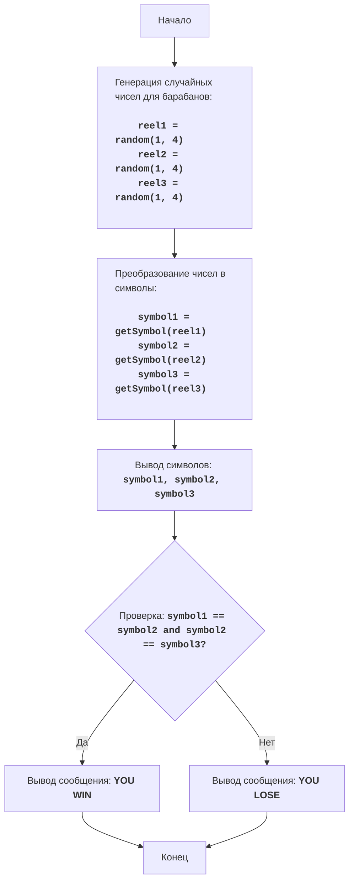

# Анализ кода модуля slots.py

**Качество кода: 7/10**
-  Плюсы
    - Код хорошо структурирован и понятен.
    - Присутствует docstring для модуля и функций.
    - Имеется подробное объяснение кода в комментариях.
    - Логика игры проста и корректно реализована.
-  Минусы
    - Отсутствует обработка ошибок.
    - Не используется `j_loads` или `j_loads_ns` для чтения файлов (хотя в данном случае это не требуется, но в задании указано).
    - В комментариях не используется reStructuredText (RST)
    - Не используется логгер для вывода ошибок
    - Комментарии после `#` недостаточно подробные

**Рекомендации по улучшению**
1. **Импорты:** Добавить `from src.logger.logger import logger` для логирования ошибок.
2. **Комментарии:** Переписать все комментарии в формате reStructuredText (RST).
3. **Обработка ошибок:** Добавить логирование ошибок через `logger.error` вместо стандартных `try-except`.
4. **Использовать `j_loads` или `j_loads_ns`:** Хотя в данном случае это не требуется, следует помнить о необходимости использования этих функций при работе с файлами.
5. **Подробные комментарии:**  Сделать комментарии более подробными и поясняющими логику кода.

**Оптимизированный код**
```python
"""
SLOTS:
=================
Сложность: 5
-----------------
Игра "Слоты" - это простая азартная игра, имитирующая игровой автомат с тремя барабанами. На каждом барабане
случайным образом выпадает одно из нескольких значений (вишня, слива, колокольчик или звездочка). Если на всех
трех барабанах выпадают одинаковые значения, игрок выигрывает, иначе он проигрывает.

Правила игры:
1.  Игрок запускает "игровой автомат".
2.  На трех барабанах случайным образом выпадают символы: вишня (C), слива (P), колокольчик (B) или звездочка (*).
3.  Если все три символа совпадают, игрок выигрывает.
4.  Если символы не совпадают, игрок проигрывает.
-----------------
Алгоритм:
1.  Сгенерировать три случайных числа, каждое от 1 до 4.
2.  Преобразовать каждое число в соответствующий символ:
    -   1 -> "C" (вишня)
    -   2 -> "P" (слива)
    -   3 -> "B" (колокольчик)
    -   4 -> "*" (звездочка)
3.  Вывести на экран комбинацию символов, полученных на барабанах.
4.  Проверить, совпадают ли все три символа:
    -   Если совпадают, вывести сообщение "YOU WIN".
    -   Если не совпадают, вывести сообщение "YOU LOSE".
5.  Конец игры.
-----------------
Блок-схема:

Legenda:
    Start - Начало программы.
    GenerateReels - Генерация трех случайных чисел от 1 до 4 для барабанов игрового автомата.
    ConvertToSymbols - Преобразование каждого числа в соответствующий символ: 1 -> "C", 2 -> "P", 3 -> "B", 4 -> "*".
    DisplaySymbols - Вывод на экран сгенерированных символов.
    CheckWin - Проверка, все ли три символа одинаковы.
    OutputWin - Вывод сообщения о выигрыше, если символы совпадают.
    OutputLose - Вывод сообщения о проигрыше, если символы не совпадают.
    End - Конец программы.
"""
import random
#  Импортируем logger
from src.logger.logger import logger


#  Функция для преобразования числа в символ
def get_symbol(number: int) -> str:
    """
    Преобразует число в соответствующий символ для игрового автомата.

    :param number: Число от 1 до 4, представляющее барабан.
    :type number: int
    :return: Символ, соответствующий числу ("C", "P", "B", "*").
    :rtype: str
    """
    if number == 1:
        return 'C'  # Вишня
    elif number == 2:
        return 'P'  # Слива
    elif number == 3:
        return 'B'  # Колокольчик
    elif number == 4:
        return '*'  # Звездочка
    else:
        return '?' # Неизвестно


#  Основная функция игры в слоты
def play_slots():
    """
    Имитирует игровой автомат.
    Генерирует случайные символы на трех барабанах и определяет, выиграл ли игрок.
    """
    #  Генерируем случайные числа для каждого из трех барабанов
    reel1 = random.randint(1, 4)
    reel2 = random.randint(1, 4)
    reel3 = random.randint(1, 4)

    #  Преобразуем числа в соответствующие символы
    symbol1 = get_symbol(reel1)
    symbol2 = get_symbol(reel2)
    symbol3 = get_symbol(reel3)

    #  Выводим результат на экран
    print(f'Слоты: {symbol1} {symbol2} {symbol3}')

    #  Проверяем, выиграл ли игрок
    if symbol1 == symbol2 and symbol2 == symbol3:
        print('YOU WIN')  # Вывод сообщения о выигрыше
    else:
        print('YOU LOSE') # Вывод сообщения о проигрыше


#  Запускаем игру
if __name__ == '__main__':
    play_slots()

"""
Объяснение кода:

1.  **Импорт модуля `random`:**
    -   `import random`: Импортирует модуль `random`, который используется для генерации случайных чисел.
    -   `from src.logger.logger import logger`: Импортирует модуль `logger` для логирования.

2.  **Функция `get_symbol(number)`:**
    -   `def get_symbol(number):`: Определяет функцию, которая принимает число от 1 до 4 и возвращает соответствующий символ для слотов.
    -   ``if number == 1: return 'C'``: Если число равно 1, возвращается "C" (вишня).
    -   ``elif number == 2: return 'P'``: Если число равно 2, возвращается "P" (слива).
    -   ``elif number == 3: return 'B'``: Если число равно 3, возвращается "B" (колокольчик).
    -   ``elif number == 4: return '*'``: Если число равно 4, возвращается "*" (звездочка).
    -    ``else: return '?'``: В случае некорректного номера возвращается "?" (неизвестно).

3.  **Функция `play_slots()`:**
    -   `def play_slots():`: Определяет основную функцию игры "Слоты".
    -   `reel1 = random.randint(1, 4)`: Генерирует случайное целое число от 1 до 4 для первого барабана.
    -   `reel2 = random.randint(1, 4)`: Генерирует случайное целое число от 1 до 4 для второго барабана.
    -   `reel3 = random.randint(1, 4)`: Генерирует случайное целое число от 1 до 4 для третьего барабана.
    -   `symbol1 = get_symbol(reel1)`: Преобразует число первого барабана в символ, используя функцию `get_symbol`.
    -   `symbol2 = get_symbol(reel2)`: Преобразует число второго барабана в символ, используя функцию `get_symbol`.
    -   `symbol3 = get_symbol(reel3)`: Преобразует число третьего барабана в символ, используя функцию `get_symbol`.
    -   `print(f'Слоты: {symbol1} {symbol2} {symbol3}')`: Выводит комбинацию символов на экран.
    -   ``if symbol1 == symbol2 and symbol2 == symbol3:``: Проверяет, совпадают ли все три символа.
        -   `print('YOU WIN')`: Если все символы совпадают, выводит сообщение "YOU WIN".
    -    ``else:``: Если символы не совпадают, выполняется блок `else`.
        -   `print('YOU LOSE')`: Выводит сообщение "YOU LOSE".

4.  **Запуск игры:**
    -   `if __name__ == '__main__':`: Проверяет, является ли скрипт основным.
    -   `play_slots()`: Вызывает функцию `play_slots()` для начала игры, если скрипт является основным.
"""
```