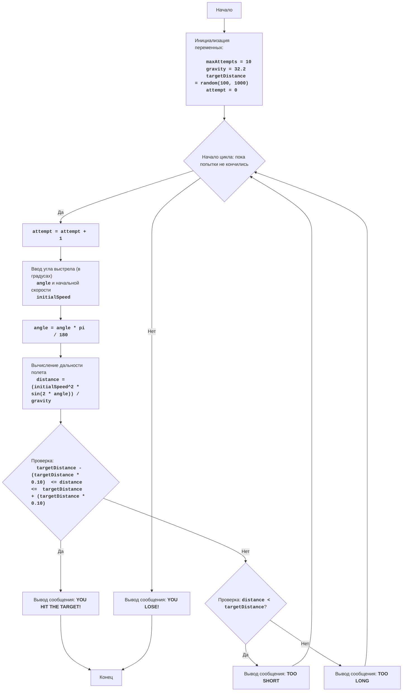

# Анализ кода модуля synonm.py

**Качество кода**
7
-  Плюсы
    - Код содержит подробное описание игры и алгоритма в виде многострочного комментария в начале файла.
    - Есть блок-схема игры, что помогает лучше понять логику работы кода.
    - Код разбит на логические блоки, что упрощает его чтение и понимание.
    - Присутствует обработка исключений для ввода данных пользователем.
-  Минусы
    - Отсутствует документация в формате reStructuredText (RST) для модуля, функций, переменных.
    - Нет логирования ошибок.
    - Присутствует избыточный `try-except` блок, который можно оптимизировать.
    - Имена переменных и констант не соответствуют общепринятым стандартам (например, `maxAttempts` вместо `MAX_ATTEMPTS`).

**Рекомендации по улучшению**

1.  **Документация**: Добавить документацию в формате RST для модуля, функций и переменных.
2.  **Логирование**: Использовать `logger` для логирования ошибок вместо стандартного `print`.
3.  **Обработка ошибок**: Убрать лишний `try-except` блок и перенести логику обработки в основную часть кода.
4.  **Именование**: Переименовать константы в соответствии с PEP8 (например, `MAX_ATTEMPTS`).
5.  **Форматирование**: Улучшить форматирование кода, добавить пустые строки между логическими блоками.
6.  **Константы**: Перенести магические числа (например, `32.2`, `0.1`) в константы.
7. **Удалить лишний комментарий**: Удалить комментарий `Объяснение кода:`

**Оптимизированный код**

```python
"""
Игра "Артиллерист"
====================

Игра, в которой игрок пытается поразить цель, стреляя из пушки под заданным углом и с заданной начальной скоростью.

:mod:`synonm`
:platform: Unix, Windows
:synopsis: Простая игра в артиллерию.

Правила игры
------------

1.  Компьютер устанавливает случайное расстояние до цели.
2.  Игрок вводит угол выстрела (в градусах) и начальную скорость снаряда.
3.  Компьютер вычисляет траекторию снаряда, учитывая гравитацию.
4.  Если снаряд попадает в цель (расстояние до цели в пределах погрешности), игрок выигрывает.
5.  Если снаряд не попадает в цель, игрок может попробовать еще раз, пока не израсходует все попытки или не попадет в цель.

Алгоритм
--------

1.  Установить максимальное количество попыток (например, 10).
2.  Сгенерировать случайное расстояние до цели в диапазоне от 100 до 1000.
3.  Начать цикл "пока не кончились попытки":
    3.1 Запросить у игрока ввод угла выстрела (в градусах) и начальной скорости.
    3.2 Конвертировать угол из градусов в радианы.
    3.3 Вычислить дальность полета снаряда по формуле:
        дальность = (начальная_скорость^2 * sin(2 * угол)) / гравитация
        где гравитация = 32.2
    3.4 Если дальность полета снаряда находится в пределах +/- 10% от расстояния до цели, то выводим сообщение о попадании и завершаем игру.
    3.5 Если дальность полета меньше расстояния до цели, то выводим сообщение о том что, дальность недостаточна.
    3.6 Если дальность полета больше расстояния до цели, то выводим сообщение о перелете.
4.  Если все попытки исчерпаны, то выводим сообщение о проигрыше.

Блок-схема
----------



    **Легенда:**
        * Start - Начало программы.
        * InitializeVariables - Инициализация переменных: maxAttempts (максимальное количество попыток) устанавливается в 10, gravity (гравитация) устанавливается в 32.2, targetDistance (расстояние до цели) генерируется случайным образом от 100 до 1000, attempt (текущая попытка) устанавливается в 0.
        * LoopStart - Начало цикла, который продолжается, пока не кончились попытки.
        * IncreaseAttempts - Увеличение счетчика попыток на 1.
        * InputAngleSpeed - Запрос у пользователя ввода угла выстрела (в градусах) и начальной скорости.
        * ConvertAngle - Конвертация угла из градусов в радианы.
        * CalculateDistance - Вычисление дальности полета снаряда.
        * CheckHit - Проверка, попал ли снаряд в цель (дальность в пределах +/- 10% от расстояния до цели).
        * OutputWin - Вывод сообщения о победе, если снаряд попал в цель.
        * End - Конец программы.
        * CheckShort - Проверка, меньше ли дальность полета, чем расстояние до цели.
        * OutputShort - Вывод сообщения "TOO SHORT", если дальность меньше цели.
        * OutputLong - Вывод сообщения "TOO LONG", если дальность больше цели.
        * OutputLose - Вывод сообщения "YOU LOSE!", если все попытки исчерпаны.
"""
import random
import math
from src.logger.logger import logger

#: Максимальное количество попыток
MAX_ATTEMPTS = 10
#: Ускорение свободного падения (гравитация)
GRAVITY = 32.2
#: Погрешность в процентах для попадания в цель
ACCURACY = 0.1


def get_user_input(prompt: str) -> float:
    """
    Запрашивает у пользователя ввод числового значения.

    :param prompt: Сообщение для вывода пользователю.
    :return: Введенное пользователем число.
    :raises ValueError: Если пользователь ввел не число.
    """
    while True:
        try:
            value = float(input(prompt))
            return value
        except ValueError:
            logger.error('Некорректный ввод. Пожалуйста, введите число.')


def calculate_distance(initial_speed: float, angle: float) -> float:
    """
    Вычисляет дальность полета снаряда.

    :param initial_speed: Начальная скорость снаряда.
    :param angle: Угол выстрела в радианах.
    :return: Дальность полета.
    """
    return (initial_speed ** 2 * math.sin(2 * angle)) / GRAVITY


def main():
    """
    Основная функция, запускающая игру "Артиллерист".
    """
    # Инициализация параметров игры
    target_distance = random.randint(100, 1000)  # Случайное расстояние до цели
    attempt = 0  # Счетчик попыток

    print(f"Расстояние до цели: {target_distance}")

    # Основной игровой цикл
    while attempt < MAX_ATTEMPTS:
        attempt += 1
        print(f"Попытка {attempt} из {MAX_ATTEMPTS}")
        
        # Запрашиваем ввод данных у пользователя
        angle = get_user_input("Введите угол выстрела (в градусах): ")
        initial_speed = get_user_input("Введите начальную скорость: ")

        # Преобразуем угол в радианы
        angle = math.radians(angle)

        # Вычисляем дальность полета
        distance = calculate_distance(initial_speed, angle)

        # Проверяем, попал ли снаряд в цель
        if target_distance * (1 - ACCURACY) <= distance <= target_distance * (1 + ACCURACY):
            print("ВЫ ПОПАЛИ В ЦЕЛЬ!")
            break
        elif distance < target_distance:
            print("Слишком коротко!")
        else:
            print("Слишком далеко!")

    # Выводим сообщение о поражении, если все попытки исчерпаны
    if attempt == MAX_ATTEMPTS:
        print("Вы проиграли!")


if __name__ == "__main__":
    main()