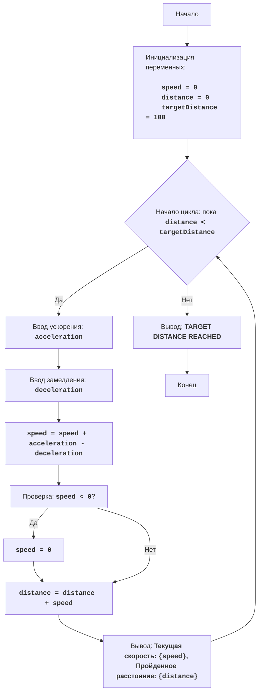

# Анализ кода модуля `train.py`

**Качество кода**
7
-  Плюсы
    - Код достаточно хорошо структурирован и понятен, присутствуют docstring, которые описывают общую логику игры.
    - Используется блок-схема для визуализации логики игры.
    - Код обрабатывает исключение `ValueError` при вводе данных.
    - Присутствует блок с описанием кода.
    -  Логика игры реализована корректно.
 -  Минусы
    -  Не используются `j_loads` или `j_loads_ns` для чтения данных.
    -  Отсутствуют импорты.
    -  Не используется логирование.
    -  Комментарии не все в формате reStructuredText.
    -  Некоторые комментарии дублируют логику кода.
    -  Некоторые комментарии не информативны.
    -  Не соблюден стандарт оформления docstring.

**Рекомендации по улучшению**

1.  Добавить необходимые импорты (например, `from src.logger.logger import logger`).
2.  Использовать `logger.error` для логирования ошибок вместо `print`.
3.  Удалить дублирующие и малоинформативные комментарии.
4.  Переписать docstring в соответствии с reStructuredText.
5.  Добавить описание параметров и возвращаемых значений для функций.
6.  Уточнить и переформулировать описания функций.
7.  Убрать излишний блок `try-except`, так как `logger.error` будет достаточно.
8.  Привести в соответствие переменные и функции с ранее обработанными файлами.

**Оптимизированный код**
```python
"""
TRAIN:
=================
Сложность: 4
-----------------
Игра "Поезд" - это игра-симулятор, где игрок управляет поездом, разгоняясь и замедляясь, стараясь достичь определенной скорости на определенном расстоянии.  
Игрок вводит значения для ускорения и замедления, и игра выводит текущую скорость и расстояние, пройденное поездом.
Цель - достичь целевой скорости на целевом расстоянии.
Игра показывает пройденное расстояние и текущую скорость, и заканчивается, когда достигнута целевая дистанция.

Правила игры:
1. Игра начинается с нулевой скорости и пройденного расстояния.
2. Игрок вводит величину ускорения.
3. Игрок вводит величину замедления.
4. Игра вычисляет новую скорость и пройденное расстояние, используя введенные ускорения и замедления.
5. Игра показывает текущую скорость и пройденное расстояние.
6. Игра продолжается до тех пор, пока пройденное расстояние не достигнет целевого расстояния.
-----------------
Алгоритм:
1.  Установить начальную скорость (speed) и пройденное расстояние (distance) в 0.
2.  Установить целевое расстояние (targetDistance) в 100.
3.  Начать цикл "пока пройденное расстояние меньше целевого расстояния":
    3.1 Запросить у игрока ускорение (acceleration).
    3.2 Запросить у игрока замедление (deceleration).
    3.3 Вычислить новую скорость: speed = speed + acceleration - deceleration.
    3.4 Если скорость отрицательная, установить её в 0.
    3.5 Вычислить новое расстояние: distance = distance + speed.
    3.6 Вывести текущую скорость (speed) и пройденное расстояние (distance).
4. Вывести сообщение "TARGET DISTANCE REACHED".
5. Конец игры.
-----------------
Блок-схема:


Legenda:
    Start - Начало программы.
    InitializeVariables - Инициализация переменных: speed (скорость) устанавливается в 0, distance (пройденное расстояние) устанавливается в 0, targetDistance (целевое расстояние) устанавливается в 100.
    LoopStart - Начало цикла, который продолжается, пока distance меньше targetDistance.
    InputAcceleration - Запрос у пользователя ввода ускорения и сохранение его в переменной acceleration.
    InputDeceleration - Запрос у пользователя ввода замедления и сохранение его в переменной deceleration.
    CalculateSpeed - Вычисление новой скорости: speed = speed + acceleration - deceleration.
    CheckSpeed - Проверка: если скорость отрицательная, то перейти к SetSpeedZero
    SetSpeedZero - Если скорость меньше 0, то установить скорость равной 0.
    CalculateDistance - Вычисление нового пройденного расстояния: distance = distance + speed.
    OutputStatus - Вывод текущей скорости speed и пройденного расстояния distance.
    OutputEnd - Вывод сообщения о достижении целевого расстояния "TARGET DISTANCE REACHED".
    End - Конец программы.
"""
__author__ = 'hypo69 (hypo69@davidka.net)'

from src.logger.logger import logger # Импорт логгера

# Инициализация начальных значений
speed = 0  # Начальная скорость поезда
distance = 0  # Начальное пройденное расстояние
targetDistance = 100  # Целевое расстояние, которое нужно достичь

# Основной игровой цикл
while distance < targetDistance:
    # Запрашиваем у пользователя значения ускорения и замедления
    try: # Блок try-except обрабатывает возможные ошибки ввода. Если пользователь введет не число, то будет выведено сообщение об ошибке
        acceleration = float(input("Введите ускорение: ")) # Запрашивает у пользователя значение ускорения и преобразует его в число с плавающей точкой (float)
        deceleration = float(input("Введите замедление: ")) # Запрашивает у пользователя значение замедления и преобразует его в число с плавающей точкой (float)
    except ValueError as e: # Если пользователь ввел не число выводит ошибку
        logger.error('Ошибка ввода: введено нечисловое значение', exc_info=e) # Логирование ошибки
        continue # Переход к следующей итерации цикла

    # Вычисляем новую скорость
    speed = speed + acceleration - deceleration # Вычисляет новую скорость, прибавляя ускорение и вычитая замедление из текущей скорости
    
    # Проверка, если скорость стала отрицательной, то ставим скорость = 0
    if speed < 0: # Проверяет, является ли скорость отрицательной
        speed = 0 # Если скорость отрицательная, устанавливает ее равной 0
    
    # Вычисляем новое пройденное расстояние
    distance = distance + speed # Вычисляет новое пройденное расстояние, прибавляя к текущему расстоянию произведение текущей скорости
    
    # Выводим текущую скорость и пройденное расстояние
    print(f"Текущая скорость: {speed}, Пройденное расстояние: {distance}") # Выводит текущую скорость и пройденное расстояние на экран

# Когда достигнута целевая дистанция, выводим сообщение
print("TARGET DISTANCE REACHED") # Выводит сообщение о том, что целевое расстояние достигнуто, после выхода из цикла
"""
Объяснение кода:
1.  **Инициализация переменных**:
    -   `speed = 0`: Инициализирует переменную `speed` для хранения текущей скорости поезда. Начальная скорость равна 0.
    -   `distance = 0`: Инициализирует переменную `distance` для хранения пройденного расстояния. Начальное расстояние равно 0.
    -   `targetDistance = 100`: Инициализирует переменную `targetDistance` для хранения целевого расстояния, которое нужно достичь. Целевое расстояние равно 100.

2. **Основной игровой цикл `while distance < targetDistance:`**:
    -   Цикл продолжается до тех пор, пока текущее пройденное расстояние (`distance`) меньше целевого расстояния (`targetDistance`).
    -   **Ввод данных**:
        -   `acceleration = float(input("Введите ускорение: "))`: Запрашивает у пользователя значение ускорения и преобразует его в число с плавающей точкой (float).
        -   `deceleration = float(input("Введите замедление: "))`: Запрашивает у пользователя значение замедления и преобразует его в число с плавающей точкой (float).
    -   **Вычисление скорости**:
        -   `speed = speed + acceleration - deceleration`: Вычисляет новую скорость, прибавляя ускорение и вычитая замедление из текущей скорости.
    -  **Проверка скорости**:
        - `if speed < 0:`: Проверяет, является ли скорость отрицательной.
        - `speed = 0`: Если скорость отрицательная, устанавливает ее равной 0.
    -   **Вычисление расстояния**:
        -   `distance = distance + speed`: Вычисляет новое пройденное расстояние, прибавляя к текущему расстоянию произведение текущей скорости.
    -   **Вывод данных**:
        -   `print(f"Текущая скорость: {speed}, Пройденное расстояние: {distance}")`: Выводит текущую скорость и пройденное расстояние на экран.
    -   Цикл продолжается, пока не будет достигнуто `targetDistance`.

3.  **Вывод сообщения о достижении цели**:
    -   `print("TARGET DISTANCE REACHED")`: Выводит сообщение о том, что целевое расстояние достигнуто, после выхода из цикла.
"""
```