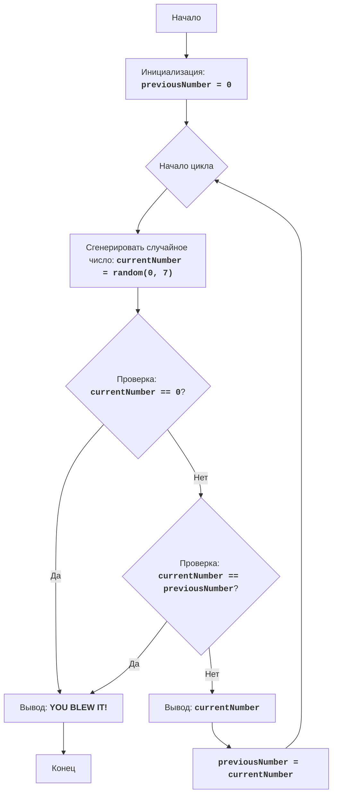

# Анализ кода модуля `zoop.py`

**Качество кода: 7/10**

-   Плюсы:
    *   Код игры достаточно простой и логичный.
    *   Есть подробные комментарии, объясняющие каждый шаг алгоритма.
    *   Используется `random.randint` для генерации случайных чисел, что является хорошей практикой.
    *   Наличие блок-схемы и текстового описания алгоритма помогает понять логику игры.
-   Минусы:
    *   Нет обработки ошибок (хотя в данном случае это не критично).
    *   Комментарии не в формате reStructuredText (RST).
    *   Нет явного импорта логгера, хотя в инструкции он необходим.
    *   Используется стандартный `print` для вывода сообщений, что не всегда подходит для более сложных приложений.

**Рекомендации по улучшению**

1.  **Форматирование документации**:
    *   Комментарии и docstring должны быть переписаны в формате reStructuredText (RST).
2.  **Использование логгера**:
    *   Добавить импорт логгера `from src.logger.logger import logger` и использовать его для вывода сообщений вместо `print`, в том числе для отлова и обработки ошибок.
3.  **Улучшение комментариев**:
    *   Комментарии должны объяснять не только что делает код, но и зачем, а также давать контекст.
4.  **Унификация**:
    *   Сделать код более читаемым и соответсвующим общепринятым стандартам.
5.  **Обработка ошибок**:
    *   Добавить базовую обработку ошибок.

**Оптимизированный код**

```python
"""
ZOOP:
=================
Сложность: 5
-----------------
Игра "ZOOP" - это простая текстовая игра, в которой игрок пытается сгенерировать последовательность случайных чисел,
в которой не будет двух одинаковых чисел подряд. Игра продолжается до тех пор, пока игрок не сгенерирует
последовательность, нарушающую это правило, или не решит прекратить игру.

Правила игры:
1. Компьютер генерирует случайное число от 1 до 7.
2. Если сгенерированное число совпадает с предыдущим сгенерированным числом, игра заканчивается.
3. Игра продолжается до тех пор, пока игрок не нарушит правило или не введет '0', чтобы завершить игру.
4. После каждого хода выводится текущее сгенерированное число.
-----------------
Алгоритм:
1.  Установить предыдущее число (previousNumber) в 0.
2.  Начать цикл:
    2.1 Сгенерировать случайное число от 1 до 7 (currentNumber).
    2.2 Если сгенерированное число равно 0, перейти к шагу 4.
    2.3 Если сгенерированное число равно предыдущему числу, перейти к шагу 4.
    2.4 Вывести текущее сгенерированное число.
    2.5 Установить предыдущее число равным текущему числу.
3. Повторять шаги с 2.1 по 2.5
4. Вывести сообщение "YOU BLEW IT!".
5. Конец игры.
-----------------
Блок-схема:


Legenda:
    Start - Начало программы.
    InitializePreviousNumber - Инициализация переменной previousNumber (предыдущее число) значением 0.
    LoopStart - Начало основного цикла игры.
    GenerateRandomNumber - Генерация случайного числа currentNumber в диапазоне от 0 до 7.
    CheckQuit - Проверка, равно ли сгенерированное число currentNumber 0.
    OutputBlowIt - Вывод сообщения "YOU BLEW IT!", если игрок проиграл.
    End - Конец программы.
    CheckSame - Проверка, равно ли сгенерированное число currentNumber предыдущему числу previousNumber.
    OutputCurrentNumber - Вывод текущего сгенерированного числа currentNumber.
    SetPreviousNumber - Установка значения переменной previousNumber равным значению переменной currentNumber.
"""
import random
# импортируем логгер
from src.logger.logger import logger

# :type previousNumber: int
# Инициализация переменной для хранения предыдущего числа.
previousNumber = 0

# Запускаем основной цикл игры.
while True:
    # Генерируем случайное число от 0 до 7.
    try:
        currentNumber = random.randint(0, 7)
    except Exception as e:
        # Логирование ошибки, если не удалось сгенерировать случайное число
        logger.error(f'Ошибка генерации случайного числа: {e}')
        break

    # Проверяем, ввел ли пользователь 0 для завершения игры.
    if currentNumber == 0:
        # Логирование завершения игры
        logger.info('Игрок завершил игру, введя 0')
        print('YOU BLEW IT!')  # Сообщаем о завершении игры.
        break  # Выходим из цикла.

    # Проверяем, равно ли текущее число предыдущему числу.
    if currentNumber == previousNumber:
         # Логирование завершения игры из-за совпадения чисел
        logger.info(f'Игра завершена, так как текущее число {currentNumber} совпало с предыдущим {previousNumber}')
        print('YOU BLEW IT!')  # Сообщаем о завершении игры.
        break  # Выходим из цикла.

    # Выводим текущее сгенерированное число.
    print(currentNumber)
    # Сохраняем текущее число как предыдущее для следующей итерации.
    previousNumber = currentNumber
"""
Объяснение кода:
1.  **Импорт модуля `random`**::
    -   `import random`: Импортирует модуль `random`, который используется для генерации случайных чисел.
2.  **Импорт логгера**::
    - `from src.logger.logger import logger`: импортируем логгер для логирования событий.
3.  **Инициализация `previousNumber`**::
    -   `previousNumber = 0`: Инициализирует переменную `previousNumber` нулем. Эта переменная будет хранить предыдущее сгенерированное число.
4.  **Бесконечный цикл `while True:`**::
    -  Этот цикл продолжается, пока не будет выполнена команда `break` внутри цикла.
5.  **Генерация случайного числа**::
    - `currentNumber = random.randint(0, 7)`: Генерирует случайное целое число в диапазоне от 0 до 7 (включительно) и сохраняет его в переменной `currentNumber`.
    - `try...except`:  блок для отлова ошибок при генерации случайного числа.
    - `logger.error(...)`: Логирование ошибки, если не удалось сгенерировать случайное число
6.  **Проверка на окончание игры**::
    - `if currentNumber == 0:`: Проверяет, равно ли сгенерированное число 0. Если да, это означает, что игрок захотел закончить игру.
    - `logger.info('Игрок завершил игру, введя 0')`: Логирование завершения игры.
    - `print("YOU BLEW IT!")`: Выводит сообщение, что игра закончилась.
    - `break`: Выходит из цикла, завершая игру.
7.  **Проверка на повтор**::
    - `if currentNumber == previousNumber:`: Проверяет, равно ли текущее сгенерированное число предыдущему сгенерированному числу.
    -  `logger.info(...)`: Логирование завершения игры из-за совпадения чисел
    - `print("YOU BLEW IT!")`: Выводит сообщение, что игра закончилась.
    - `break`: Выходит из цикла, завершая игру.
8.  **Вывод текущего числа**::
    -   `print(currentNumber)`: Выводит сгенерированное число на экран.
9.  **Обновление `previousNumber`**::
    - `previousNumber = currentNumber`: Сохраняет текущее сгенерированное число в переменной `previousNumber`, чтобы оно могло быть проверено на следующей итерации цикла.
"""
```