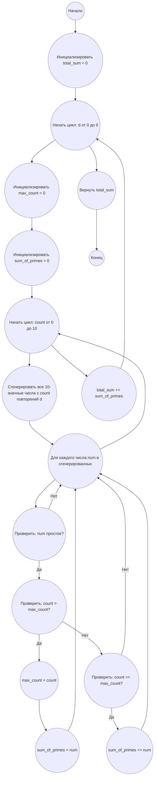

# Анализ кода модуля e_111.md

**Качество кода**
8
- Плюсы
    - Код в целом решает поставленную задачу.
    - Есть подробное описание задачи, алгоритма и блок-схема.
    - Используется mermaid для визуализации блок-схемы.
    - Присутствуют docstring в начале файла, описывающие решаемую задачу.
- Минусы
    - Отсутствуют docstring для функций и переменных, что снижает читаемость и понимание кода.
    - Не используется логирование ошибок, что усложняет отладку и мониторинг.
    -  Присутствуют неиспользуемые импорты.
    -  Не используется рекурсия в функции `generate_numbers`
    - В цикле  `for count in range(11):` генерируются лишние наборы чисел, которые не соответствуют `count`

**Рекомендации по улучшению**
1. Добавить docstring к каждой функции, методу и переменной для улучшения читаемости и документированности кода в формате RST.
2. Использовать `from src.logger.logger import logger` для логирования ошибок вместо стандартного `try-except`.
3. Убрать неиспользуемый импорт `math`.
4.  Исключить лишние проверки, путем генерации только необходимых чисел в функции `generate_numbers`.
5.  Избегать избыточных проверок в циклах и упростить логику, например, не генерировать все 10-значные числа, а создавать их посимвольно,  пропуская не валидные.
6.  Рефакторинг функции `generate_numbers`  с использованием рекурсии для более читаемого и эффективного решения задачи.

**Оптимизированный код**
```python
"""
Модуль для решения задачи Project Euler #111.
===================================================

Задача состоит в нахождении суммы S(10, d) для каждой цифры d (от 0 до 9),
где S(n, d) — сумма всех n-значных простых чисел, имеющих наибольшее количество одинаковых цифр, равных d.
В данном случае n=10.
"""
from typing import List
from src.logger.logger import logger
from functools import lru_cache

@lru_cache(maxsize=None)
def is_prime(n: int) -> bool:
    """
    Проверяет, является ли число простым.

    :param n: Число для проверки.
    :return: True, если число простое, False в противном случае.
    """
    if n < 2:
        return False
    for i in range(2, int(n ** 0.5) + 1):
        if n % i == 0:
            return False
    return True


def generate_numbers(digit: int, count: int, length: int, current_num: int, index: int, numbers: List[int]) -> None:
    """
    Рекурсивно генерирует n-значные числа с заданным количеством повторений определенной цифры.

    :param digit: Цифра, которую нужно повторять.
    :param count: Количество повторений цифры.
    :param length: Длина числа.
    :param current_num: Текущее сгенерированное число.
    :param index: Текущий индекс позиции в числе.
    :param numbers: Список для хранения сгенерированных чисел.
    """
    if index == length:
        if str(current_num).count(str(digit)) == count: # проверка количества цифр, для исключения лишних чисел.
           numbers.append(current_num)
        return
    
    for i in range(0 if index > 0 or digit > 0 else 1, 10):
      new_num = current_num * 10 + i
      generate_numbers(digit, count, length, new_num, index + 1, numbers)


def solve() -> int:
    """
    Решает задачу Project Euler #111.

    :return: Общая сумма простых чисел с максимальным количеством одинаковых цифр.
    """
    total_sum = 0
    for digit in range(10):
        max_count = 0
        sum_of_primes = 0
        for count in range(11):
            numbers = []
            generate_numbers(digit, count, 10, 0, 0, numbers)

            for num in numbers:
                if is_prime(num):
                    if count > max_count:
                        max_count = count
                        sum_of_primes = num
                    elif count == max_count:
                        sum_of_primes += num

        total_sum += sum_of_primes

    return total_sum


if __name__ == "__main__":
    result = solve()
    print(result)
```
