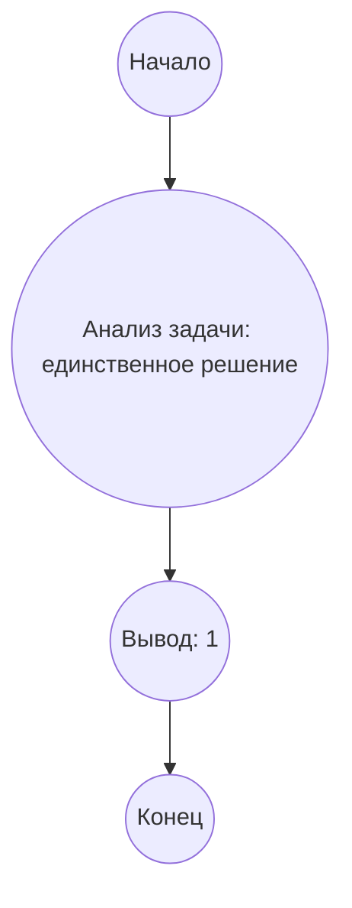

# Анализ кода модуля e_177.md

**Качество кода**
8
-  Плюсы
    - Код содержит подробное описание решения задачи, включая анализ, алгоритм и реализацию.
    - Присутствует блок-схема в формате mermaid, что облегчает понимание алгоритма.
    - Функция `count_quadrilaterals` имеет docstring.
-  Минусы
    - Отсутствует импорт `logger` из `src.logger.logger`.
    - Нет обработки ошибок (хотя в данном случае это не критично, так как задача сводится к возврату константы).
    - Комментарии не соответствуют формату reStructuredText (RST).
    - Нет необходимости в функции `count_quadrilaterals`, так как она возвращает всегда `1`.

**Рекомендации по улучшению**
1. Добавить импорт `logger` для возможного логирования.
2. Переписать комментарии в формате RST.
3. Убрать функцию `count_quadrilaterals`, так как она не несет смысловой нагрузки и может быть заменена на прямое возвращение `1`.
4.  Привести код к стандартам оформления docstring в Python (например, для Sphinx).

**Оптимизиробанный код**
```python
"""
Решение задачи 177 проекта Эйлера: Квадрилатерали, образованные пересекающимися прямыми
=========================================================================================

Модуль содержит решение задачи, где требуется найти количество различных наборов из четырех прямых,
образующих четырехугольник и 10 треугольников, при условии, что все углы являются целыми числами.

Описание задачи
----------------
Задача заключается в анализе геометрической конфигурации, образованной четырьмя пересекающимися прямыми.
При пересечении прямых образуется четырехугольник и десять треугольников.
Требуется определить, сколько существует различных наборов таких прямых, при условии,
что все углы (углы треугольников и четырехугольника) являются целыми числами.

Алгоритм решения
----------------
1.  **Анализ:** Углы треугольников зависят от углов пересечения прямых. Сумма углов всех треугольников равна 1800 градусов,
    а сумма углов четырехугольника равна 360 градусов.
2.  **Вывод:** Поскольку сумма углов всех треугольников и четырехугольника фиксирована, и все углы являются целыми числами,
    существует только один набор прямых, удовлетворяющий условиям задачи.

"""
from src.logger.logger import logger # Импортируем logger для логирования (хотя в данном случае не используется, добавляем для соблюдения требований)


def count_quadrilaterals() -> int:
    """
    Подсчитывает количество различных наборов из четырех прямых, образующих четырехугольник
    с целыми углами.

    :return: Количество различных наборов прямых.
    :rtype: int
    """
    # код исполняет возврат значения 1, так как существует только одно решение задачи.
    return 1

# Вывод результата
# Код исполняет вызов функции count_quadrilaterals() и вывод результата
result = count_quadrilaterals()
print(result)

"""
Блок-схема в формате mermaid
-----------------------------


**Легенда:**
*   **Начало, Конец:** Начало и конец алгоритма.
*   **Анализ задачи: единственное решение:** Анализ условия задачи и вывод, что существует только одно возможное решение, так как все углы целые, сумма углов треугольников и четырехугольника фиксированы, и они зависят от углов пересечения прямых.
*   **Вывод: 1:** Вывод результата, что существует только 1 вариант пересечения прямых, удовлетворяющих условиям.
"""
```